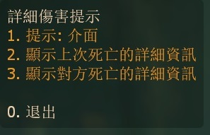

# Description | 內容
Display who killed you (weapons, distance and damage)

> __Note__ <br/>
This plugin is private, Please contact [me](https://github.com/fbef0102/Game-Private_Plugin#私人插件列表-private-plugins-list)<br/>
此為私人插件, 請聯繫[本人](https://github.com/fbef0102/Game-Private_Plugin#私人插件列表-private-plugins-list)

* Apply to | 適用於
    ```
    L4D1
    L4D2
    ```

* <details><summary>Image</summary>

    <br/>
    <br/>
    <br/>
    <br/>
</details>

* <details><summary>How does it work?</summary>

    * After Survivor Killed Special Infected
        * Display damage done to attacker
        * Display damage received to victim
    * Display murder name、weapon、distance、hit group
    * Type ```!killinfo```, Save settings with cookie. Player will have same settings if rejoin server next time.
</details>

* Require | 必要安裝
    1. [left4dhooks](https://forums.alliedmods.net/showthread.php?t=321696)
    2. [[INC] Multi Colors](https://github.com/fbef0102/L4D1_2-Plugins/releases/tag/Multi-Colors)

* <details><summary>ConVar | 指令</summary>

    * cfg/sourcemod/l4d_who_kill_you.cfg
        ```php
        // 0=Plugin off, 1=Plugin on.
        l4d_who_kill_you_enable "1"

        // If 1, display damage kill info to survivor(attacker) when kill SI
        l4d_who_kill_you_display_to_survivor "1"

        // If 1, display damage kill info to infected(victim) when get killed
        l4d_who_kill_you_display_to_infeced "1"

        // (L4D2) Display damage kill info on which zombie class death, 1=Smoker, 2=Boomer, 4=Hunter, 8=Spitter, 16=Jockey, 32=Charger, 64=Tank (0=None, 127=All)
        l4d_who_kill_you_infected_flag "127"

        // (L4D1) Display damage kill info on which zombie class death, 1=Smoker, 2=Boomer, 4=Hunter, 8=Tank (0=None, 15=All)
        l4d_who_kill_you_infected_flag "15"

        // How long damage kill info menu stay?
        l4d_who_kill_you_menu_time "10"

        // If 1, display damage to survivor(attacker) and infected(victim) when hurt everytime
        // For test
        l4d_who_kill_you_display_hurt "0"
        ```
</details>

* <details><summary>Command | 命令</summary>
    
    * **Open menu for kill damage info**
        ```php
        sm_killinfo
        ```
</details>

* Translation Support | 支援翻譯
	```
	translations/l4d_who_kill_you.phrases.txt
	```

* <details><summary>Changelog | 版本日誌</summary>

    * v1.2 (2024-9-8)
        * Update translation

    * v1.1 (2024-8-29)
        * Update cvars
        * Update translation

    * v1.0 (2024-3-9)
        * Initial Release
</details>

- - - -
# 中文說明
詳細傷害與兇手提示 (武器、距離、傷害部位)

* <details><summary>圖示</summary>

    <br/>
    <br/>
    <br/>
    <br/>
</details>

* 原理
    * 人類擊殺特感之後
        * 向攻擊者(人類)顯示造成的傷害
        * 向受害者(特感)顯示受到的傷害
    * 顯示兇手、武器、距離、擊中部位
    * 玩家輸入```!killinfo```，有自動保存機制，下次玩家進來無須重新選擇

* <details><summary>指令中文介紹 (點我展開)</summary>

    * cfg/sourcemod/l4d_who_kill_you.cfg
        ```php
        // 0=關閉插件, 1=啟動插件
        l4d_who_kill_you_enable "1"

        // 為1時，向攻擊者(人類)顯示造成的詳細傷害
        l4d_who_kill_you_display_to_survivor "1"

        // 為1時，向受害者(特感)顯示受到的詳細傷害
        l4d_who_kill_you_display_to_infeced "1"

        // (L4D2) 哪種特感死亡時顯示詳細傷害, 1=Smoker, 2=Boomer, 4=Hunter, 8=Spitter, 16=Jockey, 32=Charger, 64=Tank (0=沒有, 127=全部)
        l4d_who_kill_you_infected_flag "127"

        // (L4D1) 哪種特感死亡時顯示詳細傷害, 1=Smoker, 2=Boomer, 4=Hunter, 8=Tank (0=沒有, 15=全部)
        l4d_who_kill_you_infected_flag "15"

        // 詳細傷害介面停留顯示多久? (秒)
        l4d_who_kill_you_menu_time "10"

        // 為1時，每次當特感受傷時，向攻擊者(人類)與受害者(特感)顯示受到的傷害
        // 測試用
        l4d_who_kill_you_display_hurt "0"
        ```
</details>

* <details><summary>命令中文介紹 (點我展開)</summary>
    
    * **打開擊殺傷害顯示介面**
        ```php
        sm_killinfo
        ```
</details>