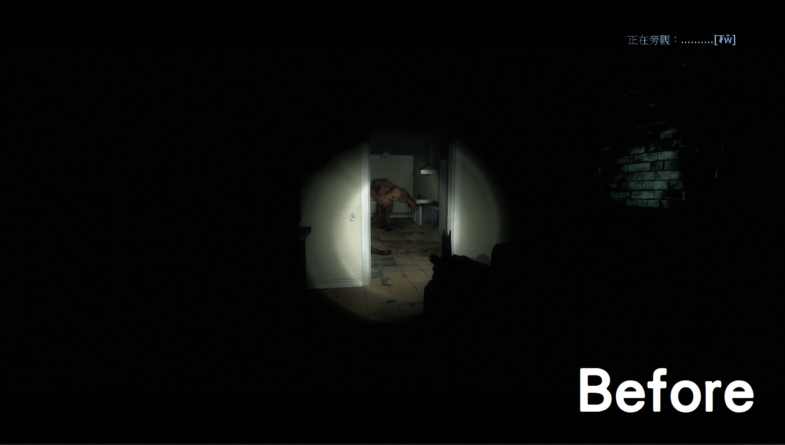

# Description | 內容
Attaches an extra flashlight to spectators and dead survivors.

> __Note__ <br/>
This plugin is private, Please contact [me](https://github.com/fbef0102/Game-Private_Plugin#私人插件列表-private-plugins-list)<br/>
此為私人插件, 請聯繫[本人](https://github.com/fbef0102/Game-Private_Plugin#私人插件列表-private-plugins-list)

* [Video | 影片展示](https://youtu.be/PWrf20wtx0Y)

* Image | 圖示
	* (Free Looking) Before - 裝載插件之前 (自由觀看)
	<br/>
	* (Free Looking) After - 裝載插件之後 (自由觀看)
	<br/>
	* (First Person View) Before - 裝載插件之前 (第一人稱視角)
	<br/>
	* (First Person View) After - 裝載插件之後 (第一人稱視角)
	<br/>
	* (Third Person View) Before - 裝載插件之前 (第三人稱視角)
	<br/>
	* (Third Person View) After - 裝載插件之後 (第三人稱視角)
	<br/>

* Require | 必要安裝
	1. [[INC] Multi Colors](https://github.com/fbef0102/L4D1_2-Plugins/releases/tag/Multi-Colors)

* <details><summary>ConVar | 指令</summary>

	* cfg/sourcemod/l4d_flashlight_speconly.cfg
		```php
		// 0=Plugin off, 1=Plugin on.
		l4d_flashlight_speconly_allow "1"

		// Brightness of the light <10-1000> (changes Distance value).
		l4d_flashlight_speconly_bright "450.0"

		// The default light color. Three values between 0-255 separated by spaces. RGB Color255 - Red Green Blue.
		l4d_flashlight_speconly_colour "80 80 80"

		// Players with these flags can have flashlight. (Empty = all, -1=Nobody).
		l4d_flashlight_speconly_flags ""

		// 0=Off, 1=Show intro message to players entering spectator or death.
		l4d_flashlight_speconly_hints "0"

		// 0=Let players set their flashlight color, 1=Force to cvar specified.
		l4d_flashlight_speconly_lock "0"

		// 0=Off, 1=Save client preferences for flashlight color and state.
		l4d_flashlight_speconly_save "1"

		// If 1, Turns on flashlight for spectators by default.
		l4d_flashlight_speconly_default "1"

		// If 1, Turns off flashlight when spectating in first person view.
		l4d_flashlight_speconly_first_person_off "1"

		// 0=Off, 1=Create flashlight for dead survivors.
		l4d_flashlight_speconly_dead_survivor "1"
		```
</details>

* <details><summary>Command | 命令</summary>
	
	* **Toggle the attached spec flashlight. Usage: sm_lightspec [R G B|off|random|red|green|blue|purple|cyan|orange|white|pink|lime|maroon|teal|yellow|grey]**
		```php
		sm_lightspec
		```

	* **Opens the spec flashlight color menu.**
		```php
		sm_lightspec_menu
		```
</details>

* Apply to | 適用於
	```
	L4D1
	L4D2
	```

* <details><summary>Translation Support | 支援翻譯</summary>

	```
	English
	繁體中文
	简体中文
	```
</details>

* <details><summary>Related Plugin | 相關插件</summary>

	1. [l4d2_spectating_cheat](https://github.com/fbef0102/L4D1_2-Plugins/tree/master/l4d2_spectating_cheat): A spectator who watching the survivor at first person view can now see the infected model glows though the wall
		> 旁觀者能看到特感的光圈，主要是用來更好的觀看體驗
</details>

* <details><summary>Changelog | 版本日誌</summary>

	* v1.5h (2024-3-24)
		* Update cvars

	* v1.4h (2023-9-7)
		* More translation.

	* v1.3h (2023-6-7)
		* Allow flashlight for dead survivors.

	* v1.2h (2023-4-17)
		* Support Free Looking, First Person View, Third Person View
		* Auto turn off flashlight if observe infected first person view

	* v1.1h (2022-12-24)
		* Enable spectator flash light when new round starts

	* v1.0h (2022-11-17)
		* Remove unnecessary codes and cvars
		* Add Spectator/Dead Survivor Flashlight Only

	* 2.25
		* [Original Plugin By Silvers](https://forums.alliedmods.net/showthread.php?t=173257)
</details>

- - - -
# 中文說明
給死亡玩家或旁觀者手電筒，照亮地圖

* 原理
	* 當倖存者玩家死亡時或切換到旁觀者，給予手電筒，只有該玩家能看光亮
	* 有自動保存機制，玩家設置的手電筒開關狀態與顏色會自動保存

* 用意在哪?
	* 適合用於對抗模式的伺服器，旁觀者能看到黑暗環境內的玩家情況
	* 適合用於戰役模式三方圖的伺服器，死亡玩家能在地圖上幫忙探路

* <details><summary>指令中文介紹 (點我展開)</summary>

	* cfg/sourcemod/l4d_flashlight_speconly.cfg
		```php
		// 0=關閉插件, 1=啟動插件
		l4d_flashlight_speconly_allow "1"

		// 手電筒的亮度 <10-1000> (影響最遠可見範圍).
		l4d_flashlight_speconly_bright "450.0"

		// 設置手電筒預設的顏色，填入RGB三色 (三個數值介於0~255，需要空格)
		l4d_flashlight_speconly_colour "80 80 80"

		// 擁有這些權限的玩家，才可以有手電筒 (留白 = 任何人都有, -1: 無人)
		l4d_flashlight_speconly_flags ""

		// 為1時，當玩家死亡或者切換到旁觀者，提示如何使用手電筒
		l4d_flashlight_speconly_hints "0"

		// 0=讓玩家自己選擇手電筒的顏色, 1=強制所有玩家的手電筒顏色與l4d_flashlight_speconly_colour一樣.
		l4d_flashlight_speconly_lock "0"

		// 為1時，本地資料庫保存所有玩家的顏色與開關狀態
		l4d_flashlight_speconly_save "1"

		// 為1時，自動幫旁觀者打開手電筒 (0=需要輸入!lightspec手動開啟)
		l4d_flashlight_speconly_default "1"

		// 為1時，旁觀者觀看第一人稱視角時關閉手電筒
		l4d_flashlight_speconly_first_person_off "1"

		// 為1時，死亡的倖存者也可以有手電筒 (0=關閉)
		l4d_flashlight_speconly_dead_survivor "1"
		```
</details>

* <details><summary>命令中文介紹 (點我展開)</summary>
	
	* **(只限旁觀者或死亡的倖存者) 開關手電筒或指定顏色，使用方式為 !sm_lightspec <顏色名稱或R G B>，顏色名稱有 [off|random|red|green|blue|purple|cyan|orange|white|pink|lime|maroon|teal|yellow|grey]**
		```php
		sm_lightspec
		```

	* **(只限旁觀者或死亡的倖存者) 打開手電筒顏色介面**
		```php
		sm_lightspec_menu
		```
</details>
