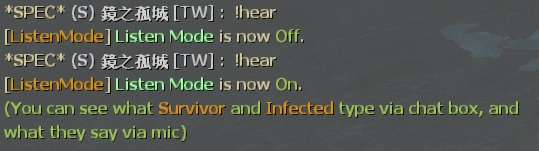

# Description | 內容
Allows spectator listen others team voice and see others team chat for l4d

> __Note__ <br/>
This plugin is private, Please contact [me](/#私人插件列表-private-plugins-list)<br/>
此為私人插件, 請聯繫[本人](/#私人插件列表-private-plugins-list)

* Apply to | 適用於
    ```
    L4D1
    L4D2
    ```

* Image
    <br/>

* <details><summary>How does it work?</summary>

	* Spectator can type ```!hear``` in chatbox
        * Allow spectator to listen survivor and infected team voice
        * Allow spectator to see survivor and infected team chat
    * This plugin auto disabled when ```sv_alltalk 1```
</details>

* Require | 必要安裝
	1. [[INC] Multi Colors](https://github.com/fbef0102/L4D1_2-Plugins/releases/tag/Multi-Colors)

* <details><summary>ConVar | 指令</summary>

	* cfg/sourcemod/l4d_versus_specListener.cfg
        ```php
        // 0=Plugin off, 1=Plugin on.
        l4d_versus_specListener_enable "1"

        // If 1, Enable Hear Feature for all spectators by default [0-Disable]
        l4d_versus_specListener_default "1"

        // If 1, Show Spectators Survivors and Infected Team chat?
        l4d_versus_specListener_team_chat_spec "1"

        // Players with these flags have access to use sm_hear command to enable or disable hear feature. (Empty = Everyone, -1: Nobody)
        l4d_versus_specListener_command_access_flag ""
        ```
</details>

* <details><summary>Command | 命令</summary>

    * **Enable/Disable Listen Mode for personal**
        ```php
        sm_hear
        ```
</details>

* Translation Support | 支援翻譯
	```
	translations/l4d_versus_specListener.phrases.txt
	```

* <details><summary>Related Plugin | 相關插件</summary>

    1. [show_mic](https://github.com/fbef0102/L4D1_2-Plugins/tree/master/show_mic): Voice Announce in centr text + create hat to Show Who is speaking.
	    > 顯示誰在語音並且在說話的玩家頭上帶帽子
</details>

* <details><summary>Changelog | 版本日誌</summary>

	* v3.5 (2023-5-9)
        * Spectator can see survivor team chat and infected team chat
        * Support official convar ```sv_alltalk 1```
        * Translation support

	* v1.0
        * [Original Plugin by waertf](https://forums.alliedmods.net/showthread.php?t=95474)
</details>

- - - -
# 中文說明
旁觀者可以透過聊天視窗看到倖存者和特感的隊伍對話，亦可透過音頻聽到隊伍談話

* 圖示
	* 旁觀者可以在聊天框輸入```!hear```開啟或關閉 監聽模式
    <br/>

* 原理
    * 旁觀者可以在聊天框輸入```!hear```開啟或關閉 監聽模式
    * 監聽模式開啟的時候
        * 旁觀者能透過聊天視窗看到倖存者和特感的隊伍對話
        * 可透過音頻聽到倖存者和特感的隊伍MIC談話
    * 監聽模式關閉的時候 
        * 看不到倖存者和特感的隊伍對話
        * 聽不到倖存者和特感的隊伍MIC談話
    * ```sv_alltalk 1``` 開啟的時候，此插件會暫時失效
    * 可以搭配[show_mic插件](https://github.com/fbef0102/L4D1_2-Plugins/tree/master/show_mic)，顯示誰在語音並且在說話的玩家頭上帶帽子
    * 戰役模式也適用

* <details><summary>指令中文介紹 (點我展開)</summary>

	* cfg/sourcemod/l4d_versus_specListener.cfg
        ```php
        // 0=關閉插件, 1=啟動插件
        l4d_versus_specListener_enable "1"

        // 監聽模式 1=預設打開, 0=預設關閉
        l4d_versus_specListener_default "1"

        // 為1時，旁觀者能透過聊天視窗看到倖存者和特感的隊伍對話
        l4d_versus_specListener_team_chat_spec "1"

        // 擁有這些權限的玩家，可以輸入!hear (留白 = 任何人都能, -1: 無人)
        l4d_versus_specListener_command_access_flag ""
        ```
</details>

* <details><summary>命令中文介紹 (點我展開)</summary>

    * **開啟/關閉 監聽模式 (個人)**
        ```php
        sm_hear
        ```
</details>