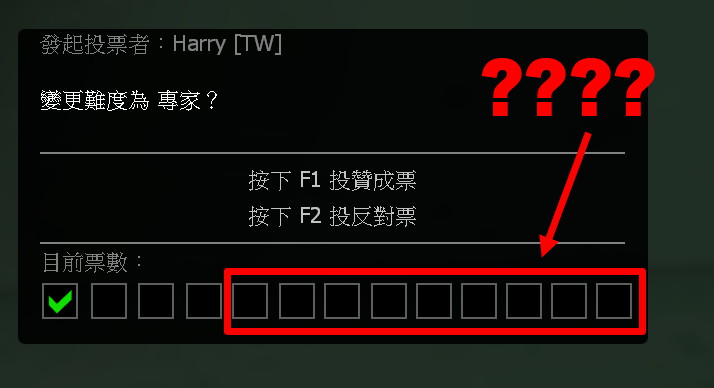
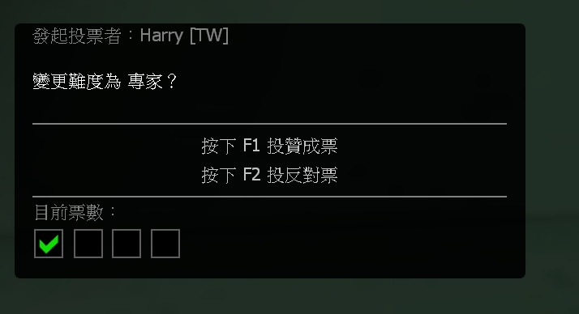

# Description | 內容
Spectators can not call official vote and not eligible to vote (F1/F2)

> __Note__ <br/>
This plugin is private, Please contact [me](https://github.com/fbef0102/Game-Private_Plugin#私人插件列表-private-plugins-list)<br/>
此為私人插件, 請聯繫[本人](https://github.com/fbef0102/Game-Private_Plugin#私人插件列表-private-plugins-list)

* Apply to | 適用於
    ```
    L4D1
    L4D2
    ```

* Image | 圖示
    | Before (裝此插件之前)  			| After (裝此插件之後) |
    | -------------|:-----------------:|
    | ||

* <details><summary>How does it work?</summary>

    * (Before) 
        * Spectators can call official vote (ESC->CALL A VOTE)
        * Spectators can press F1/F2 to vote yes/no
    * (After) 
        * Spectators are unable to call official vote (ESC->Call vote)
        * Spectators are unable to press F1/F2 to vote yes/no
    * This plugin does not affect custom votes from other plugins
    * If you want to allow spectators to vote, type ```!specblock```
</details>

* Require | 必要安裝
    1. [[INC] Multi Colors](https://github.com/fbef0102/L4D1_2-Plugins/releases/tag/Multi-Colors)
    2. [builtinvotes](https://github.com/fbef0102/Game-Private_Plugin/releases/tag/builtinvotes)

* <details><summary>ConVar | 指令</summary>

    * cfg\sourcemod\spectator_block_vote.cfg
        ```php
        // 0=Plugin off, 1=Plugin on.
        spectator_block_vote_enable "1"

        // Delay to start another vote when use !specblock.
        spectator_block_vote_delay "60"

        // Numbers of real survivor/infected required to start a vote when use !specblock.
        spectator_block_vote_required "1"
        ```
</details>

* <details><summary>Command | 命令</summary>

    * **Calls a vote to enable/disable Spec Block Vote**
        ```php
        sm_specblock
        ```
</details>

* Translation Support | 支援翻譯
    ```
    translations/spectator_block_vote.phrases.txt
    ```

* <details><summary>Changelog | 版本日誌</summary>

    * v1.0h (2025-8-4)
        * Remake code
        * Add cvars, cmds, translations
        * Only block official vote
        * Use builtinvotes to detect if vote is from other plugins
        * Prevent conflict with other custom vote from other plugins

    * Credit & Original
        * By disawar1: [Vote Poll Fix](https://forums.alliedmods.net/showthread.php?t=218829)
</details>

- - - -
# 中文說明
禁止旁觀者參與官方的投票，移除旁觀者的投票資格

* 圖示
    * 旁觀者可以在聊天框輸入```!hear```開啟或關閉 監聽模式
    <br/>

* 原理
    * (裝此插件之前) 
        * 旁觀者可以發起官方投票 (ESC->發起投票)
        * 旁觀者可以按F1/F2參與官方投票
    * (After) 
        * 旁觀者禁止發起官方投票 (ESC->發起投票)
        * 旁觀者不能按F1/F2參與官方投票
    * 此插件不會影響其他插件生成的自定義投票
    * 如果你想要旁觀者能參與投票，請輸入 ```!specblock```

* <details><summary>指令中文介紹 (點我展開)</summary>

    * cfg\sourcemod\spectator_block_vote.cfg
        ```php
        // 0=關閉插件, 1=啟動插件
        spectator_block_vote_enable "1"

        // 使用!specblock投票的間隔時間
        spectator_block_vote_delay "60"

        // 使用!specblock投票的所需的真人倖存者與特感玩家數量
        spectator_block_vote_required "1"
        ```
</details>

* <details><summary>命令中文介紹 (點我展開)</summary>

    * **開/關 旁觀者可以參與投票**
        ```php
        sm_specblock
        ```
</details>