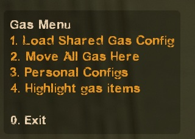
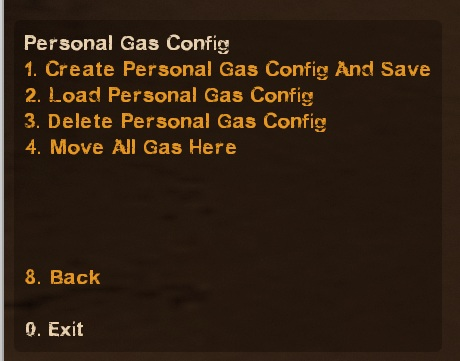
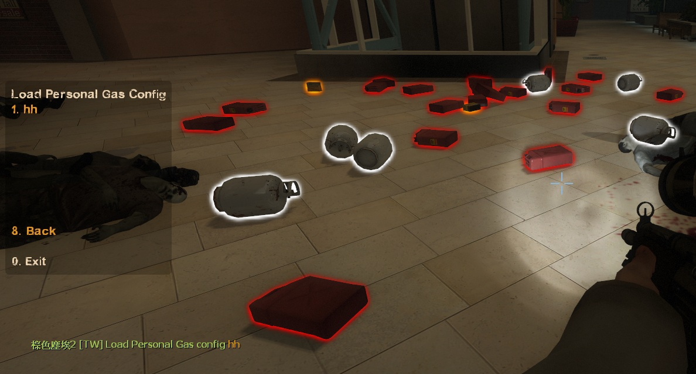
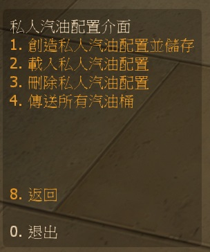

# Description | 內容
Save and load gas configs

> __Note__ <br/>
This plugin is private, Please contact [me](https://github.com/fbef0102/Game-Private_Plugin#私人插件列表-private-plugins-list)<br/>
此為私人插件, 請聯繫[本人](https://github.com/fbef0102/Game-Private_Plugin#私人插件列表-private-plugins-list)

* [Video | 影片展示](https://youtu.be/78Ed0eMKk1U)

* Image
	* Display Menu
    <br/>
	* Personal config
    <br/>
	* Support Gascan, Firework Crate, Propane Tank, Oxygen Tank, Explosive Pack, Incendiary Pack
    <br/>

* <details><summary>How does it work?</summary>

	1. Play survival map, take and put items on the map before survival begins
        *  Gascan, Firework Crate, Propane Tank, Oxygen Tank, Explosive Pack, Incendiary Pack
    2. Save Gas Config
        * Shared：Admin types ```!gasmenu``` -> "Create Shared Gas Config And Save" -> type in chatbox to name the config -> saved
        * Private：Everyone ```!gasmenu``` -> "Personal Configs" -> "Create Gas Config And Save" -> type in chatbox to name the config -> saved
    3. Admin types ```!gasmenu``` -> "Load  Shared Gas Config" -> Choose any config
    4. Restart map, all items has been placed automatically
</details>

* Require | 必要安裝
	1. [left4dhooks](https://forums.alliedmods.net/showthread.php?t=321696)
	2. [[INC] Multi Colors](https://github.com/fbef0102/L4D1_2-Plugins/releases/tag/Multi-Colors)
    3. [[INC] l4d2_weapons](/L4D_插件/Require_檔案/scripting/include/l4d2_weapons.inc)

* <details><summary>ConVar | 指令</summary>

    * cfg/sourcemod/l4d_survival_GasConfig.cfg
        ```php
        // Max number of shared gas setups to allow per map
        l4d_survival_GasConfig_shared_limit "10"

        // Max number of personal gas setups to allow per map (0=Not Allow any personal gas setups)
        l4d_survival_GasConfig_personal_limit "5"

        // Players with these flags have access to use ADM gas menu
        l4d_survival_GasConfig_adm_menu_flag "z"

        // Players with these flags have access to use "Lock gas config" menu
        l4d_survival_GasConfig_adm_lock_flag "z"
        ```
</details>

* <details><summary>Command | 命令</summary>
    
    * **Loads the gas menu**
        ```php
        sm_gasmenu
        ```
    
    * **Moves all the gascans to the player**
        ```php
        sm_gashere
        ```
</details>

* <details><summary>Data Config</summary>

	* Auto create files in [data/GasConfigs](data/GasConfigs) folder to save gas config
    * Don't try to modify unless you know what you are doing
</details>

* Apply to | 適用於
    ```
    L4D1 Survival
    L4D2 Survival
    ```

* <details><summary>Translation Support | 支援翻譯</summary>

	```
	English
	繁體中文
	简体中文
	```
</details>

* <details><summary>Related Plugin | 相關插件</summary>

	1. [l4d_survival_setup](/L4D_插件/Survival_生存模式/l4d_survival_setup): Set up weapon slots before survival starts
        * 生存模式開始之前設定自己想要拿取的武器與物品，下次回合開始之時會自動裝備
    2. [l4d_Teleport_Item](/L4D_插件/Survival_生存模式/l4d_Teleport_Item): Open Menu to teleport items on the map.
        * 打開選單傳送地圖上所有物品到身邊
</details>

* <details><summary>Changelog | 版本日誌</summary>

    * v1.3h (2025-1-12)
        * Update translation
        * Limit Gas config name 2-15 characters

    * v1.2h (2023-1-26)
        * Add "Locked Shared Gas Config", if the config is locked, anyone can not delete that config.
        * Add a convar ```l4d_survival_GasConfig_adm_lock_flag "z"```, Players with these flags have access to use "Lock gas config" menu
        * Translation Support

    * v1.1h (2022-12-7)
        * Add personal gas config
        * Fix memory leak

    * v1.0h (2022-11-29)
	    * Remake code
		* Convert code to latest syntax
		* Changes to fix warnings when compiling on SourceMod 1.11.
        * Support Gascan, Firework Crate, Propane Tank, Oxygen Tank, Explosive Pack, Incendiary Pack
        * Fix errors

    * v1.0
        * [Original Plugin by khan](https://github.com/graviti666/Some-Plugins/tree/master/Gas%20Configs)
</details>

- - - -
# 中文說明
生存模式開始之前設定汽油桶位置，下次回合開始之時汽油桶自動擺放

* 圖示
	* 輸入!gasmenu打開設定介面
    <br/>
	* 個人的gas config
    <br/>
	* 載入不同的汽油桶擺放配置
    <br/>

* 原理
    * 在生存模式中，自動擺放好玩家預先設定的物品位置
        * 汽油桶、瓦斯桶、氧氣罐、煙火盒、火焰包、高爆彈
    * 所有設定會自動保存到配置文件中

* 用意在哪?
    * 節省生存模式搬運物品時間

* 如何使用
    1. 先擺放好地圖上的汽油桶位置
    2. 儲存配置
        * 共享配置：管理員可以輸入```!gasmenu``` -> "創造共享汽油配置並儲存" -> 聊天視窗輸入文字為這個配置命名
        * 私人配置：所有人可以輸入```!gasmenu``` -> 私人配置 -> "創造私人汽油配置並儲存" -> 聊天視窗輸入文字為這個配置命名
    3. 管理員輸入```!gasmenu``` -> "設定地圖預設汽油配置" -> 選擇剛才命名的共享配置
    4. 重新地圖，所有物品已自動擺放好位置

* <details><summary>指令中文介紹 (點我展開)</summary>

    * cfg/sourcemod/l4d_survival_GasConfig.cfg
        ```php
        // 一張地圖內，最多的"共享汽油配置"數量
        l4d_survival_GasConfig_shared_limit "10"

        // 一張地圖內，每一位玩家最多的"私人汽油配置"數量 (0=不允許任何私人配置)
        l4d_survival_GasConfig_personal_limit "5"

        // 擁有這些權限的玩家，才可以輸入看到選單上更多的設置 (留白 = 任何人都能, -1: 無人)
        l4d_survival_GasConfig_adm_menu_flag "z"

        // 擁有這些權限的玩家，才可以鎖定並刪除 "共享汽油配置" (留白 = 任何人都能, -1: 無人)
        l4d_survival_GasConfig_adm_lock_flag "z"
        ```
</details>

* <details><summary>命令中文介紹 (點我展開)</summary>
    
    * **打開選單**
        ```php
        sm_gasmenu
        ```
    
    * **將所有汽油桶傳送到玩家身上**
        ```php
        sm_gashere
        ```
</details>

* <details><summary>文件設定範例</summary>

	* 此插件會自動創建文件於[data/GasConfigs](data/GasConfigs)資料夾，用來儲存玩家的物資擺放設定
    * 沒事別改動文件除非你知道這是在幹嗎
</details>


