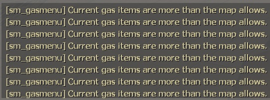

# Description | 內容
Check if the total number of Gas/Prop/Ammp Pack items more than map allowed when survival begins

> __Note__ <br/>
This plugin is private, Please contact [me](/#私人插件列表-private-plugins-list)<br/>
此為私人插件, 請聯繫[本人](/#私人插件列表-private-plugins-list)

* Apply to | 適用於
	```
	L4D1 Survival
	L4D2 Survival
	```

* Image | 圖示
	<br/>

* <details><summary>How does it work?</summary>

	* This plugin just display message only.
	* When survival begins, check if the total number of items more than map allowed when survival begins
		* defibrillator, first aid kit, pill, adrenaline, molotov, pipe bomb, vomitjar, gascan, firework, propane tank, oxygen tank, explosive pack, incendiary pack
		* Edit map defaut count in file: [data/l4d_survival_gas_item_counts_check.cfg](data/l4d_survival_gas_item_counts_check.cfg)
</details>

* Require | 必要安裝
	1. [left4dhooks](https://forums.alliedmods.net/showthread.php?t=321696)
	2. [[INC] Multi Colors](https://github.com/fbef0102/L4D1_2-Plugins/releases/tag/Multi-Colors)

* <details><summary>ConVar | 指令</summary>

	* cfg/sourcemod/l4d_survival_gas_item_counts_check.cfg
		```php
		// 0=Plugin off, 1=Plugin on.
		l4d_survival_gas_item_counts_check_enable "1"
		```
</details>

* Translation Support | 支援翻譯
	```
	translations/l4d_survival_gas_item_counts_check.phrases.txt
	```

* <details><summary>Changelog | 版本日誌</summary>

	* v1.0 (2025-9-24)
		* Initial Release
</details>

- - - -
# 中文說明
生存模式計時開始之後，檢查物資數量是否不符合地圖預設數量

* 原理
	* 只適用於生存模式，此插件只是提示訊息用
	* 生存模式計時開始時，此插件會檢測所有物資的數量，如果超過地圖原有的數量，將會有顯眼的提示
		* 治療包、電擊器、藥丸、腎上腺素、火瓶、土製炸彈、膽汁瓶、汽油桶、瓦斯桶、氧氣罐、煙火盒、高爆彈包、燃燒彈包
		* 寫下地圖數量於文件: [data/l4d_survival_gas_item_counts_check.cfg](data/l4d_survival_gas_item_counts_check.cfg)

* <details><summary>指令中文介紹 (點我展開)</summary>

	* cfg/sourcemod/l4d_survival_gas_item_counts_check.cfg
		```php
		// 0=關閉插件, 1=啟動插件
		l4d_survival_gas_item_counts_check_enable "1"
		```
</details>