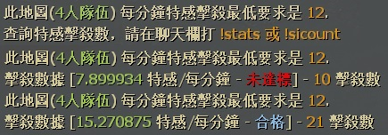

# Description | 內容
Display Minimum SI/min requirement and stats on each survival map.

> __Note__ <br/>
This plugin is private, Please contact [me](https://github.com/fbef0102/Game-Private_Plugin#私人插件列表-private-plugins-list)<br/>
此為私人插件, 請聯繫[本人](https://github.com/fbef0102/Game-Private_Plugin#私人插件列表-private-plugins-list)

* Apply to | 適用於
	```
	L4D1 Survival
	L4D2 Survival
	```

* Image
	<br/>

* <details><summary>How does it work?</summary>

	* This plugin just display message only.
	* Display Minimum SI/min requirement and stats on each survival map.
	* Display message when survival begins and round end.
	* Edit Minimum SI/min requirement in file: [data/l4d_survival_min_si_stats.cfg](data/l4d_survival_min_si_stats.cfg)
		* Manual in this file, click for more details...
</Chargedetails>

* Require | 必要安裝
	1. [left4dhooks](https://forums.alliedmods.net/showthread.php?t=321696)
	2. [[INC] Multi Colors](https://github.com/fbef0102/L4D1_2-Plugins/releases/tag/Multi-Colors)

* <details><summary>Command | 命令</summary>

	* **Minimum SI/Min requirement for full-team category on this map**
		```php
		sm_stats
		sm_sicount
		```
</details>

* Translation Support | 支援翻譯
	```
	translations/l4d_survival_min_si_stats.phrases.txt
	```

* <details><summary>Changelog | 版本日誌</summary>

	* v1.3 (2025-7-13)
		* Update data
		* Update translation

	* v1.2 (2024-3-16)
		* Update Cvars
		* Update Data
		* Update translation
		* Display message on round end

	* v1.1 (2023-2-10)
		* Display different SI requirement numbers based on how many alive survivors when survival begins

	* v1.0
		* Initial Release
</details>

- - - -
# 中文說明
生存模式下顯示人類隊伍全體的特感擊殺數與數據

* 圖示
	<br/>

* 原理
	* 只適用於生存模式，此插件只是提示訊息用
	* 顯示```平均每分鐘，最少要擊殺的特感數量```，不同地圖不同要求
	* 在生存模式開始時提示訊息，回合結束時提示是否達標
	* 可自行到文件修改門檻: [data/l4d_survival_min_si_stats.cfg](data/l4d_survival_min_si_stats.cfg)