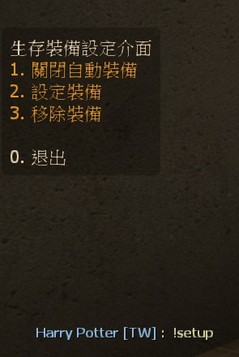
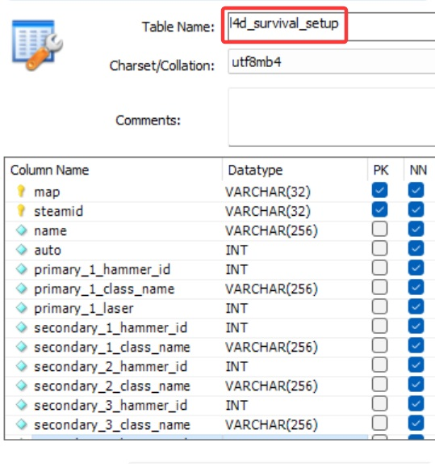

# Description | 內容
Set up weapon slots before survival starts

> __Note__ <br/>
This plugin is private, Please contact [me](/#私人插件列表-private-plugins-list)<br/>
此為私人插件, 請聯繫[本人](/#私人插件列表-private-plugins-list)

* Apply to | 適用於
    ```
    L4D1 Survival
    L4D2 Survival
    ```

* [Video | 影片展示](https://youtu.be/P3Y1ExRmBIU)

* Image
    * Menu
    <br/>
    <br/>
    * Support Database (MySQL & SQLite)
    <br/>

* <details><summary>How does it work?</summary>

    * How to use?
        * In survival mode, type ```!setup``` -> aim the weapon or item on the map -> save -> 
        * Auto pickup or equip on next survival round start
    * Can't upgrade laser if there is no laser sight on the map
	* Support Database (MySQL & SQLite), data saved even if player disconnected from server or server restart
    * [data/l4d_survival_setup.cfg](data/l4d_survival_setup.cfg): Enable/disable or laser blocked in some maps
        * You can modify this file
</details>

* <details><summary>How to Set Database</summary>

	* Choose one of the following method
		1. MySQL: Database across server, set ConVar ```l4d_survival_setup_database "l4d_survival_setup"``` and write the following in ```sourcemod/configs/databases.cfg```
			```php
			// There would a data table named "l4d_survival_setup" in database
			"l4d_survival_setup"
			{
				"driver"			"mysql"
				"host"				"x.x.x.x"
				"database"			"yourdatabase"
				"user"				"youruser"
				"pass"				"yourpass"
				"port"				"yourport"
			}
			```

		2. SQLite: Local Database, set ConVar ```l4d_survival_setup_database "l4d_survival_setup"``` and write the following in ```sourcemod/configs/databases.cfg```
			```php
			// There would be a file created: sourcemod/data/sqlite/l4d_survival_setup.sq3
			"l4d_survival_setup"
			{
				"driver"			"sqlite"
				"database"			"l4d_survival_setup"
			}
			```
</details>

* Require | 必要安裝
    1. [left4dhooks](https://forums.alliedmods.net/showthread.php?t=321696)
    2. [[INC] Multi Colors](https://github.com/fbef0102/L4D1_2-Plugins/releases/tag/Multi-Colors)
    3. [[INC] l4d2_weapons](/L4D_插件/Require_檔案/scripting/include/l4d2_weapons.inc)

* <details><summary>ConVar | 指令</summary>

    * cfg/sourcemod/l4d_survival_setup.cfg
        ```php
        // 0=Plugin off, 1=Plugin on.
        l4d_survival_setup_enable "1"

        // Changes how message displays. (0: Disable, 1:In chat, 2: In Hint Box, 3: In center text)
        l4d_survival_setup_announce_type "1"

		// Database to save survival setup system. (MySQL & SQLite supported)
		l4d_survival_setup_database "l4d_survival_setup"
        ```
</details>

* <details><summary>Command | 命令</summary>
    
    * **Open Setup menu for survival mod**
        ```php
        sm_setup
        ```
</details>

* Translation Support | 支援翻譯
    ```
    translations/l4d_survival_setup.phrases.txt
    ```

* <details><summary>Related Plugin | 相關插件</summary>

    1. [l4d_survival_GasConfig](/L4D_插件/Survival_生存模式/l4d_survival_GasConfig): Save and load gas configs
        * 生存模式開始之前設定汽油桶位置，下次回合開始之時汽油桶自動擺放位置
</details>

* <details><summary>Changelog | 版本日誌</summary>

    * v1.4 (2025-11-24)
        * Update translation, data, cvars
        * Support database (MySQL & SQLite)

    * v1.3 (2025-4-11)
        * Update data file
        * Use OnClientPostAdminCheck to get data safely
        * Optimize code to save data

    * v1.2 (2024-9-19)
        * Update Translation
        * Fixed not working on some entities

    * v1.1 (2023-2-4)
        * Translation Support
        * Disable laser if there is no any laser sight on the map

    * v1.0 (2022-11-09)
        * Initial Release
</details>

- - - -
# 中文說明
生存模式開始之前設定自己的生存開場裝備，下次回合開始之時會自動裝備所設定的武器與物品

* 圖示
    * 菜單
    <br/>
    <br/>
    * 使用資料庫保存玩家的設定 (支援 MySQL & SQLite)
    <br/>

* 原理
    * 如何使用?
        1. 輸入```!setup```打開介面 => "設定裝備"
        2. 尋找地圖上的武器或物品 => 準心指向 => 設定裝備
        3. 下次回合開始時，自動裝備，無須走過去拿取
    * 沒有紅外線升級裝置的地圖，無法設定雷射紅外線
    * 使用資料庫保存玩家的經驗值 (支援 MySQL & SQLite)，即使離開伺服器或伺服器重啟，玩家數據依然保存
    * 修改文件 [data/l4d_survival_setup.cfg](data/l4d_survival_setup.cfg): 在某些地圖啟用/關閉插件，或是限制紅外線雷射裝置

* 用意在哪?
    * 節省生存模式拿取武器或物品的時間

* <details><summary>如何設定資料庫</summary>

	* 以下方法二選一
		1. MySQL: 支援跨伺服器儲值，設定指令 ```l4d_survival_setup_database "l4d_survival_setup"```，然後設定文件 ```sourcemod/configs/databases.cfg```
			```php
			// 資料庫中自動創建表格，名稱是 "l4d_survival_setup"
			"l4d_survival_setup"
			{
				"driver"			"mysql"
				"host"				"x.x.x.x"
				"database"			"yourdatabase"
				"user"				"youruser"
				"pass"				"yourpass"
				"port"				"yourport"
			}
			```
			
		2. SQLite: 本地資料庫儲值，設定指令 ```l4d_survival_setup_database "l4d_survival_setup"```，然後設定文件 ```sourcemod/configs/databases.cfg```
			```php
			// 自動創建檔案: sourcemod/data/sqlite/l4d_survival_setup.sq3
			"l4d_survival_setup"
			{
				"driver"			"sqlite"
				"database"			"l4d_survival_setup"
			}
			```
</details>

* <details><summary>指令中文介紹 (點我展開)</summary>

    * cfg/sourcemod/l4d_survival_setup.cfg
        ```php
        // 0=插件關閉, 1=插件開啟.
        l4d_survival_setup_enable "1"
        
        // 提示該如何顯示. (0: 不提示, 1: 聊天框, 2: 黑底白字框, 3: 螢幕正中間)
        l4d_survival_setup_announce_type "1"

		// 儲存玩家裝備的資料庫設定. (支援 MySQL & SQLite)
		l4d_survival_setup_database "l4d_survival_setup"
        ```
</details>

* <details><summary>命令中文介紹 (點我展開)</summary>

    * **打開選單設定裝備與物品**
        ```php
        sm_setup
        ```
</details>

