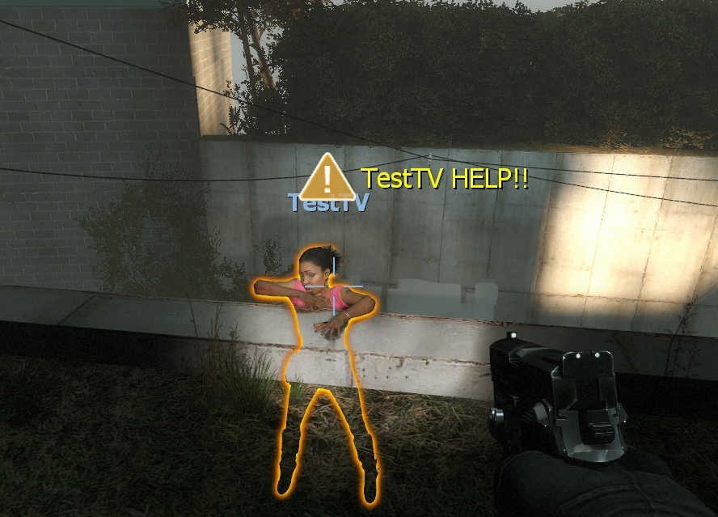
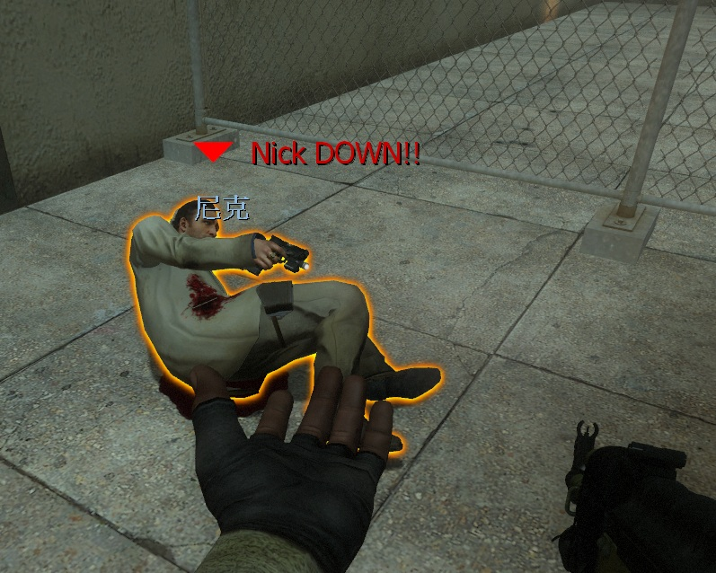

# Description | 內容
Notify people when survivor is dead/incap/hanging from ledge or when someone uses defibrillator to revive a survivor

> __Note__ <br/>
This plugin is private, Please contact [me](/#私人插件列表-private-plugins-list)<br/>
此為私人插件, 請聯繫[本人](/#私人插件列表-private-plugins-list)

* Apply to | 適用於
	```
	L4D2
	```

* [Video | 影片展示](https://youtu.be/krdGPEqaE_g)

* Image | 圖示
	* Display director hint (提示導演系統訊息)
	<br/>
	<br/>
	<br/>
	<br/>

* <details><summary>How does it work?</summary>

	* Display director hint when survivor dead
	* Display director hint when survivor uses defibrillator to revive dead player
	* Display director hint when survivor becomes incapacitated
	* Display director hint when survivor hanging from ledge
	* Player must Enabled GAME INSTRUCTOR, in ESC -> Options -> Multiplayer, or they can't see the hint
	* DO NOT modify convar ```sv_gameinstructor_disable 1```, this force all clients to disable their game instructors.
</Chargedetails>


* Require | 必要安裝
	1. [left4dhooks](https://forums.alliedmods.net/showthread.php?t=321696)
	2. [[INC] Multi Colors](https://github.com/fbef0102/L4D1_2-Plugins/releases/tag/Multi-Colors)

* <details><summary>ConVar | 指令</summary>

	* cfg/sourcemod/l4d_danger_director_notify.cfg
		```php
		// 0=Plugin off, 1=Plugin on.
		l4d_danger_director_notify_enable "1"

		// Changes how message displays on survivor dead. 0=Disable, 1=In chat, 2=In Hint Box, 4=In center text, 8=Director hint. Add numbers together. (15=All)
		l4d_danger_director_notify_dead_announce_type "9"

		// Director hint color on survivor dead.
		l4d_danger_director_notify_dead_director_color "255 255 255"

		// Director hint icon name on survivor dead. (For more icons: https://developer.valvesoftware.com/wiki/Env_instructor_hint)
		l4d_danger_director_notify_dead_director_icon "icon_skull"

		// Director hint display range on survivor dead. (0=Any distance)
		l4d_danger_director_notify_dead_director_range "1500"

		// Director hint display time on survivor dead. (0=Forever)
		l4d_danger_director_notify_dead_director_time "0"

		// Changes how message displays when survivor revives teammate from hell. 0=Disable, 1=In chat, 2=In Hint Box, 4=In center text, 8=Director hint. Add numbers together. (15=All)
		l4d_danger_director_notify_revive_announce_type "9"

		// Director hint color when survivor revives teammate from hell.
		l4d_danger_director_notify_revive_director_color "200 200 0"

		// Director hint icon name when survivor revives teammate from hell.
		l4d_danger_director_notify_revive_director_icon "icon_shield"

		// Director hint display range when survivor revives teammate from hell. (0=Any distance)
		l4d_danger_director_notify_revive_director_range "1000"

		// Director hint display time when survivor revives teammate from hell.
		l4d_danger_director_notify_revive_director_time "8.0"

		// Changes how message displays when survivor becomes incapacitated. 0=Disable, 1=In chat, 2=In Hint Box, 4=In center text, 8=Director hint. Add numbers together. (15=All)
		l4d_danger_director_notify_incap_announce_type "9"

		// Director hint color when survivor becomes incapacitated.
		l4d_danger_director_notify_incap_director_color "200 0 0"

		// Director hint icon name when survivor becomes incapacitated.
		l4d_danger_director_notify_incap_director_icon "icon_arrow_plain"

		// Director hint display range when survivor becomes incapacitated. (0=Any distance)
		l4d_danger_director_notify_incap_director_range "800"

		// Director hint display time when survivor becomes incapacitated. (0=Forever)
		l4d_danger_director_notify_incap_director_time "0.0"

		// Changes how message displays when survivor hanging from ledge. 0=Disable, 1=In chat, 2=In Hint Box, 4=In center text, 8=Director hint. Add numbers together. (15=All)
		l4d_danger_director_notify_hanging_announce_type "9"

		// Director hint color when survivor hanging from ledge.
		l4d_danger_director_notify_hanging_director_color "255 255 0"

		// Director hint icon name when survivor hanging from ledge.
		l4d_danger_director_notify_hanging_director_icon "icon_alert_red"

		// Director hint display range when survivor hanging from ledge. (0=Any distance)
		l4d_danger_director_notify_hanging_director_range "800"

		// Director hint display time when survivor hanging from ledge. (0=Forever)
		l4d_danger_director_notify_hanging_director_time "0.0"
		```
</details>

* Translation Support | 支援翻譯
	```
	translations/l4d_danger_director_notify.phrases.txt
	```

* <details><summary>Related Plugin | 相關插件</summary>

	1. [LMC_Black_and_White_Notifier](https://github.com/fbef0102/L4D1_2-Plugins/tree/master/LMC_Black_and_White_Notifier): Notifies selected team(s) when someone is on final strike and add glow
		> 顯示誰是黑白狀態，有更多的提示與支援LMC模組
</details>

* <details><summary>Changelog | 版本日誌</summary>

	* v1.1 (2026-2-15)
		* Remake code
		* Update cvars
		* Add incap/hanging from ledge director notify

	* v1.0
		* Initial Release
</details>

- - - -
# 中文說明
當玩家死亡/倒地/掛邊或者從地獄被救活時，提示導演系統訊息給大家

* 原理
	* 當玩家被電擊器救活時，提示導演系統訊息
	* 當玩家死亡或倒地或掛邊時，提示導演系統訊息
	* 玩家必須啟動[遊戲指導系統](/Tutorial_教學區/Chinese_繁體中文/Game#%E5%95%9F%E5%8B%95%E9%81%8A%E6%88%B2%E6%8C%87%E5%B0%8E%E7%B3%BB%E7%B5%B1)，否則玩家看不見導演系統提示
	* 不要修改伺服器指令 ```sv_gameinstructor_disable 1```，這會關閉所有導演系統提示

* <details><summary>指令中文介紹 (點我展開)</summary>

	* cfg/sourcemod/l4d_danger_director_notify.cfg
		```php
		// 0=關閉插件, 1=啟動插件
		l4d_danger_director_notify_enable "1"

		// (人類死亡) 提示該如何顯示. 0=不提示, 1=聊天框, 2=黑底白字框, 4=螢幕正中間, 8=導演系統提示
		// 請將數字相加, 15=全部
		l4d_danger_director_notify_dead_announce_type "9"

		// (人類死亡) 導演系統提示的顏色
		l4d_danger_director_notify_dead_director_color "255 255 255"

		// (人類死亡) 導演系統提示的圖案 (想看更多可用圖案請看: https://developer.valvesoftware.com/wiki/Env_instructor_hint)
		l4d_danger_director_notify_dead_director_icon "icon_skull"

		// (人類死亡) 導演系統提示的可見範圍 (0=無距離限制)
		l4d_danger_director_notify_dead_director_range "1500"

		// (人類死亡) 導演系統提示的顯示時間 (0=永久顯示)
		l4d_danger_director_notify_dead_director_time "0"

		// (人類被電擊器救活) 提示該如何顯示. 0=不提示, 1=聊天框, 2=黑底白字框, 4=螢幕正中間, 8=導演系統提示
		// 請將數字相加, 15=全部
		l4d_danger_director_notify_revive_announce_type "9"

		// (人類被電擊器救活) 導演系統提示的顏色
		l4d_danger_director_notify_revive_director_color "200 200 0"

		// (人類被電擊器救活) 導演系統提示的圖案
		l4d_danger_director_notify_revive_director_icon "icon_shield"

		// (人類被電擊器救活) 導演系統提示的可見範圍 (0=無距離限制)
		l4d_danger_director_notify_revive_director_range "1000"

		// (人類被電擊器救活) 導演系統提示的顯示時間 (0=永久顯示)
		l4d_danger_director_notify_revive_director_time "8.0"

		// (人類倒地) 提示該如何顯示. 0=不提示, 1=聊天框, 2=黑底白字框, 4=螢幕正中間, 8=導演系統提示
		// 請將數字相加, 15=全部
		l4d_danger_director_notify_incap_announce_type "9"

		// (人類倒地) 導演系統提示的顏色
		l4d_danger_director_notify_incap_director_color "200 0 0"

		// (人類倒地) 導演系統提示的圖案
		l4d_danger_director_notify_incap_director_icon "icon_arrow_plain"

		// (人類倒地) 導演系統提示的可見範圍 (0=無距離限制)
		l4d_danger_director_notify_incap_director_range "800"

		// (人類倒地) 導演系統提示的顯示時間 (0=永久顯示)
		l4d_danger_director_notify_incap_director_time "0.0"

		// (人類掛邊) 提示該如何顯示. 0=不提示, 1=聊天框, 2=黑底白字框, 4=螢幕正中間, 8=導演系統提示
		// 請將數字相加, 15=全部
		l4d_danger_director_notify_hanging_announce_type "9"

		// (人類掛邊) 導演系統提示的顏色
		l4d_danger_director_notify_hanging_director_color "255 255 0"

		// (人類掛邊) 導演系統提示的圖案
		l4d_danger_director_notify_hanging_director_icon "icon_alert_red"

		// (人類掛邊) 導演系統提示的可見範圍 (0=無距離限制)
		l4d_danger_director_notify_hanging_director_range "800"

		// (人類掛邊) 導演系統提示的顯示時間 (0=永久顯示)
		l4d_danger_director_notify_hanging_director_time "0.0"
		```
</details>
