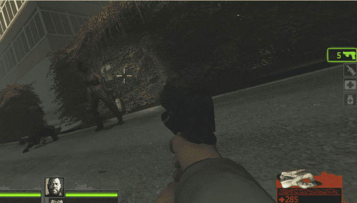
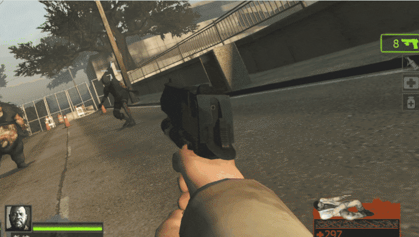

# Description | 內容
Incapacitated survivors can kill C.I/S.I./Tank/Witch to get up by themselves

> __Note__ <br/>
This plugin is private, Please contact [me](/#私人插件列表-private-plugins-list)<br/>
此為私人插件, 請聯繫[本人](/#私人插件列表-private-plugins-list)

* Apply to | 適用於
	```
	L4D1
	L4D2
	```

* [Video | 影片展示](https://youtu.be/tGgcigQtyeM)

* Image | 圖示
	<br/>
	<br/>
	<br/>

* <details><summary>How does it work?</summary>

	* Incapacitated survivors can get up by themselves by killing 
		* Tank
		* Witch
		* Special infected
		* Common infected
	* Does not work if survivors are haning from ledge
	* Can adjust hp reward, read cvars
</details>

* Require | 必要安裝
	1. [left4dhooks](https://forums.alliedmods.net/showthread.php?t=321696)
    2. [[INC] Multi Colors](https://github.com/fbef0102/L4D1_2-Plugins/releases/tag/Multi-Colors)

* <details><summary>ConVar | 指令</summary>

	* cfg/sourcemod/l4d_incap_revive_kill.cfg
		```php
		// 0=Plugin off, 1=Plugin on.
		l4d_incap_revive_kill_enable "1"

		// How many common infecteds have to kill to get up by themselves (0=Off)
		l4d_incap_revive_kill_ci_count "5"

		// How much hp can get if killing a common infected
		l4d_incap_revive_kill_ci_hp "10"

		// How many special infecteds (not including tank) have to kill to get up by themselves (0=Off)
		l4d_incap_revive_kill_si_count "1"

		// How much hp can get if killing a smoker (0=Off)
		l4d_incap_revive_kill_smoker_hp "15"

		// How much hp can get if killing a boomer (0=Off)
		l4d_incap_revive_kill_boomer_hp "10"

		// How much hp can get if killing a hunter (0=Off)
		l4d_incap_revive_kill_hunter_hp "30"

		// How much hp can get if killing a spitter (0=Off)
		l4d_incap_revive_kill_spitter_hp "15"

		// How much hp can get if killing a jockey (0=Off)
		l4d_incap_revive_kill_jockey_hp "35"

		// How much hp can get if killing a charger (0=Off)
		l4d_incap_revive_kill_charger_hp "40"

		// How much hp can get if killing a tank (0=Off)
		l4d_incap_revive_kill_tank_hp "50"

		// How much hp can get if killing a witch (0=Off)
		l4d_incap_revive_kill_witch_hp "80"

		// How to heal survivors, 0=Get Permant health (reset incap count), 1=Get Temporary Health
		l4d_incap_revive_kill_health_type "1"
		```
</details>

* Translation Support | 支援翻譯
	```
	translations/l4d_incap_revive_kill.phrases.txt
	```

* <details><summary>Changelog | 版本日誌</summary>

	* v1.0 (2025-10-3)
		* Initial Release
</details>

- - - -
# 中文說明
倒地的倖存者擊殺特感/Tank/Witch/普通感染者，可以自救並獲得血量

* 原理
	* 倒地的倖存者擊殺以下種類會自動站起來 (自救)
		* Tank
		* Witch
		* 一定數量的特感
		* 一定數量的普通感染者
	* 掛邊的玩家不適用
	* 可以看指令設置血量

* <details><summary>指令中文介紹 (點我展開)</summary>

	* cfg/sourcemod/l4d_incap_revive_kill.cfg
		```php
		// 0=關閉插件, 1=啟動插件
		l4d_incap_revive_kill_enable "1"

		// 殺多少隻普通感染者才會自救 (0=殺普通感染者不能自救)
		l4d_incap_revive_kill_ci_count "5"

		// 殺普通感染者自救的血量
		l4d_incap_revive_kill_ci_hp "10"

		// 殺多少隻特感才會自救 (Tank除外, 0=殺特感不能自救)
		l4d_incap_revive_kill_si_count "1"

		// 殺Smoker自救的血量 (0=殺Smoker不能自救)
		l4d_incap_revive_kill_smoker_hp "15"

		// 殺Boomer自救的血量 (0=殺Boomer不能自救)
		l4d_incap_revive_kill_boomer_hp "10"

		// 殺Hunter自救的血量 (0=殺Hunter不能自救)
		l4d_incap_revive_kill_hunter_hp "30"

		// 殺Spitter自救的血量 (0=殺Spitter不能自救)
		l4d_incap_revive_kill_spitter_hp "15"

		// 殺Jockey自救的血量 (0=殺Jockey不能自救)
		l4d_incap_revive_kill_jockey_hp "35"

		// 殺Charger自救的血量 (0=殺Charger不能自救)
		l4d_incap_revive_kill_charger_hp "40"

		// 殺Tank自救的血量 (0=殺Tank不能自救)
		l4d_incap_revive_kill_tank_hp "50"

		// 殺Witch自救的血量 (0=殺Witch不能自救)
		l4d_incap_revive_kill_witch_hp "80"

		// 獲得的血量為
		// 0=實血 (會重置倒地次數)
		// 1=虛血
		l4d_incap_revive_kill_health_type "1"
		```
</details>