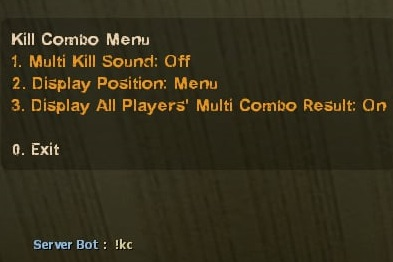
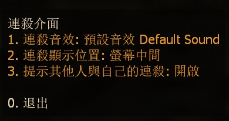

# Description | 內容
Display Kill Combo and play sound when killing special infected

> __Note__ <br/>
This plugin is private, Please contact [me](/#私人插件列表-private-plugins-list)<br/>
此為私人插件, 請聯繫[本人](/#私人插件列表-private-plugins-list)

* Apply to | 適用於
    ```
    L4D1
    L4D2
    ```

* [Video | 影片展示](https://youtu.be/klrjfJlCVNI)

* Image
    <br/>
    <br/>

* <details><summary>How does it work?</summary>

    * Display multi kill text and play sound when player keep killing special infected including tank
	* Accumulate S.I kill combo when headshot only
    * Type ```!kc```, settings will be saved to Cookies Cached. Player will have same settings if rejoin server next time.
        * Sound: choose custom kill combo sound
        * Display: Off, Center text, Hint, Menu
        * Display All Players' Multi Combo Result: On/Off
    * Reward weapon ammo if player has kill combo
    * Make custom sound in [data/al4d_kill_combo.cfg](data/l4d_kill_combo.cfg)
        * Manual in this file, click for more details...
</details>

* Require | 必要安裝
	1. [left4dhooks](https://forums.alliedmods.net/showthread.php?t=321696)
	2. [[INC] Multi Colors](https://github.com/fbef0102/L4D1_2-Plugins/releases/tag/Multi-Colors)

* <details><summary>ConVar | 指令</summary>

	* cfg/sourcemod/l4d_kill_combo.cfg
        ```php
        // 0=Plugin off, 1=Plugin on.
        l4d_kill_combo_enable "1"

        // Accumulate S.I kill combo within this time
        l4d_kill_combo_time "4.0"

        // 0=Accumulate kill combo from first kill. 1=Accumulate kill combo if keep killing S.I.
        l4d_kill_combo_reset_type "1"

        // 1=Accumulate S.I kill combo when headshot only, 2=Reset kill combo if not headshot (0=Off)
        l4d_kill_combo_headshot_only "0"

        // Reset kill combo if receive this amount of damage during combo (0=off)
        l4d_kill_combo_reset_damage "10.0"

        // Announce player's kill combo in chatbox and display trophy achievement when
        // 1=After kill combo time end (_time cvar)
        // 2=Once Count combo >= _notify_number cvar value
        // 0=Off
        l4d_kill_combo_notify_type "2"

        // If player's kill combo >= this valve, announce kill combo in chatbox and display trophy achievement
        l4d_kill_combo_notify_number "5"

        // If 1, reward weapon ammo when player has kill combo
        l4d_kill_combo_reward_ammo "1"
        ```
</details>

* <details><summary>Command | 命令</summary>
    
	* **Open menu for kill combo**
		```php
		sm_kc
		```
</details>

* Translation Support | 支援翻譯
	```
	translations/l4d_kill_combo.phrases.txt
	```

* <details><summary>Changelog | 版本日誌</summary>

    * v1.4 (2026-2-27)
        * Reward weapon ammo if player has kill combo
        * Update data

    * v1.3 (2024-11-21)
        * Update cvars, translation, menu
        * Add data file

    * v1.2 (2024-2-15)
        * Headshot only when kill si
        * Update cvars

    * v1.1 (2024-1-9)
        * Update translation
        * Add "Display: Menu"

    * v1.0 (2022-12-7)
	    * Initial Release
</details>

- - - -
# 中文說明
連續擊殺特感會有提示與音效

* 圖示
    <br/>
    <br/>
* 原理
    * 在一定時間內連續擊殺特感，會有提示與音效，擊殺Tank也算
    * 自己的擊殺數超過一定數量之後，顯示訊息給所有玩家
    * 玩家輸入```!kc```，有自動保存機制，下次玩家進來無須重新選擇
        * 音效: 選擇自定義的音效
        * 顯示: 關閉, 螢幕中間, 下方黑底白字, 介面
        * 提示其他人與自己的連殺: 開啟/關閉
    * 當玩家獲得擊殺數時，獎勵主武器的備用子彈
    * 自定義連殺音效: [data/al4d_kill_combo.cfg](data/l4d_kill_combo.cfg)
        * 內有中文說明，可點擊查看

* 用意在哪?
    * 模仿CS連殺提示，爽而已

* <details><summary>指令中文介紹 (點我展開)</summary>

	* cfg/sourcemod/l4d_kill_combo.cfg
        ```php
        // 0=關閉插件, 1=啟動插件
        l4d_kill_combo_enable "1"

        // 4秒內累積特感擊殺數
        l4d_kill_combo_time "4.0"

        // 0 = 從第一個殺死的特感開始計時，計算4秒內累積的特感擊殺數
        // 1 = 只要4秒內持續殺死特感，繼續計時
        l4d_kill_combo_reset_type "1"

        // 1 = 殺死特感沒爆頭不列入擊殺數 (繼續計時)
        // 2 = 殺死特感沒爆頭，中斷計時與擊殺數
        // 0 = 關閉這項功能
        l4d_kill_combo_headshot_only "0"

        // 如果受到10滴以上的傷害，中斷計時與擊殺數 (0=關閉這項功能)
        l4d_kill_combo_reset_damage "10.0"

        // (將自己的擊殺數顯示給所有玩家 + 並在頭上冒出獎盃的特效)
        // 1 = 當計時時間到之時 (l4d_kill_combo_time)
        // 2 = 當殺死特感並擊殺數大於或等於"l4d_kill_combo_notify_number"指令值之時
        // 0 = 關閉此功能
        l4d_kill_combo_notify_type "2"

        // 當自己的擊殺數大於或等於此指令值，
        // 在聊天框打印自己的擊殺數，顯示給所有玩家
        // 以及頭上顯示獎盃成就
        l4d_kill_combo_notify_number "5"

        // 為1時，當玩家獲得擊殺數時，獎勵主武器的備用子彈
        l4d_kill_combo_reward_ammo "1"
        ```
</details>

* <details><summary>命令中文介紹 (點我展開)</summary>
    
	* **打開擊殺介面**
		```php
		sm_kc
		```
</details>