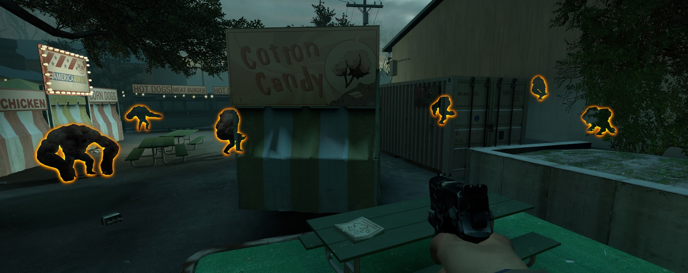

# Description | 內容
Sets glows on tanks everyone can see

> __Note__ <br/>
This plugin is private, Please contact [me](https://github.com/fbef0102/Game-Private_Plugin#私人插件列表-private-plugins-list)<br/>
此為私人插件, 請聯繫[本人](https://github.com/fbef0102/Game-Private_Plugin#私人插件列表-private-plugins-list)

* [Video | 影片展示](https://youtu.be/gmylMHJX8lc)

* Image | 圖示
	<br/>

* Require | 必要安裝
	1. [left4dhooks](https://forums.alliedmods.net/showthread.php?t=321696)
	2. Optional - [Attachments API](https://forums.alliedmods.net/showthread.php?t=325651)

* <details><summary>ConVar | 指令</summary>

	* cfg/sourcemod/l4d2_tank_glow.cfg
		```php
		// 0=Plugin off, 1=Plugin on.
		l4d2_tank_glow_enable "1"

		// Tank glow color, Three values between 0-255 separated by spaces. RGB Color255 - Red Green Blue.
		l4d2_tank_glow_color "255 102 0"

		// Tank Glow max Range (0=No maximum distance)
		l4d2_tank_glow_max_range "1500"

		// Minimum distance that the client must be from the Tank to start glowing
		l4d2_tank_glow_min_range "500"

		// Which teams can see the glow
		// 0 = NONE, 1 = SURVIVOR, 2 = INFECTED, 4 = SPECTATOR.
		// Add numbers greater than 0 for multiple options.
		// Example: "3", enables for SURVIVOR and INFECTED.
		l4d2_tank_glow_for_team "5"
		```
</details>

* <details><summary>Command | 命令</summary>

	None
</details>

* Apply to | 適用於
	```
	L4D2
	```

* <details><summary>Related Plugin | 相關插件</summary>

	1. [witch_glow](/L4D_插件/Witch_女巫/witch_glow): Sets glows on witches everyone can see
		* 在Witch身上打上光圈，所有人都可以看見Witch在哪裡
</details>

* <details><summary>Changelog | 版本日誌</summary>

	* v1.0 (2024-8-28)
		* Initial Release
</details>

- - - -
# 中文說明
在Tank身上打上光圈，所有人都可以看見Tank在哪裡

* 原理
	* 倖存者 + 特感隊伍 + 旁觀者會看見Tank在哪裡

* <details><summary>指令中文介紹 (點我展開)</summary>

	* cfg/sourcemod/l4d2_tank_glow.cfg
		```php
		// 0=關閉插件, 1=啟動插件
		l4d2_tank_glow_enable "1"

		// Tank的光圈顏色，填入RGB三色 (三個數值介於0~255，需要空格)
		l4d2_tank_glow_color "255 102 0"

		// Tank的光圈顏色最遠範圍 (0=無限制)
		l4d2_tank_glow_max_range "1500"

		// Tank的光圈顏色在這範圍內不會發光
		l4d2_tank_glow_min_range "500"

		// 哪些隊伍可以看見Tank的光圈
		// 0 = 無, 1 = 倖存者, 2 = 特感隊伍, 4 = 旁觀者.
		// 請將數字相加起來
		// 舉例: "3"=倖存者+特感隊伍
		l4d2_tank_glow_for_team "5"
		```
</details>