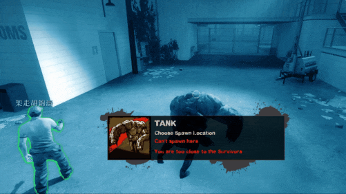
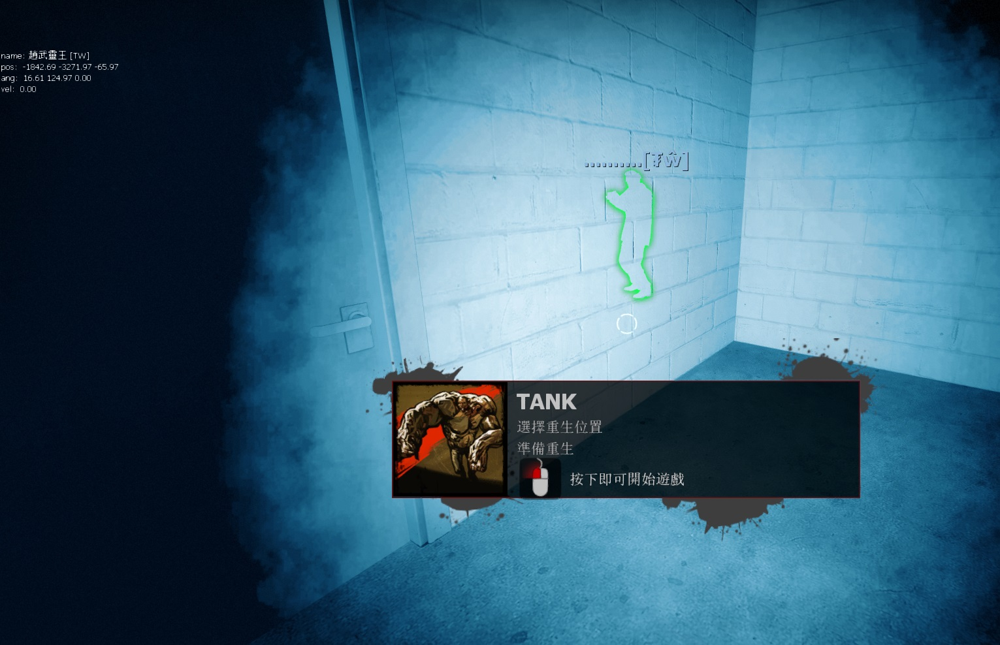

# Description | 內容
When player gets the tank, he will become ghost tank and freely choose anywhere to spawn

> __Note__ <br/>
This plugin is private, Please contact [me](/#私人插件列表-private-plugins-list)<br/>
此為私人插件, 請聯繫[本人](/#私人插件列表-private-plugins-list)

* Apply to | 適用於
	```
	L4D1
	L4D2
	```

* [Video | 影片展示](https://youtu.be/1U6JTxAhN50)

* Image
	<br/>

* <details><summary>How does it work?</summary>

	* When player is about to be the tank (X will get tank), he will become ghost state
	* Freely choose a safe place to spawn alive
</details>

* Require | 必要安裝
	1. [left4dhooks](https://forums.alliedmods.net/showthread.php?t=321696)
	2. [[INC] Multi Colors](https://github.com/fbef0102/L4D1_2-Plugins/releases/tag/Multi-Colors)

* <details><summary>ConVar | 指令</summary>

	* cfg/sourcemod/l4d_tank_ghost_spawn.cfg
		```php
		// 0=Plugin off, 1=Plugin on.
		l4d_tank_ghost_spawn_enable "1"

		// How long can human tank player become ghost? (If time up, force player suicide, 0=No time limit)
		l4d_tank_ghost_spawn_time "60"

		// Changes how count down message displays. (0: Disable, 1:In chat, 2: In Hint Box, 3: In center text)
		l4d_tank_ghost_spawn_announce_type "2"

		// Player with these flag have access to become ghost tank when spawn (Empty=Everyone, -1=No one)
		l4d_tank_ghost_spawn_flags ""
		```
</details>

* Translation Support | 支援翻譯
	```
	translations/l4d_tank_ghost_spawn.phrases.txt
	```

* <details><summary>Changelog | 版本日誌</summary>

	* v1.1 (2023-4-21)
		* Update cvars

	* v1.0 (2023-8-14)
	     * Initial Release
</details>

- - - -
# 中文說明
操控Tank的玩家可以變成靈魂，自由尋找位置復活

* 圖示
	* 即將變成Tank的玩家，將成為靈魂狀態，可以自由找任何安全位置復活
	<br/>
	<br/>

* <details><summary>指令中文介紹 (點我展開)</summary>

	* cfg/sourcemod/l4d_tank_ghost_spawn.cfg
		```php
		// 0=關閉插件, 1=啟動插件
		l4d_tank_ghost_spawn_enable "1"

		// Tank能持續多久靈魂狀態? (如果時間到沒有復活, 強制自殺) (0=無時間限制)
		l4d_tank_ghost_spawn_time "60"

		// 倒數提示該如何顯示. (0: 不提示, 1: 聊天框, 2: 黑底白字框, 3: 螢幕正中間)
		l4d_tank_ghost_spawn_announce_type "2"

		// 擁有這些權限的玩家，可以變成靈魂tank (留白 = 任何人都能, -1: 無人)
		l4d_tank_ghost_spawn_flags ""
		```
</details>
