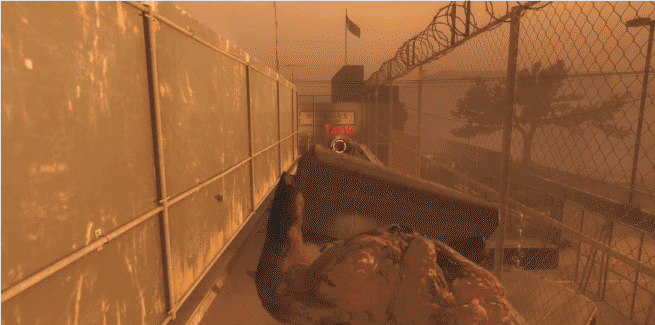
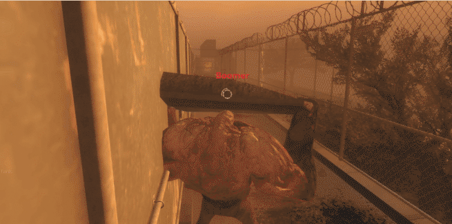

# Description | 內容
Prevent Tank rocks from killing another tank, witch or other S.I.

> __Note__ <br/>
This plugin is private, Please contact [me](https://github.com/fbef0102/Game-Private_Plugin#私人插件列表-private-plugins-list)<br/>
此為私人插件, 請聯繫[本人](https://github.com/fbef0102/Game-Private_Plugin#私人插件列表-private-plugins-list)

* Apply to | 適用於
	```
	L4D1
	L4D2
	```

* Image | 圖示
	| Before (裝此插件之前)  			| After (裝此插件之後) |
	| -------------|:-----------------:|
	| ||
	| ||
	| ||

* <details><summary>How does it work?</summary>

	* Prevent Tank rocks from killing another tank, witch or other S.I.
</details>

* Require | 必要安裝
	1. [collisionhook](https://github.com/fbef0102/Collisionhook/releases)

* <details><summary>ConVar | 指令</summary>

	* cfg/sourcemod/l4d_tank_rock_block_ff.cfg
		```php
		// 0=Plugin off, 1=Plugin on.
		l4d_tank_rock_block_ff_enable "1"

		// If 1, Tank rock won't kill smoker
		l4d_tank_rock_block_ff_smoker "1"

		// If 1, Tank rock won't kill boomer
		l4d_tank_rock_block_ff_boomer "1"

		// If 1, Tank rock won't kill hunter
		l4d_tank_rock_block_ff_hunter "1"

		// If 1, Tank rock won't kill spitter
		l4d_tank_rock_block_ff_spitter "1"

		// If 1, Tank rock won't kill jockey
		l4d_tank_rock_block_ff_jockey "1"

		// If 1, Tank rock won't kill charger
		l4d_tank_rock_block_ff_charger "1"

		// If 1, Tank rock won't kill tank
		l4d_tank_rock_block_ff_tank "1"

		// If 1, Tank rock won't kill witch
		l4d_tank_rock_block_ff_witch "1"
		```
</details>

* <details><summary>Changelog | 版本日誌</summary>

	* v1.0 (2025-7-2)
		* Initial Release
</details>

- - - -
# 中文說明
避免Tank的石頭砸死另一個Tank、Witch、特感

* 原理
	* Tank的石頭不會砸死另一個Tank
	* Tank的石頭不會砸死Witch
	* Tank的石頭不會砸死特感

* <details><summary>指令中文介紹 (點我展開)</summary>

	* cfg/sourcemod/l4d_tank_rock_block_ff.cfg
		```php
		// 0=關閉插件, 1=啟動插件
		l4d_tank_rock_block_ff_enable "1"

		// 為1時，Tank的石頭不會砸死Smoker
		l4d_tank_rock_block_ff_smoker "1"

		// 為1時，Tank的石頭不會砸死Boomer
		l4d_tank_rock_block_ff_boomer "1"

		// 為1時，Tank的石頭不會砸死Hunter
		l4d_tank_rock_block_ff_hunter "1"

		// 為1時，Tank的石頭不會砸死Spitter
		l4d_tank_rock_block_ff_spitter "1"

		// 為1時，Tank的石頭不會砸死Jockey
		l4d_tank_rock_block_ff_jockey "1"

		// 為1時，Tank的石頭不會砸死Charger
		l4d_tank_rock_block_ff_charger "1"

		// 為1時，Tank的石頭不會砸死Tank
		l4d_tank_rock_block_ff_tank "1"

		// 為1時，Tank的石頭不會砸死Witch
		l4d_tank_rock_block_ff_witch "1"
		```
</details>

