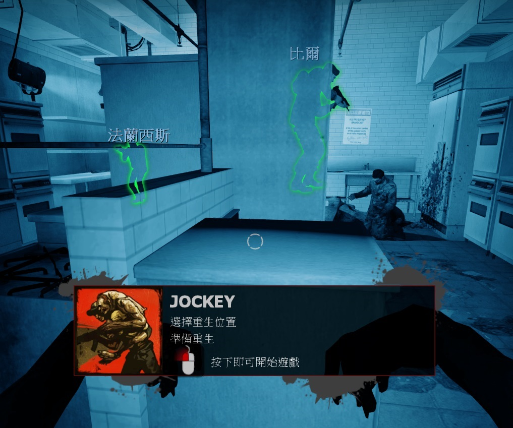
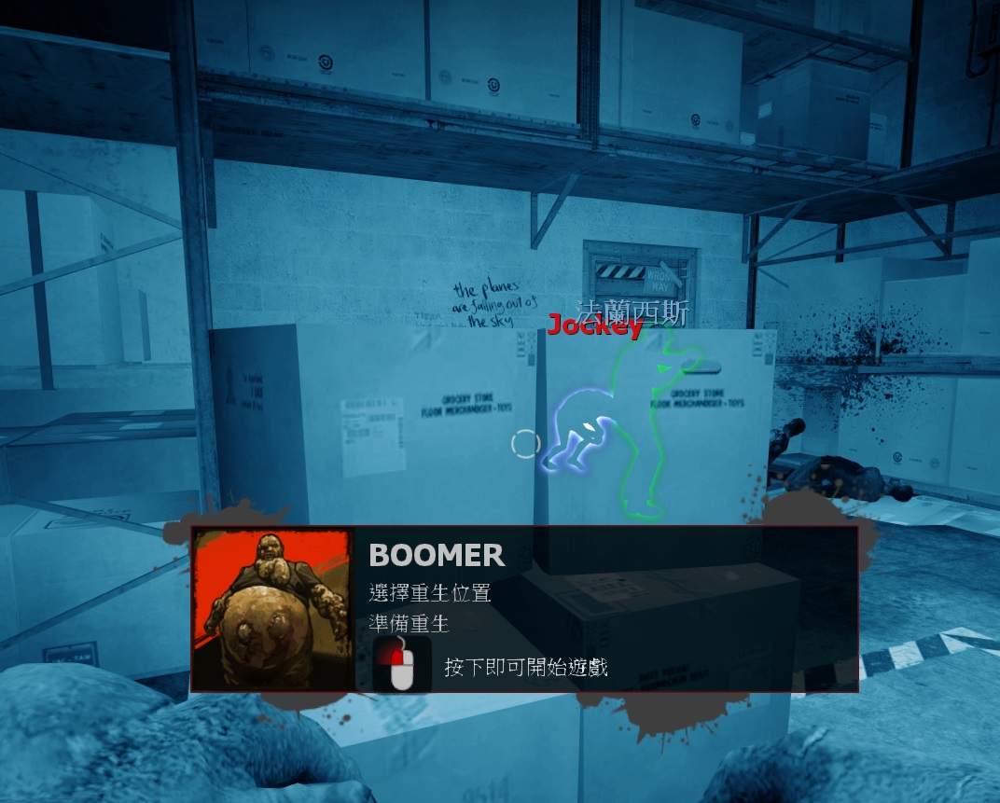

# Description | 內容
Changes to conditions for ghost spawning in start/end areas.

> __Note__ <br/>
This plugin is private, Please contact [me](https://github.com/fbef0102/Game-Private_Plugin#私人插件列表-private-plugins-list)<br/>
此為私人插件, 請聯繫[本人](https://github.com/fbef0102/Game-Private_Plugin#私人插件列表-private-plugins-list)

* Apply to | 適用於
	```
	L4D1 versus
	L4D2 versus
	```

* Image | 圖示
	* Allow to spawn in start saferoom (起始安全室內復活)
	<br/>
	* Allow to spawn in end saferoom (終點安全室內復活)
	<br/>

* <details><summary>How does it work?</summary>

	* Allow to spawn in start saferoom after first survivor has left the saferoom
	* Allow to spawn in end saferoom
</details>

* Require | 必要安裝
	1. [left4dhooks](https://forums.alliedmods.net/showthread.php?t=321696)
	2. [[INC] Multi Colors](https://github.com/fbef0102/L4D1_2-Plugins/releases/tag/Multi-Colors)

* <details><summary>ConVar | 指令</summary>

	* cfg/sourcemod/l4d_ghost_checkpoint_spawn.cfg
		```php
		// 0=Plugin off, 1=Plugin on.
		l4d_ghost_checkpoint_spawn_enable "1"

		// Changes how message displays. (0: Disable, 1:In chat, 2: In Hint Box, 3: In center text)
		l4d_ghost_checkpoint_spawn_announce_type "1"

		// When to allow ghost to spawn in start saferoom even if not all survivors leave?
		// 0=Game default
		// 1: First survivor leaves safe area
		// 2: After tank spawn
		// 3: While tank alive
		l4d_ghost_checkpoint_spawn_in_start "1"

		// When to allow ghost to spawn in end saferoom?
		// 0=Game default
		// 1: First survivor leaves safe area
		// 2: After tank spawn
		// 3: While tank alive
		l4d_ghost_checkpoint_spawn_in_end "1"
		```
</details>

* <details><summary>Changelog | 版本日誌</summary>

	* v1.1h (2023-5-22)
		* Update for l4d2 2.2.2.7 version

	* v1.0h (2022-11-27)
		* Auto generate cfg
		* Allow to spawn after tank has spawned

	* v1.1
	    * [Original Plugin By jensewe](https://github.com/Target5150/MoYu_Server_Stupid_Plugins/tree/master/The%20Last%20Stand/l4d_ghost_checkpoint_spawn)
</details>

- - - -
# 中文說明
靈魂特感能夠在安全室內復活

* 原理
	* (裝此插件之前) 在一代官方對抗模式中，靈魂特感永遠不能在安全室內復活
	* (裝此插件之前) 在二代官方對抗模式中，有倖存者尚未離開安全室，靈魂特感永遠不能在起始安全室內復活
	* (裝此插件之後) 只要有第一位倖存者離開安全室，靈魂特感可以在安全室內復活

* <details><summary>ConVar | 指令</summary>

	* cfg/sourcemod/l4d_ghost_checkpoint_spawn.cfg
	```php
	// 0=關閉插件, 1=啟動插件
	l4d_ghost_checkpoint_spawn_enable "1"

	// 提示該如何顯示. (0: 不提示, 1: 聊天框, 2: 黑底白字框, 3: 螢幕正中間)
	l4d_ghost_checkpoint_spawn_announce_type "1"

	// 靈魂特感何時可以在起始安全室內復活?
	// 0=遊戲預設 (所有倖存者離開後)
	// 1=第一位倖存者離開安全室之後
	// 2=Tank復活之後
	// 3=只有當Tank在場上時
	l4d_ghost_checkpoint_spawn_in_start "1"

	// 靈魂特感何時可以在終點安全室內復活?
	// 0=遊戲預設 (永遠不能復活)
	// 1=第一位倖存者離開安全室之後
	// 2=Tank復活之後
	// 3=只有當Tank在場上時
	l4d_ghost_checkpoint_spawn_in_end "1"
	```
</details>
