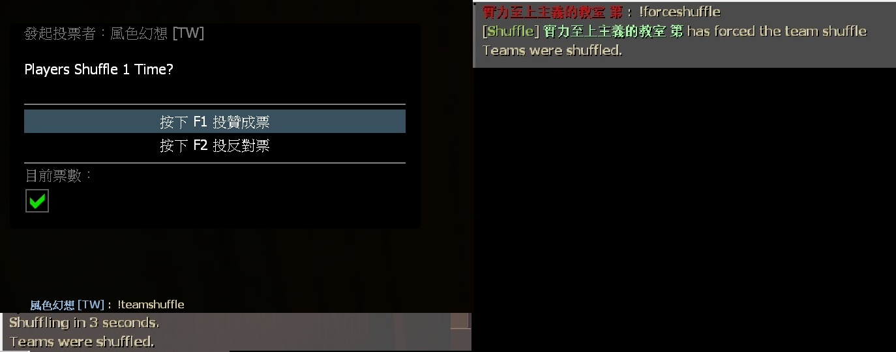

# Description | 內容
Allows teamshuffles by voting or admin-forced before round starts.

> __Note__ <br/>
This plugin is private, Please contact [me](https://github.com/fbef0102/Game-Private_Plugin#私人插件列表-private-plugins-list)<br/>
此為私人插件, 請聯繫[本人](https://github.com/fbef0102/Game-Private_Plugin#私人插件列表-private-plugins-list)

* Apply to | 適用於
	```
	L4D1 versus
	L4D2 versus
	```

* Image | 圖示
	<br/>

* <details><summary>How does it work?</summary>

	* In Versus -> Type ```!shuffle``` -> shuffle all players and distribute team automatically
	* Shuffle before game starts
</details>

* Require | 必要安裝
	1. [left4dhooks](https://forums.alliedmods.net/showthread.php?t=321696)
	2. [[INC] Multi Colors](https://github.com/fbef0102/L4D1_2-Plugins/releases/tag/Multi-Colors)

* <details><summary>Command | 命令</summary>

	* **Vote for a team shuffle. <number> = numbers of time to shuffle**
		```php
		sm_shuffle <number>
		sm_teamshuffle <number>
		```

	* **Force to Shuffle the teams. <number> = numbers of time to shuffle (Adm Required: ADMFLAG_ROOT)**
		```php
		sm_forceshuffle
		sm_forceteamshuffle
		```
</details>

* <details><summary>Related Plugin | 相關插件</summary>

	1. [readyup](/L4D_插件/Server_伺服器/readyup): Ready Plugin
		* 所有玩家準備才能開始遊戲的插件
	2. [l4d_mix](https://github.com/fbef0102/L4D1_2-Plugins/tree/master/l4d_mix): L4D1/2 Mix
		* 對抗模式中，投票選雙方隊長，雙方隊長再選隊員
</details>

* <details><summary>Changelog | 版本日誌</summary>

	* v1.1h (2025-5-26)
		* Use builtin-votes

	* v1.0h (2024-3-17)
		* Require lef4dhooks
		* Remake code, convert code to latest syntax
		* Fix warnings when compiling on SourceMod 1.11.
		* Optimize code and improve performance

	* v1.0
		* [Original Plugin by Tabun](https://github.com/Tabbernaut/L4D2-Plugins/tree/master/teamshuffle)
</details>

- - - -
# 中文說明
輸入!shuffle，打散玩家並隨機分配隊伍

* 原理
	* 雙方隊伍輸入```!shuffle``` -> 打散玩家並重新分配隊伍
	* 支援Readyup插件
	* 只限回合開始前使用

* 用意在哪？
	* 對抗模式不知道怎麼分配玩家時可以使用這個插件
	* 避免每次都是那幾個人同一個隊伍，增加隊伍多樣性

* <details><summary>指令中文介紹 (點我展開)</summary>

	* **開啟shuffle打散玩家並隨機分配隊伍, <數字> 指的是洗牌次數**
		```php
		sm_shuffle <數字>
		sm_teamshuffle <數字>
		```

	* **強制shuffle啟動, <數字> 指的是洗牌次數 (權限: ADMFLAG_ROOT)**
		```php
		sm_forceshuffle <數字>
		sm_forceteamshuffle <數字>
		```
</details>
