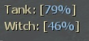
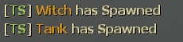

# Description | 內容
Sets a tank and witch spawn point based on the percentage of passing the map in versus mode

> __Note__ <br/>
This plugin is private, Please contact [me](/#私人插件列表-private-plugins-list)<br/>
此為私人插件, 請聯繫[本人](/#私人插件列表-private-plugins-list)

* Apply to | 適用於
	```
	L4D1 versus
	L4D2 versus
	```

* Image | 圖示
	<br/>
	<br/>

* <details><summary>How does it work?</summary>

	* Control Versus director, Boss (Tank or Witch) will be spawned when the furthest survivor reach a percentage of map
		* For example
			```php
			// When furthest survivor reach 79% of map completion, the Tank will be spawned.
			// Same algorithm for Witch.
			Tank spawn: 79%,
			Witch spawn: 70%
			```
		* Spawn only one tank and one witch each round
	* Does not affect boss static spawn by map, for example: C6M1/C13M2/C7M1
	* 🟥 Please write down the following official cvars in ```cfg/server.cfg```
		```php
		// Adjust tank spawns: 100% chance on every map (0.00 ~ 1.00)
		sm_cvar versus_tank_chance_intro 		"1" //first map (1=Spawn Tank, 0=Disable Spawn)
		sm_cvar versus_tank_chance 				"1" //regular map (1=Spawn Tank, 0=Disable Spawn)
		sm_cvar versus_tank_chance_finale 		"1" //final map (1=Spawn Tank, 0=Disable Spawn)

		// Adjust witch spawns: 100% chance on every map (0.00 ~ 1.00)
		sm_cvar versus_witch_chance_intro 		"1" //first map (1=Spawn Witch, 0=Disable Spawn)
		sm_cvar versus_witch_chance 			"1" //regular map (1=Spawn Witch, 0=Disable Spawn)
		sm_cvar versus_witch_chance_finale 		"1" //final map (1=Spawn Witch, 0=Disable Spawn)

		// Adjust tank/witch spawn range percentage
		sm_cvar versus_boss_flow_min_intro 		"0.20" //first map min (range: 0.00~1.00, 0.20=20% percentage)
		sm_cvar versus_boss_flow_max_intro 		"0.85" //first map max (range: 0.00~1.00, 0.85=85% percentage)

		sm_cvar versus_boss_flow_min 			"0.25" //regular map min (range: 0.00~1.00, 0.20=20% percentage)
		sm_cvar versus_boss_flow_max 			"0.85" //regular map max (range: 0.00~1.00, 0.85=85% percentage)

		sm_cvar versus_boss_flow_min_finale 	"0.20" //final map min (range: 0.00~1.00, 0.20=20% percentage)
		sm_cvar versus_boss_flow_max_finale 	"0.85" //final map max (range: 0.00~1.00, 0.85=85% percentage)
		```
	* Does not affect boss static spawn by map, for example: C6M1/C13M2/C7M1
	* To control witch/tank spawn in each map, modify file: [data/mapinfo.txt](data/mapinfo.txt)
</details>

* Require | 必要安裝
	1. [left4dhooks](https://forums.alliedmods.net/showthread.php?t=321696)
	2. [[INC] Multi Colors](https://github.com/fbef0102/L4D1_2-Plugins/releases/tag/Multi-Colors)
	3. [builtinvotes](https://github.com/fbef0102/builtinvotes/releases)

* <details><summary>Support | 支援插件</summary>

	1. [readyup](/L4D_插件/Server_伺服器/readyup): Display Tank/Witch percentage on readyup panel
		* 在Readyup的面板上預先顯示這回合Tank與Witch的生成路程
</details>

* <details><summary>ConVar | 指令</summary>

	* cfg/sourcemod/versusbosses_ifier.cfg
		```php
		// If 1, Allow for Easy Setup of the Boss Spawns (!voteboss)
		l4d_versus_boss_vote_enable "1"

		// How many players at least to vote Boss Spawns.
		l4d_versus_boss_vote_need_player "4"

		// 1=Enables tanks to spawn, 0=Disable All Tank Spawn
		l4d_versus_boss_tank_can_spawn "1"

		// 1=Enables witches to spawn, 0=Disable All Witch Spawn
		l4d_versus_boss_witch_can_spawn "1"

		// Minimum flow amount witches should avoid tank spawns by, by half the value given on either side of the tank spawn
		l4d_versus_boss_avoid_tank_spawn "10"

		// 1=Display boss percentages to entire team when using commands, 0=Display boss percentages to user only team when using commands
		l4d_versus_boss_global_percent "1"

		// Display which message? Add numbers together
		// 1=Tank has spawned, 2=Witch has spawned, 4=Tank flow percentage, 8=Witch flow percentage
		l4d_versus_boss_chat_flag "15"
		```
</details>

* <details><summary>Command | 命令</summary>

	* **force witch spawn percent before leaving saferoom (Adm required: ADMFLAG_BAN)**
		```php
		sm_setwitch <number>
		sm_fwitch <number>
		```

	* **force tank spawn percent before leaving saferoom (Adm required: ADMFLAG_BAN)**
		```php
		sm_settank <number>
		sm_ftank <number>
		```

	* **Display Spawn percent for boss**
		```php
		sm_boss
		sm_tank
		sm_witch
		sm_t
		```

	* **Let's vote to set those Boss Spawns!**
		```php
		sm_voteboss	<tank> <witch>
		sm_bossvote <tank> <witch>
		```
</details>

* <details><summary>API | 串接</summary>

	* [versusbosses_ifier.inc](scripting/include/versusbosses_ifier.inc)
		```php
		library name: versusbosses_ifier
		```
</details>

* Translation Support | 支援翻譯
	```
	translations/versusbosses_ifier.phrases.txt
	```

* <details><summary>Related | 相關插件</summary>

	1. [coopbosses_ifier](/L4D_插件/Coop_戰役模式/coopbosses_ifier): Sets a tank and witch spawn point on every map in coop mode
		* 戰役模式下每一張地圖挑選隨機路程生成一隻Tank與一個Witch

	2. [l4d_current_survivor_progress](https://github.com/fbef0102/L4D1_2-Plugins/tree/master/l4d_current_survivor_progress): Print survivor progress in flow percents
		* 使用指令顯示人類目前的路程

	3. [l4d_tank_spawn](/L4D_插件/Tank_坦克/l4d_tank_spawn): Spawn multi Tanks on the map and final rescue
		* 一個關卡中或救援期間生成多隻Tank，對抗模式也適用

	4. [l4d_witch_spawn](/L4D_插件/Witch_女巫/l4d_witch_spawn): Spawn lots of witches on the map
		* 遊戲開始後每隔一段時間在地圖上生成Witch
</details>

* <details><summary>Changelog | 版本日誌</summary>

	* v1.8h (2025-5-14)
		* Support readyup panel

	* v1.7h (2024-10-6)
		* Update cvars
		* Update data

	* v1.6h (2024-5-26)
		* Update API and inc
		* Support Translation 
		* Update cvars

	* v1.5h (2023-6-20)
		* Require left4dhooks v1.33 or above

	* v1.4h (2023-2-11)
		* Fix plugin does not work if there is no any start safe area in some custom maps
		* Makes Versus Boss Spawns obey cvars

	* v1.3
		* Initial Release
</details>

- - - -
# 中文說明
對抗模式下每一張地圖挑選隨機路程生成一隻Tank與一個Witch

* 原理
	* 此插件控制導演系統，決定何時生成Tank與Witch
		* 假設75%生成Tank，當人類路程走到75%路程，生成一個Tank
		* 假設70%生成Witch，當人類路程走到70%路程，生成一個Witch
			```php
			Tank spawn: 75%,
			Witch spawn: 70%
			```
		* 由官方指令決定每一關的Tank與Witch生成範圍
		* 每回合只會生成一隻Tank與Witch
	* 不影響有固定刷Tank/Witch的地圖，譬如C6M1/C13M2/C7M1
	* 🟥 請務必將以下指令寫入文件 ```cfg/server.cfg```，可自行調整
		```php
		// 對抗模式下每張地圖100%生成Tank (0.00 ~ 1.00)
		sm_cvar versus_tank_chance_intro 		"1" //第一關 (1=生成, 0=不生成)
		sm_cvar versus_tank_chance 				"1" //普通關卡 (1=生成, 0=不生成)
		sm_cvar versus_tank_chance_finale 		"1" //最後一關 (1=生成, 0=不生成)

		// 對抗模式下每張關卡100%生成Witch (0.00 ~ 1.00)
		sm_cvar versus_witch_chance_intro 		"1" //第一關 (1=生成, 0=不生成)
		sm_cvar versus_witch_chance 			"1" //普通關卡 (1=生成, 0=不生成)
		sm_cvar versus_witch_chance_finale 		"1" //最後一關 (1=生成, 0=不生成)

		// 對抗模式下決定關卡的Tank/Witch生成路程範圍
		sm_cvar versus_boss_flow_min_intro 		"0.25" //第一關最短 (數值範圍: 0.00~1.00, 0.25代表25%路程)
		sm_cvar versus_boss_flow_max_intro 		"0.85" //第一關最遠 (數值範圍: 0.00~1.00, 0.85代表85%路程)

		sm_cvar versus_boss_flow_min 			"0.25" //普通關卡最短 (數值範圍: 0.00~1.00, 0.25代表25%路程)
		sm_cvar versus_boss_flow_max 			"0.85" //普通關卡最遠 (數值範圍: 0.00~1.00, 0.85代表85%路程)

		sm_cvar versus_boss_flow_min_finale 	"0.25" //最後一關最短 (數值範圍: 0.00~1.00, 0.25代表25%路程)
		sm_cvar versus_boss_flow_max_finale 	"0.85" //最後一關最遠 (數值範圍: 0.00~1.00, 0.85代表85%路程)
		```
	* 若想要控制每張地圖的 tank/witch 生成，請修改文件: [data/mapinfo.txt](data/mapinfo.txt)

* <details><summary>指令中文介紹 (點我展開)</summary>

	* cfg/sourcemod/versusbosses_ifier.cfg
		```php
		// If 1, 允許玩家打 !voteboss 發起投票決定Tank/Witch 路程
		l4d_versus_boss_vote_enable "1"

		// 發起!voteboss投票所需的玩家數量 
		l4d_versus_boss_vote_need_player "4"

		// 1=允許生成tank, 0=禁止任何tank生成
		l4d_versus_boss_tank_can_spawn "1"

		// 1=允許生成witch, 0=禁止任何witch生成
		l4d_versus_boss_witch_can_spawn "1"

		// Tank 附近前後5% (10除以2) 避開生成witch
		l4d_versus_boss_avoid_tank_spawn "10"

		// 使用指令打印該回合 Tank/Witch 路程時 1=顯示給跟你相同的隊伍所有人, 0=只顯示給自己看
		l4d_versus_boss_global_percent "1"

		// 顯示以下哪些訊息給玩家看? 請將數字相加
		// 1=Tank已復活, 2=Witch已復活, 4=Tank路程, 8=Witch路程
		l4d_versus_boss_chat_flag "15"
		```
</details>

* <details><summary>命令中文介紹 (點我展開)</summary>

	* **管理員決定 witch 路程，請在出去安全室之前決定好 (權限：ADMFLAG_BAN)**
		```php
		sm_setwitch <數字>
		```

	* **管理員決定 tank 路程，請在出去安全室之前決定好 (權限：ADMFLAG_BAN)**
		```php
		sm_settank <數字>
		```

	* **打印該回合 Tank/Witch 路程**
		```php
		sm_boss
		sm_tank
		sm_witch
		sm_t
		```
		
	* **投票決定Tank/Witch的路程 ，請在出去安全室之前決定好**
		```php
		sm_voteboss <數字> <數字>
		sm_bossvote <數字> <數字>
		```
</details>
