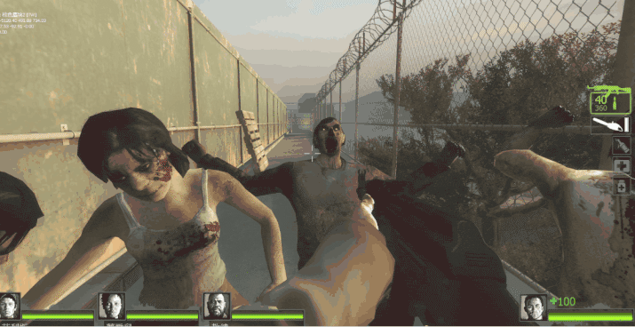
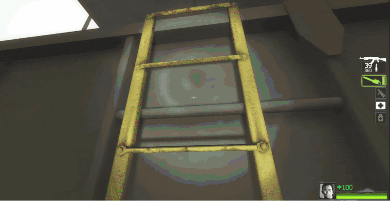
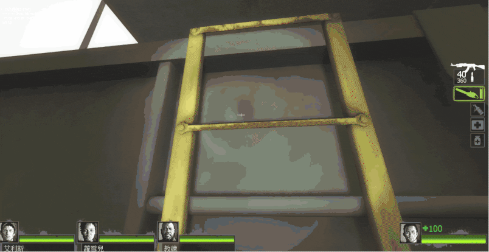

# Description | 內容
Reduce the start duration of chainsaw deploying animation

> __Note__ <br/>
This plugin is private, Please contact [me](https://github.com/fbef0102/Game-Private_Plugin#私人插件列表-private-plugins-list)<br/>
此為私人插件, 請聯繫[本人](https://github.com/fbef0102/Game-Private_Plugin#私人插件列表-private-plugins-list)

* Apply to | 適用於
    ```
    L4D2
    ```

* Image | 圖示
    | Before (裝此插件之前)  			| After (裝此插件之後) |
    | -------------|:-----------------:|
    | ||
    | ||
    | ||

* <details><summary>How does it work?</summary>

    * Reduce the start duration of chainsaw deploying animation
        * After pinned by S.I
        * After incap or hanging from ledge
        * After climbing the ladder
        * When switching current weapon to chainsaw
        * After tank punch
</details>

* Require | 必要安裝
    1. [left4dhooks](https://forums.alliedmods.net/showthread.php?t=321696)

* <details><summary>ConVar | 指令</summary>

    * cfg/sourcemod/l4d2_chainsaw_deploy_speed.cfg
        ```php
        // 0=Plugin off, 1=Plugin on.
        l4d2_chainsaw_deploy_speed_enable "1"

        // Deploy speed after pinned by S.I. or flung by a Charger impact [0.0~1.0]
        l4d2_chainsaw_deploy_speed_getup "0.0"

        // Deploy speed after incap or hanging from ledge [0.0~1.0]
        l4d2_chainsaw_deploy_speed_hanging_incap "0.6"

        // Deploy speed after climbing the ladder [0.0~1.0]
        l4d2_chainsaw_deploy_speed_ladder "0.6"

        // Deploy speed when switching current weapon to chainsaw [0.0~1.0]
        l4d2_chainsaw_deploy_speed_switch "0.6"

        // Deploy speed after tank punch [0.0~1.0]
        l4d2_chainsaw_deploy_speed_tank_punch "0.0"
        ```
</details>

* <details><summary>Related Official ConVar</summary>

	* You can write down the following cvars in ```cfg/server.cfg``` and modify value
		```php
        // Higher this value will make chainsaw attack hitbox wider but more randomizer (default: 30)
        // 30 mean hit angel
        sm_cvar chainsaw_attack_cone 30

        // Higher will make chainsaw attack hitbox gets farther (default: 50)
        sm_cvar chainsaw_attack_distance 50

        // chainsaw dps equal damage/interval = 1000
        // (default: 100/0.1)
        sm_cvar chainsaw_damage 100
        sm_cvar chainsaw_hit_interval 0.1

        // chainsaw fuel (default: 20)
        sm_cvar ammo_chainsaw_max 20
		```
</details>

* <details><summary>Changelog | 版本日誌</summary>

    * v1.0 (2025-6-19)
        * Initial Release
</details>

- - - -
# 中文說明
減少啟動電鋸的時間，能快速使用電鋸

* 原理
    * 減少啟動電鋸的時間，幫助倖存者快速使用電鋸
        * 解除被特感控制之後、被Charger撞飛之後
        * 倒地或掛邊之後
        * 爬梯之後
        * 武器切換電鋸之後
        * 被Tank揮拳拍飛之後

* <details><summary>指令中文介紹 (點我展開)</summary>

    * cfg/sourcemod/l4d2_chainsaw_deploy_speed.cfg
        ```php
        // 0=關閉插件, 1=啟動插件
        l4d2_chainsaw_deploy_speed_enable "1"

        // 啟動電鋸的時間 (解除被特感控制之後、被Charger撞飛之後) [0.0~1.0]
        l4d2_chainsaw_deploy_speed_getup "0.0"

        // 啟動電鋸的時間 (解除被特感控制之後、被Charger撞飛之後) [0.0~1.0]
        l4d2_chainsaw_deploy_speed_hanging_incap "0.6"

        // 啟動電鋸的時間 (爬梯之後) [0.0~1.0]
        l4d2_chainsaw_deploy_speed_ladder "0.6"

        // 啟動電鋸的時間 (武器切換) [0.0~1.0]
        l4d2_chainsaw_deploy_speed_switch "0.6"

        // 啟動電鋸的時間 (被Tank揮拳拍飛之後) [0.0~1.0]
        l4d2_chainsaw_deploy_speed_tank_punch "0.0"
        ```
</details>

* <details><summary>相關的官方指令中文介紹 (點我展開)</summary>

	* [膽汁瓶投擲物官方介紹](https://developer.valvesoftware.com/wiki/Vomitjar_projectile)
	* 可將以下指令寫在 ```cfg/server.cfg``` 並自行修改
		```php
        // 數值越大，電鋸攻擊判定的範圍越廣，但是隨機性 (預設: 30)
        // 舉例: 30=電鋸攻擊判定角度 
        sm_cvar chainsaw_attack_cone 30

        // 數值越大，電鋸攻擊判定的長 (預設: 50)
        sm_cvar chainsaw_attack_distance 50

        // 電鋸的傷害間隔 (預設: 每0.1秒造成100傷害)
        sm_cvar chainsaw_damage 100
        sm_cvar chainsaw_hit_interval 0.1

        // 電鋸的電量 (預設: 20)
        sm_cvar ammo_chainsaw_max 20
		```
</details>