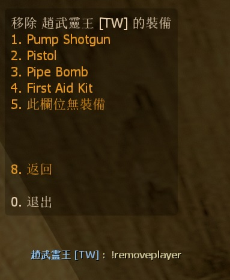

# Description | 內容
Admin can remove player's equipment

> __Note__ <br/>
This plugin is private, Please contact [me](/#私人插件列表-private-plugins-list)<br/>
此為私人插件, 請聯繫[本人](/#私人插件列表-private-plugins-list)

* Apply to | 適用於
    ```
    L4D1
    L4D2
    ```

* [Video | 影片展示](https://youtu.be/E90sBRLcKIM)

* <details><summary>Image</summary>

    <br/>
    <br/>
</details>

* <details><summary>How does it work?</summary>

	* Admin types ```!admin``` -> Player Commands -> Remove Player Equipment -> choose player -> remove weapon slot
    * Admin types ```!removeplayer``` -> choose player -> remove weapon slot
</details>

* Require | 必要安裝
    1. [left4dhooks](https://forums.alliedmods.net/showthread.php?t=321696)
	2. [[INC] Multi Colors](https://github.com/fbef0102/L4D1_2-Plugins/releases/tag/Multi-Colors)
    3. [[INC] l4d2_weapons](/L4D_插件/Require_檔案/scripting/include/l4d2_weapons.inc)

* <details><summary>ConVar | 指令</summary>

    * cfg/sourcemod/l4d_player_remove_equipment.cfg
        ```php
        // 0=Plugin off, 1=Plugin on.
        l4d_player_remove_equipment_enable "1"

        // Players with these flags have access to use command (Empty = Everyone, -1: Nobody)
        l4d_player_remove_equipment_command_flag "z"

        // If 1, Add 'Remove Player Equipment' item in admin menu under 'Player commands' category?
        l4d_player_remove_equipment_adminmenu "1"
        ```
</details>

* <details><summary>Command | 命令</summary>
    
    * **Open menu to choose player to remove equipment**
        ```php
        sm_removeplayer
        ```
</details>

* Translation Support | 支援翻譯
	```
	translations/l4d_player_remove_equipment.phrases.txt
	```

* <details><summary>Changelog | 版本日誌</summary>

    * v1.0 (2023-8-14)
	    * Initial Release
</details>

- - - -
# 中文說明
管理員可以移除任何玩家身上的裝備與武器

* 圖示
    <br/>

* 原理
    * 管理員輸入```!admin```-> 玩家指令 -> 移除玩家裝備 -> 選擇玩家 -> 移除玩家身上的武器或物品
    * 管理員輸入```!removeplayer``` -> 選擇玩家 -> 移除玩家身上的武器或物品

* <details><summary>指令中文介紹 (點我展開)</summary>

    * cfg/sourcemod/l4d_player_remove_equipment.cfg
        ```php
        // 0=關閉插件, 1=啟動插件
        l4d_player_remove_equipment_enable "1"

        // 擁有這些權限的玩家，才可以輸入!removeplayer (留白 = 任何人都能, -1: 無人)
        l4d_player_remove_equipment_command_flag "z"

        // 為1時，在管理員介面的＂玩家指令＂下新增'移除玩家裝備'
        l4d_player_remove_equipment_adminmenu "1"
        ```
</details>