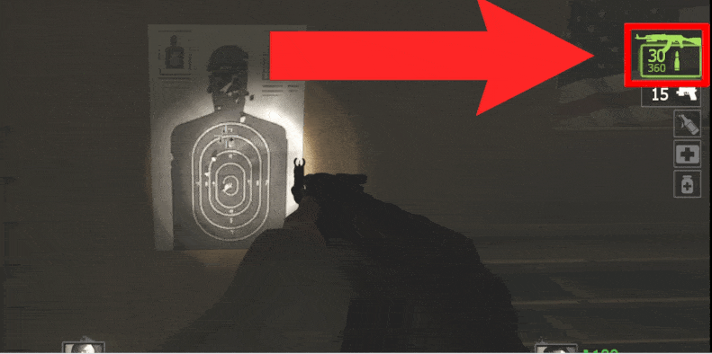

# Description | 內容
Block specific music or song from playing to clients

> __Note__ <br/>
This plugin is private, Please contact [me](https://github.com/fbef0102/Game-Private_Plugin#私人插件列表-private-plugins-list)<br/>
此為私人插件, 請聯繫[本人](https://github.com/fbef0102/Game-Private_Plugin#私人插件列表-private-plugins-list)

* Image | 圖示
	| Before (裝此插件之前)  			| After (裝此插件之後) |
	| -------------|:-----------------:|
	| ||

* Apply to | 適用於
	```
	L4D1
	L4D2
	```

* <details><summary>How does it work?</summary>

	* When you reload weapon, abandon the magazine
	* For example, Reload Ak47: 30/360
		* (Original) -> 0/390 -> 40/350
		* (After) -> 0/360 -> 40/320
</details>

* Require | 必要安裝
<br/>None

* <details><summary>ConVar | 指令</summary>

	* cfg/sourcemod/l4d_weapon_clear_reload.cfg
		```php
		// 0=off plugin, 1=on plugin
		l4d_weapon_clear_reload_allow "1"
		```
</details>

* <details><summary>Changelog | 版本日誌</summary>

	* v1.0 (2025-2-15)
		* Initial Release
</details>

- - - -
# 中文說明
武器裝彈時放棄彈夾內的所有子彈

* 原理
	* 譬如裝一個AK47武器: 30/360
		* (裝此插件之前) -> 0/390 -> 40/350
		* (裝此插件之後) -> 0/360 -> 40/320

* <details><summary>指令中文介紹 (點我展開)</summary>

	* cfg/sourcemod/l4d_weapon_clear_reload.cfg
		```php
		// 0=關閉插件, 1=啟動插件
		l4d_weapon_clear_reload_allow "1"
		```
</details>