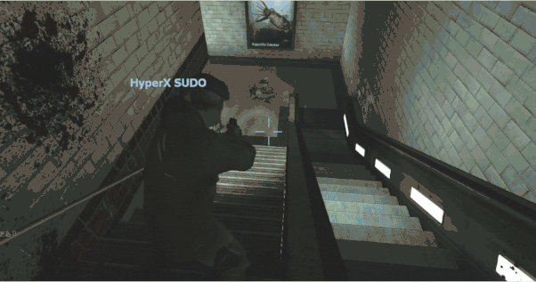
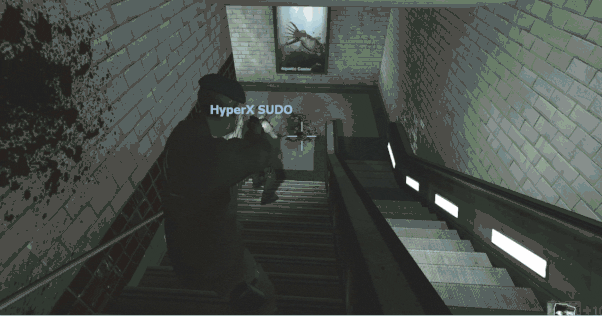
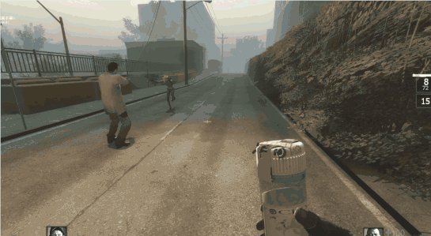
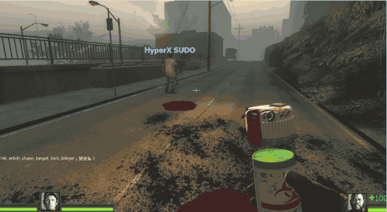
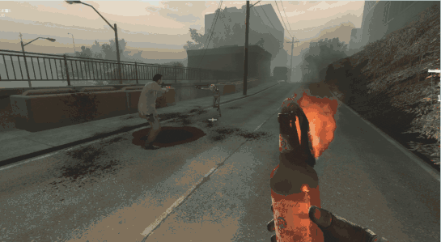
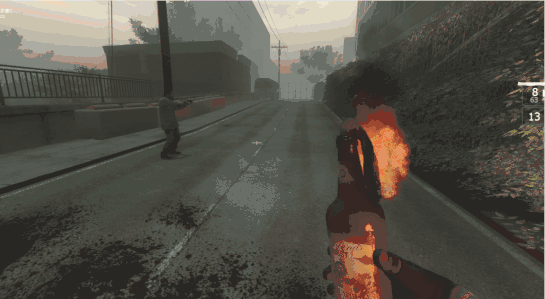

# Description | 內容
The witch will never change the initial target no matter other survivors block her path, burn her or throw bile jar

> __Note__ <br/>
This plugin is private, Please contact [me](/#私人插件列表-private-plugins-list)<br/>
此為私人插件, 請聯繫[本人](/#私人插件列表-private-plugins-list)

* Apply to | 適用於
    ```
    L4D1
    L4D2
    ```

* [Video | 影片展示](https://youtu.be/N9yWndpvArg)

* Image | 圖示
	| Before (裝此插件之前)  			| After (裝此插件之後) |
	| -------------|:-----------------:|
	| ||
	| ||
	| ||

* <details><summary>How does it work?</summary>

  * Witch only chases the target who startles her at first.
	* Witch won't change target if anyone blocks her path (still get stagger)
		* This also fixes the issue witch sometimes changes target to attack special infected
  	* Witch won't change target if other survivors throw bile jar at her
	* Witch won't change target if other survivors try to burn her
  * After witch kills her initial target, witch can chase new target if anyone burns her or throw bile jar at her
</details>

* Require | 必要安裝
	1. [l4d_fix_target_replace](https://github.com/Target5150/MoYu_Server_Stupid_Plugins/tree/master/The%20Last%20Stand/l4d_fix_target_replace)
	2. [actions](https://forums.alliedmods.net/showthread.php?t=336374)
	3. [l4d_change_witch_victim](https://github.com/Target5150/MoYu_Server_Stupid_Plugins/tree/master/The%20Last%20Stand/l4d_change_witch_victim)

* <details><summary>Support | 支援插件</summary>

	1. [l4d_witch_follow_kill_everyone](/L4D_%E6%8F%92%E4%BB%B6/Witch_%E5%A5%B3%E5%B7%AB/l4d_witch_follow_kill_everyone): If install both plugins, witch kills the initial target first, then go for other survivors
		* 如果兩個插件同時裝, Witch會優先殺死原始目標, 之後開始攻擊其他人
</details>

* <details><summary>ConVar | 指令</summary>

	* cfg/sourcemod/l4d_witch_chase_target_lock.cfg
		```php
		// 0=Plugin off, 1=Plugin on.
		l4d_witch_chase_target_lock_enable "1"

		// If 1, witch won't change target if other survivors throw bile jar at her
		l4d_witch_chase_target_lock_bilejar "1"

		// If 1, witch won't change target if other survivors try to burn her
		l4d_witch_chase_target_lock_burn "1"

		// If 1, witch won't change target if anyone blocks her path (still get stagger)
		// Override official cvar "z_witch_allow_change_victim"
		// This also fixes the issue witch sometimes changes target to attack special infected
		l4d_witch_chase_target_lock_path "1"
		```
</details>

* <details><summary>Changelog | 版本日誌</summary>

	* v1.1 (2026-5-13)
		* Add more functions to prevent witch from changing target
		* Update cvars

	* v1.0 (2023-8-1)
		* Initial Release
</details>

- - - -
# 中文說明
Witch永遠不會改變目標，不管多少人阻擋Witch的路、燒Witch、丟膽汁瓶

* 原理
	* Witch只會追第一個驚嚇她的人
	* Witch在追逐的路上，Witch永遠不會改變目標
		* 不管多少個倖存者阻擋她的路，Witch不會改變目標 (但依然會被震退)
			* 修復Witch轉移目標攻擊特感
		* 不管倖存者扔膽汁瓶在她身上，Witch不會改變目標
		* 不管倖存者如何用火燒她，Witch不會改變目標
	* Witch在殺死第一個驚嚇她的人之後，其他人燒她或是扔膽汁時會開始追逐新的目標

* <details><summary>指令中文介紹 (點我展開)</summary>

	* cfg/sourcemod/l4d_witch_chase_target_lock.cfg
		```php
		// 0=關閉插件, 1=啟動插件
		l4d_witch_chase_target_lock_enable "1"

		// 為1時，不管倖存者丟膽汁瓶在她身上，Witch不會改變目標
		l4d_witch_chase_target_lock_bilejar "1"

		// 為1時，不管倖存者如何用火燒她，Witch不會改變目標
		l4d_witch_chase_target_lock_burn "1"

		// 為1時，不管多少個倖存者阻擋她的路，Witch不會改變目標 (但依然會被震退)
		// 覆蓋官方指令 "_witch_allow_change_victim"
		// 順便修復Witch轉移目標攻擊特感
		l4d_witch_chase_target_lock_path "1"
		```
</details>