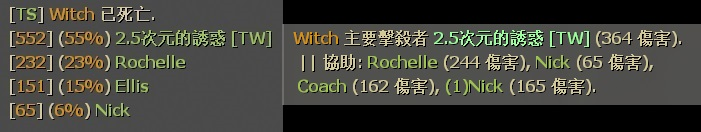
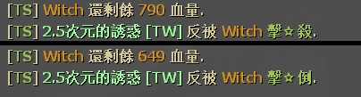

# Description | 內容
Displays how much damage done to witch on witch death + display health remaining when witch kills or incaps the survivor.

> __Note__ <br/>
This plugin is private, Please contact [me](/#私人插件列表-private-plugins-list)<br/>
此為私人插件, 請聯繫[本人](/#私人插件列表-private-plugins-list)

* Apply to | 適用於
	```
	L4D1
	L4D2
	```

* Image | 圖示
<br/>
<br/>

* <details><summary>How does it work?</summary>

	* Display statistics on witch death.
	* Display health remaining when witch kills or incaps the survivor.
</details>

* Require | 必要安裝
	1. [[INC] Multi Colors](https://github.com/fbef0102/L4D1_2-Plugins/releases/tag/Multi-Colors)

* <details><summary>ConVar | 指令</summary>

	* cfg/sourcemod/l4d_witch_dmg_report.cfg
		```php
		// 0=Plugin off, 1=Plugin on.
		l4d_witch_dmg_report_enable "1"

		// If 1, display witch health remaining when witch incaps the survivor.
		l4d_witch_dmg_report_incap "1"

		// If 1, display witch health remaining when witch kills the survivor.
		l4d_witch_dmg_report_kill "1"

		// Witch damage report type, 0=Stats report, dmg+percentage, 1=Assist report, dmg only
		l4d_witch_dmg_report_display_type "0"

		// How many players displayed in each line of damage report
		l4d_witch_dmg_report_display_num "1"
		```
</details>

* Translation Support | 支援翻譯
	```
	translations/l4d_witch_dmg_report.phrases.txt
	```

* <details><summary>Related Plugin | 相關插件</summary>

	1. [l4d2_assist](https://github.com/fbef0102/L4D1_2-Plugins/tree/master/l4d2_assist): Show damage done to S.I. by survivors
		> 每個特感死亡時顯示對特感傷害統計表

	2. [l4d_tank_dmg_report](/L4D_插件/Tank_坦克/l4d_tank_dmg_report): Displays how much damage done to tank + rock/punch/hittable from tank statistics on tank death.
		> Tank死亡時，顯示對Tank造成傷害統計表 + 顯示受到的 拳頭/石頭/車子 統計
</details>

* <details><summary>Changelog | 版本日誌</summary>

	* v1.1 (2024-12-3)
		* Update cvars
		* Update translation

	* v1.0 (2024-11-26)
		* Initial Release
</details>

- - - -
# 中文說明
Witch死亡時，顯示對Witch造成傷害統計表 + Witch抓傷或抓死人時，顯示剩餘血量

* 圖示
<br/>
<br/>

* 原理
	* Witch死亡時，顯示對Witch造成傷害統計表
	* Witch抓傷或抓死人時，顯示剩餘血量
	* 支援多隻Witch

* <details><summary>指令中文介紹 (點我展開)</summary>

	* cfg/sourcemod/l4d_witch_dmg_report.cfg
		```php
		// 0=關閉插件, 1=啟動插件
		l4d_witch_dmg_report_enable "1"

		// 為1時，Witch抓傷人時，顯示剩餘血量
		l4d_witch_dmg_report_incap "1"

		// 為1時，Witch抓死人時，顯示剩餘血量
		l4d_witch_dmg_report_kill "1"

		// 顯示哪一種傷害統計表, 0=統計報告, 傷害+百分比, 1=協助擊殺報告, 只顯示傷害
		l4d_witch_dmg_report_display_type "0"

		// 報告表當中, 每一行顯示多少玩家? (用於多人房，倖存者數量太多顯示不完)
		l4d_witch_dmg_report_display_num "1"
		```
</details>