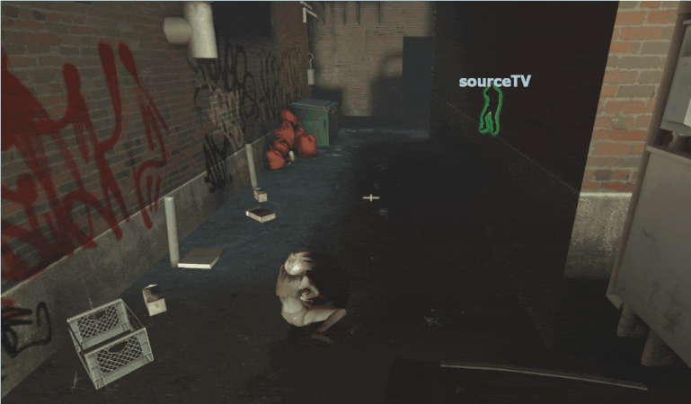

# Description | 內容
Witch will chase another survivor after the witch incapacitates or kills victim + witch auto follows survivors

> __Note__ <br/>
This plugin is private, Please contact [me](/#私人插件列表-private-plugins-list)<br/>
此為私人插件, 請聯繫[本人](/#私人插件列表-private-plugins-list)

* Apply to | 適用於
    ```
    L4D1
    L4D2
    ```

* [Video | 影片展示](https://youtu.be/VwX01Uwxi4c)

* Image | 圖示
    <br/>
    <br/>

* <details><summary>How does it work?</summary>

    * Witch is allowed to chase another target after she incapacitates a survivor. 
    * Witch is allowed to chase another target after she kills a survivor. 
    * Witch will follow survivor if within the range where witch can see
</details>

* Require | 必要安裝
    1. [Actions](https://forums.alliedmods.net/showthread.php?t=336374)
    2. [l4d_change_witch_victim](https://github.com/Target5150/MoYu_Server_Stupid_Plugins/tree/master/The%20Last%20Stand/l4d_change_witch_victim)
    3. [l4d_fix_target_replace](https://github.com/Target5150/MoYu_Server_Stupid_Plugins/tree/master/The%20Last%20Stand/l4d_fix_target_replace)

* <details><summary>Support | 支援插件</summary>

    1. [l4d_witch_target_forever](/L4D_插件/Witch_女巫/l4d_witch_target_forever): If install both plugins, the witch's priority option is to kill her initial target first and then change target
        * 如果兩個插件同時裝, Witch會優先攻擊並殺死原始目標, 之後才會改變目標
    2. [Witch fixes](https://forums.alliedmods.net/showthread.php?t=315481): 4 witch fix plugins By Lux, no conflict with this plugin
        * 四個修復Witch的插件可以裝, 不會跟此插件有衝突
</details>

* <details><summary>ConVar | 指令</summary>

    * cfg/sourcemod/l4d_witch_follow_kill_everyone.cfg
        ```php
        // 1=Plugin On. 0=Plugin Off
        l4d_witch_follow_kill_everyone_on "1"

        // Chance the witch will chase another target after she incapacitates a survivor. [0-100]
        l4d_witch_follow_kill_everyone_incap_chance "100"

        // Chance the witch will chase another target after she kills a survivor. [0-100]
        l4d_witch_follow_kill_everyone_kill_chance "100"

        // Add witch health if she is allowed to chase another target after she incapacitates a survivor. (0=Off)
        l4d_witch_follow_kill_everyone_incap_health_add "100"

        // Add witch health if she is allowed to chase another target after she kills a survivor. (0=Off)
        l4d_witch_follow_kill_everyone_kill_health_add "400"

        // This controls the range for witch to reacquire another target. [1.0, 9999.0] (If no targets within range, witch default behavior)
        l4d_witch_follow_kill_everyone_chase_range "9999"

        // Chance of following survivors [0, 100]
        l4d_witch_follow_kill_everyone_followsurvivor_chance "100"

        // Witch's vision range, witch will follow survivor if in range. [100.0, 9999.0] 
        l4d_witch_follow_kill_everyone_followsurvivor_range "800.0"

        // Witch's following speed.
        l4d_witch_follow_kill_everyone_followsurvivor_speed "45.0"

        // Witch stops following when her rage over this value. [0.0, 1.0] (Witch will follow again when her rage below this value)
        l4d_witch_follow_kill_everyone_followsurvivor_rage "0.5"
        ```
</details>

* <details><summary>Changelog | 版本日誌</summary>

    * v1.0h (2025-8-5)
        * Remake code, provide a better way to change witch's target without burning, spawning new witch, or HitByVomitJar
        * Support l4d_witch_target_forever
        * Update Cvars
        * Require actions, l4d_change_witch_victim
        * Witch stops following when her rage over the certain value
        * Use new method to change witch's target instead of igniting her
        * Fixed witch wil be killed after change target 15 seconds 
        * Witch is allowed to chase another target after she incapacitates a survivor. 
        * Witch is allowed to chase another target after she kills a survivor. 
        * Witch will not follow survivor if there is a wall between witch and survivor.
        * Witch will not follow survivor if survivor standing on the higher place.

    * Credit & Original 
        * panxiaohai: [Evil Witch](https://forums.alliedmods.net/showthread.php?t=167077)
        * [AlliedModders Post](https://forums.alliedmods.net/showthread.php?t=329520): Thanks to BHaType, xZk, cravenge: 
        * Provide gamedata: [Forgetest](https://github.com/jensewe)
</details>

- - - -
# 中文說明
Witch會自動跟蹤你，一旦驚嚇到她，不殺死任何人絕不罷休

* 原理
    * 出現在Witch看得到的視野之內，她將會自動走向你
    * 嚇到Witch之後，將目標玩家倒地或殺死之後，自動把目標轉向剩餘的倖存者繼續追殺

* <details><summary>指令中文介紹 (點我展開)</summary>

    * cfg/sourcemod/l4d_witch_follow_kill_everyone.cfg
        ```php
        // 1=開啟插件. 0=關閉插件
        l4d_witch_follow_kill_everyone_on "1"

        // 目標玩家倒地之後繼續追殺其他倖存者的機率 [0-100]
        l4d_witch_follow_kill_everyone_incap_chance "100"

        // 目標玩家死亡之後繼續追殺其他倖存者的機率 [0-100]
        l4d_witch_follow_kill_everyone_kill_chance "100"

        // 如果Witch在目標玩家倒地之後繼續追殺其他倖存者，增加數值血量. (0=關閉)
        l4d_witch_follow_kill_everyone_incap_health_add "100"

        // 如果Witch在目標玩家死亡之後繼續追殺其他倖存者，增加數值血量. (0=關閉)
        l4d_witch_follow_kill_everyone_kill_health_add "400"

        // Witch準備追殺的另外一名倖存者並須在這個範圍之內 [1.0~9999.0] (如果範圍內沒有倖存者, 那Witch繼續遊戲預設行為)
        l4d_witch_follow_kill_everyone_chase_range "9999"

        // Witch會跟蹤倖存者的機率
        l4d_witch_follow_kill_everyone_followsurvivor_chance "100"

        // 倖存者距離Witch的一定可見範圍內，Witch會跟蹤倖存者 [100.0~9999.0] 
        l4d_witch_follow_kill_everyone_followsurvivor_range "800.0"

        // Witch的跟蹤速度
        l4d_witch_follow_kill_everyone_followsurvivor_speed "45.0"

        // Witch如果驚嚇值超過此數值會停止跟蹤倖存者. [0.0~1.0] (Witch驚嚇值低於此數值則繼續跟蹤倖存者)
        l4d_witch_follow_kill_everyone_followsurvivor_rage "0.5"
        ```
</details>