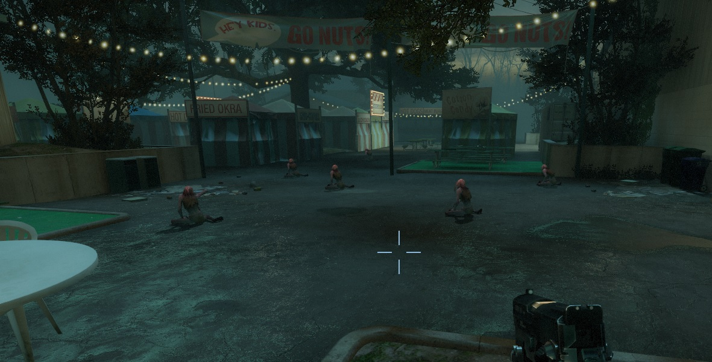

# Description | 內容
Spawn lots of witches on the map

> __Note__ <br/>
This plugin is private, Please contact [me](/#私人插件列表-private-plugins-list)<br/>
此為私人插件, 請聯繫[本人](/#私人插件列表-private-plugins-list)

* Apply to | 適用於
    ```
    L4D1
    L4D2
    ```

* Image | 圖示
	<br/>

* <details><summary>How does it work?</summary>

	* After survivors has left the saferoom, spawn witch on the map every certain seconds
	* Maximum witch limit on the field
	* Does not affect director witch
</details>

* Require | 必要安裝
	1. [left4dhooks](https://forums.alliedmods.net/showthread.php?t=321696)

* <details><summary>ConVar | 指令</summary>

	* cfg/sourcemod/l4d_witch_spawn.cfg
		```php
		// 0=Disable, 1=Enable Plugin, Spawn numbers of Witches depending on the map (Does not affect director spawn)
		l4d_witch_spawn_enable "1"

		// Maximum witch limit on the field (does not affect director witches)
		l4d_witch_spawn_max_limit "6"

		// Sets the max spawn time for witch spawned by the plugin in seconds.
		l4d_witch_spawn_spawn_time_max "90.0"

		// Sets the mix spawn time for witch spawned by the plugin in seconds.
		l4d_witch_spawn_spawn_time_min "60.0"

		// If 1, still spawn witch in final stage rescue
		l4d_witch_spawn_spawn_final "0"

		// Amount of seconds before a witch is removed. (Only remove witches spawned by this plugin)
		l4d_witch_spawn_lifespan "200"
		```
</details>

* <details><summary>Changelog | 版本日誌</summary>

    * v1.0 (2023-12-05)
		* Initial Release
</details>

- - - -
# 中文說明
遊戲開始後每隔一段時間在地圖上生成Witch

* 原理
	* 當倖存者離開安全室之後，每隔一段時間在地圖上生成Witch
	* 場上的Witch不會同時存在六隻以上
	* 此插件不影響導演生成的Witch

* <details><summary>指令中文介紹 (點我展開)</summary>

	* cfg/sourcemod/l4d_witch_spawn.cfg
		```php
		// 0=關閉插件, 1=啟動插件
		l4d_witch_spawn_enable "1"

		// 場上的Witch滿六隻以上時不生成Witch (不影響導演生成的Witch)
		l4d_witch_spawn_max_limit "6"

		// 生成Witch的最大時間間隔
		l4d_witch_spawn_spawn_time_max "90.0"

		// 生成Witch的最小時間間隔
		l4d_witch_spawn_spawn_time_min "60.0"

		// 為1時，救援開始後繼續生成Witch
		l4d_witch_spawn_spawn_final "0"

		// 如果沒人驚嚇或靠近Witch，Witch將會在200秒之後自動消失 (只會移除此插件生成的Witch)
		l4d_witch_spawn_lifespan "200"
		```
</details>