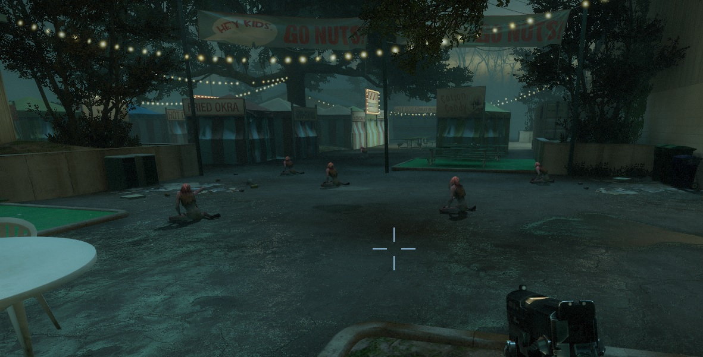

# Description | 內容
Spawn Witches every amount of time passed after survivors leave the saferoom

> __Note__ <br/>
This plugin is private, Please contact [me](/#私人插件列表-private-plugins-list)<br/>
此為私人插件, 請聯繫[本人](/#私人插件列表-private-plugins-list)

* Apply to | 適用於
    ```
    L4D1
    L4D2
    ```

* Image | 圖示
	<br/>

* <details><summary>How does it work?</summary>

	* After survivors has left the saferoom, spawn witch on the map every certain seconds
		* Spawn random numbers of witches each time.
		* Random time interval
		* Disable witch spawn after final starts
	* Maximum witch limit on the field
	* Does not affect director witch
</details>

* Require | 必要安裝
	1. [left4dhooks](https://forums.alliedmods.net/showthread.php?t=321696)
	2. [spawn_infected_nolimit](https://github.com/fbef0102/L4D1_2-Plugins/tree/master/spawn_infected_nolimit)

* <details><summary>ConVar | 指令</summary>

	* cfg/sourcemod/l4d_witch_timer_spawn.cfg
		```php
		// 0=Plugin off, 1=Plugin on.
		l4d_witch_timer_spawn_enable "1"

		// (L4D2) 1=Disable director witch spawn, 2=Disable director/mutation/static/final stage witch spawn (could break the map process and game stuck), 0=Off
		// (L4D1) 1=Disable director witch spawn (and tank), 0=Off
		l4d_witch_timer_spawn_disable_director "0"

		// Set max interval time to spawn witch
		l4d_witch_timer_spawn_interval_max "120"

		// Set min interval time to spawn witch
		l4d_witch_timer_spawn_interval_min "60"

		// Set total max numbers of Witches to spawn each time
		l4d_witch_timer_spawn_number_max "2"

		// Set total min numbers of Witches to spawn each time
		l4d_witch_timer_spawn_number_min "0"

		// Max witch limit on the filed (If limit reached, don't spawn witches)
		l4d_witch_timer_spawn_limit "2"

		// When to start the timer to spawn witch 1=After a survivor leaves the saferoom and before final starts, 2=After final starts, 3=After a survivor leaves the saferoom + after final starts
		l4d_witch_timer_spawn_when "3"

		// If 1, display chat message
		l4d_witch_timer_spawn_notify "0"

		// If 1, kill all witches when final stage starts
		l4d_witch_timer_spawn_final_remove "1"

		// Amount of seconds before a witch is removed. (Only remove witches spawned by this plugin)
		l4d_witch_timer_spawn_lifespan "200"
		```
</details>

* <details><summary>Changelog | 版本日誌</summary>

	* v1.0 (2026-7-22)
		* Initial Release
</details>

- - - -
# 中文說明
遊戲開始後每隔一段時間在地圖上生成Witch

* 原理
	* 在倖存者離開安全室之後，這個插件每過一段時間會生成多個Witch
		* 每次數量隨機
		* 時間間隔隨機
		* 救援開始後不生成Witch
	* 此插件不影響導演生成的Witch

* <details><summary>指令中文介紹 (點我展開)</summary>

	* cfg/sourcemod/l4d_witch_timer_spawn.cfg
		```php
		// 0=關閉插件, 1=啟動插件
		l4d_witch_timer_spawn_enable "1"

		// (L4D2) 1=關閉導演系統生成witch, 2=關閉 遊戲導演/突變模式/地圖固定/救援階段 生成Witch (可能導致遊戲卡關, 不建議使用), 0=關閉這項功能
		// (L4D1) 1=關閉導演系統生成witch (這也會關閉導演系統生成Tank), 0=關閉這項功能
		l4d_witch_timer_spawn_disable_director "0"

		// 生成witch的時間間隔 (最長時間)
		l4d_witch_timer_spawn_interval_max "120"

		// 生成witch的時間間隔 (最短時間)
		l4d_witch_timer_spawn_interval_min "60"

		// 每次生成Witch的數量 (最多)
		l4d_witch_timer_spawn_number_max "2"

		// 每次生成Witch的數量 (最少)
		l4d_witch_timer_spawn_number_min "0"

		// 場上的Witch數量上限 (已達數量時不會繼續生成witch)
		l4d_witch_timer_spawn_limit "2"

		// 何時開始生成Witch, 1=倖存者離開安全區後+救援開始之前, 2=救援開始之後, 3=倖存者離開安全區後+救援開始之後
		l4d_witch_timer_spawn_when "3"

		// 為1時，聊天框顯示Witch數量與時間提示
		l4d_witch_timer_spawn_notify "0"

		// 為1時，救援開始時殺死場上所有Witch
		l4d_witch_timer_spawn_final_remove "1"

		// 如果沒人驚嚇或靠近Witch，Witch將會在200秒之後自動消失 (只會移除此插件生成的Witch)
		l4d_witch_timer_spawn_lifespan "200"
		```
</details>