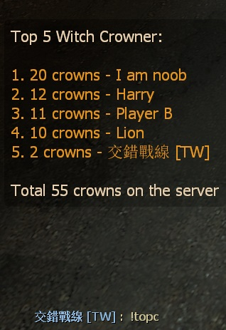
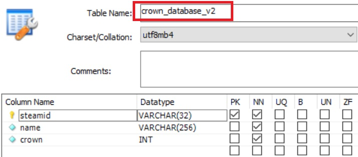

# Description | 內容
Adding a statistic of witch crowns and save to database

> __Note__ <br/>
This plugin is private, Please contact [me](/#私人插件列表-private-plugins-list)<br/>
此為私人插件, 請聯繫[本人](/#私人插件列表-private-plugins-list)

* <details><summary>Image | 圖示</summary>

	* Record crowns
	<br/>
	<br/>
	* Support MySql & Sqlite (支援資料庫，跨伺服器儲存)
	<br/>
</details>

* Apply to | 適用於
	```
	L4D1
	L4D2
	```

* <details><summary>How does it work?</summary>

	* Add statistic when a player killed the witch in one shot
	* Support Database (MySQL & SQLite), data saved even if player disconnected from server or server restart
	* Type ```!topc``` to see top 5 witch crowner
	* Type ```!myc``` to see your crowns and rank
</details>

* Require | 必要安裝
	1. [[INC] Multi Colors](https://github.com/fbef0102/L4D1_2-Plugins/releases/tag/Multi-Colors)

* <details><summary>ConVar | 指令</summary>

	* cfg/sourcemod/l4d_with_crowns_database_remake.cfg
		```php
		// 0=Plugin off, 1=Plugin on.
		l4d_with_crowns_database_remake_enable "1"

		// Numbers of real survivor players required at least to enable this plugin
		l4d_with_crowns_database_remake_survivor_required "2"

		// Database to save crown to.
		// (MySQL & SQLite supported)
		l4d_with_crowns_database_remake_sql "crowns"
		```
</details>

* <details><summary>Command | 命令</summary>

	* **Shows your own crown count and rank**
		```php
		sm_myc
		```

	* **Shows the top 5 crowners.**
		```php
		sm_topc
		```
</details>

* <details><summary>How to Set Database</summary>

	* Choose one of the following method
		1. MySQL: Database across server, set ConVar ```l4d_with_crowns_database_remake_sql "crowns"``` and write the following in ```sourcemod/configs/databases.cfg```
			```php
			// There would a data table named "crown_database_v2" in database
			"crowns"
			{
				"driver"			"mysql"
				"host"				"x.x.x.x"
				"database"			"yourdatabase"
				"user"				"youruser"
				"pass"				"yourpass"
				"port"				"yourport"
			}
			```

		2. SQLite: Local Database, set ConVar ```l4d_with_crowns_database_remake_sql "crowns"``` and write the following in ```sourcemod/configs/databases.cfg```
			```php
			// There would be a file created: sourcemod/data/sqlite/crowns.sq3
			"crowns"
			{
				"driver"			"sqlite"
				"database"			"crowns"
			}
			```
</details>

* <details><summary>Changelog | 版本日誌</summary>

	* v1.1h (2025-11-24)
		* Remove data file
		* Optimize code

	* v1.0h (2025-1-10)
		* Remake code
		* Add mysql & sqilite database support
		* Fixed huge memory link and out of memory error
		* Change steam id type
		* Update cvars, cmds
	
	* Original
		* [By Die Teetasse](https://forums.alliedmods.net/showthread.php?t=123433)
</details>

- - - -
# 中文說明
統計一槍擊殺Witch的數量，並儲存於數據庫當中

* 原理
	* 當玩家一槍擊殺Witch時，統計+1
	* 使用資料庫保存玩家的統計數據 (支援 MySQL & SQLite)，即使離開伺服器或伺服器重啟，玩家數據依然保存
	* 輸入 ```!topc``` 查看前五名一槍擊殺Witch數量的玩家
	* 輸入 ```!myc``` 查看自己一槍擊殺Witch的數量與排行榜

* <details><summary>指令中文介紹 (點我展開)</summary>

	* cfg/sourcemod/l4d_with_crowns_database_remake.cfg
		```php
		// 0=關閉插件, 1=啟動插件
		l4d_with_crowns_database_remake_enable "1"

		// 至少需要X位真人玩家在倖存者隊伍才能有記錄
		l4d_with_crowns_database_remake_survivor_required "2"

		// 儲存統計的資料庫
		// (支援 MySQL & SQLite)
		l4d_with_crowns_database_remake_sql "crowns"
		```
</details>

* <details><summary>命令中文介紹 (點我展開)</summary>

	* **查看自己一槍擊殺Witch的數量與排行榜**
		```php
		sm_myc
		```

	* **查看前五名一槍擊殺Witch數量的玩家**
		```php
		sm_topc
		```
</details>

* <details><summary>如何設定資料庫</summary>

	* 以下方法二選一
		1. MySQL: 支援跨伺服器，儲值經驗值，設定指令 ```l4d_with_crowns_database_remake_sql "crowns"```，然後設定文件 ```sourcemod/configs/databases.cfg```
			```php
			// 資料庫中自動創建表格，名稱是 "crown_database_v2"
			"crowns"
			{
				"driver"			"mysql"
				"host"				"x.x.x.x"
				"database"			"yourdatabase"
				"user"				"youruser"
				"pass"				"yourpass"
				"port"				"yourport"
			}
			```
			
		2. SQLite: 本地資料庫儲值，設定指令 ```l4d_with_crowns_database_remake_sql "crowns"```，然後設定文件 ```sourcemod/configs/databases.cfg```
			```php
			// 自動創建檔案: sourcemod/data/sqlite/crowns.sq3
			"crowns"
			{
				"driver"			"sqlite"
				"database"			"crowns"
			}
			```
</details>
