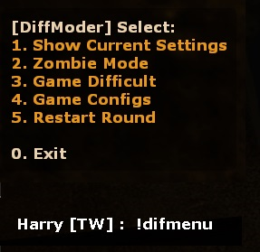
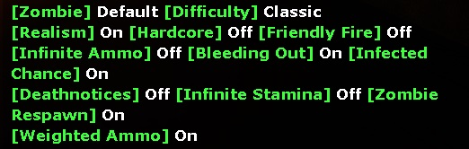
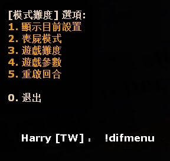

# Description | 內容
Allow player to call menu vote to change difficult, config, and zombie mode.

> __Note__ <br/>
This plugin is private, Please contact [me](https://github.com/fbef0102/Game-Private_Plugin#私人插件列表-private-plugins-list)<br/>
此為私人插件, 請聯繫[本人](https://github.com/fbef0102/Game-Private_Plugin#私人插件列表-private-plugins-list)

* Apply to | 適用於
	```
	No More Room in Hell
	```

* Image
	<br/>
	<br/>

* <details><summary>How does it work?</summary>

	* Type ```!difmenu``` to open menu -> call vote to change difficult, config, and zombie mode.
        1. Show Current Settings
        2. Zombie mode
            - Runner
            - All Kid
            - Default
        3. Game Difficult
            - Classic
            - Casual
            - Nightmare
        4. Game configs
            - Realism
            - Friendly Fire
            - Hardcore
            - Infinite Ammo
            - Bleeding Out
            - Infected Chance
            - Deathnotices
            - Infinite Stamina
            - Zombie Respawn
            - Weighted Ammo
            - Default
        5. Restart Round
    * Use data to control default settings and menu: [data/nmrih_diffmoder.cfg](data/nmrih_diffmoder.cfg)
        * Manual in this file, click for more details...
</details>

* Require | 必要安裝
<br/>None

* <details><summary>ConVar | 指令</summary>

    * cfg/sourcemod/nmrih_diffmoder.cfg
        ```php
        // Enable/Disable plugin.
        nmrih_diffmoder_enable "1"

        // Players with these flags have access in this plugin. (Empty = All players have access, -1: Noboday has access)
        nmrih_diffmoder_admin_access "-1"

        // Ammo mode for all non-access players (With infinite ammo vote enable)
        // 1 - Infinite ammo, 2 - Infinite clip
        nmrih_diffmoder_infinite_ammo_all "1"

        // Ammo mode for all access players (Without infinite ammo vote enable)
        // 0 - Normal mode
        // 1 - Infinite ammo
        // 2 - Infinite clip
        nmrih_diffmoder_infinite_ammo_admin "1"
        ```
</details>

* <details><summary>Command | 命令</summary>
    
	* **Open Menu**
		```php
		sm_difmenu
		sm_difvote
		```
</details>

* <details><summary>Related Official ConVar</summary>

	* This plugin already modified the following cvars, You don't need to change 

	| ConVar 				| Parameters or default value 	| Effect|
	| -------------|:-------------:|:-------------:|
	| sv_max_runner_chance 	        | 0.6 | Maximum chance of a runner zombie spawning (0.6 = 60%)|
	| ov_runner_chance          	| 0.075 | Chance for each zombie spawned to be a runner (0.075 = 7.5%)|
	| ov_runner_kid_chance          | 0.5 | Chance of spawned runner zombie to be a kid (0.5 = 50%)|
	| sv_realism          	        | 0 | Enables/disables realism mode. Headshots will be instant kills and all other areas of the body will take no damage.|
	| mp_friendlyfire          	    | 0 | Allows team members to injure other members of their team|
	| sv_hardcore_survival          | 0 | Enables or disables survival hardcore mode|
	| sv_difficulty          	    | classic | Difficulty mode, "classic", "casual", "Nightmare"|
	| sv_infection_chance          	| 1.0 | Chance for zombie to infect players per hit. (1.0 = 100%)|
	| sv_bleedout_chance_high       | 0.05 | Chance for bleedout at not low health (0.05 = 5%)|
	| sv_bleedout_chance_low        | 0.15 | Chance for bleedout at low health (0.15 = 15%)|
	| sv_spawn_regen_target         | 0.5 | By default dead zombies will be replaced to maintain this factor of total live zombies for a brush over two minutes time.|
	| inv_ammoweight          	    | 5 | Ammo weight per box|
	| sv_deathnotice          	    | 0 | Show deathnotices on player kills/deaths|

	*  You can modify in ```cfg/server.cfg```

	| ConVar 				| Parameters or default value 	| Effect|
	| -------------|:-------------:|:-------------:|
	| sv_max_stamina 	        | 130 | Maximum stamina |
</details>

* Translation Support | 支援翻譯
	```
	translations/nmrih_diffmoder.phrases.txt
	```

* <details><summary>Changelog | 版本日誌</summary>

    * v1.1h (2025-2-18)
        * Add Deathnotices, Zombie Respawn, Weighted Ammo
        * Add data file
        * Default settings when server starts up or after everyone leaves the server

    * v1.0h (2025-2-15)
        * Remake code
        * Add infinite ammo, infinite stamina, round restart, bleeding out, infection
        * Update menu, cvars, cmds, translation

    * Original & Credit
	    * [Grey83](https://forums.alliedmods.net/showthread.php?t=261699)
	    * [mostten](https://forums.alliedmods.net/showthread.php?t=301322)
</details>

- - - -
# 中文說明
輸入 !difmenu 可以打開菜單投票切換參數, 模式, 難度

* 圖示
	<br/>
	<br/>

* 原理
    * 輸入 ```!difmenu``` 可以打開菜單 -> 發起投票 -> 修改參數, 模式, 難度
        1. 顯示目前設置
        2. 喪屍模式
            - 奔跑
            - 全小孩
            - 預設
        3. 遊戲難度
            - 經典
            - 休閒
            - 惡夢
        4. 遊戲參數
            - 寫實模式開關
            - 隊友友傷開關
            - 硬核生存開關
            - 無限子彈開關
            - 血流不止開關
            - 感染屍變開關
            - 死亡提示開關
            - 無限體力開關
            - 殭屍重生開關
            - 彈藥重量開關
            - 預設遊戲參數
        5. 重啟回合
    * 使用文件控制菜單與預設配置: [data/nmrih_diffmoder.cfg](data/nmrih_diffmoder.cfg)
        * 內有中文說明，可點擊查看

* <details><summary>指令中文介紹 (點我展開)</summary>

    * cfg/sourcemod/nmrih_diffmoder.cfg
        ```php
        // 0=關閉插件, 1=啟動插件
        nmrih_diffmoder_enable "1"

        // 擁有這些權限的玩家，享有特權 (留白 = 任何人都有特權, -1: 無人有特權)
        nmrih_diffmoder_admin_access "-1"

        // 沒有特權的玩家 (必須要投票開啟無限子彈)
        // 1 - 無限彈藥 (要裝彈）, 2 - 無限彈夾 (不用裝彈)
        nmrih_diffmoder_infinite_ammo_all "1"

        // 有特權的玩家 (不用投票開啟無限子彈)
        // 0 - 正常
        // 1 - 無限彈藥 (要裝彈)
        // 2 - 無限彈夾 (不用裝彈)
        nmrih_diffmoder_infinite_ammo_admin "1"
        ```
</details>

* <details><summary>命令中文介紹 (點我展開)</summary>
    
	* **打開菜單**
		```php
		sm_difmenu
		sm_difvote
		```
</details>

* <details><summary>相關的官方指令中文介紹 (點我展開)</summary>

	* 這個插件已經修改以下任何指令, 你無須更動

	| ConVar 				| Parameters or default value 	| Effect|
	| -------------|:-------------:|:-------------:|
	| sv_max_runner_chance 	        | 0.6 | 奔跑殭屍生成機率 (0.6 = 60%)|
	| ov_runner_chance          	| 0.075 | 普通殭屍變成奔跑殭屍的機率 (0.075 = 7.5%)|
	| ov_runner_kid_chance          | 0.5 | 奔跑殭屍變成小孩的機率 (0.5 = 50%)|
	| sv_realism          	        | 0 | 為1時，啟用寫實模式，可以一槍爆頭殭屍，其他部位無傷|
	| mp_friendlyfire          	    | 0 | 為1時，有友傷|
	| sv_hardcore_survival          | 0 | 為1時，啟用硬核生存|
	| sv_difficulty          	    | classic | 難度, 只有三種 "classic"(經典), "casual"(休閒), "Nightmare"(惡夢)|
	| sv_infection_chance          	| 1.0 | 被感染的機率 (1.0 = 100%)|
	| sv_bleedout_chance_high       | 0.05 | 被打後如果是高血量，會流血的機率 (0.05 = 5%)|
	| sv_bleedout_chance_low        | 0.15 | 被打後如果是低血量，會流血的機率 (0.15 = 15%)|
	| sv_spawn_regen_target         | 0.5 | 已經走過的路, 殭屍會重生, 0=已經走過的路, 殭屍不會重生 |
	| inv_ammoweight          	    | 5 | 彈藥重量, 0=彈葯盒不會佔空間|
	| sv_deathnotice          	    | 0 | 0=關閉, 1=顯示擊殺以及玩家死亡, 2=僅玩家死亡|

	*  可自行更動，寫在```cfg/server.cfg```

	| ConVar 				| Parameters or default value 	| Effect|
	| -------------|:-------------:|:-------------:|
	| sv_max_stamina 	        | 130 | 最大體力值 |
</details>


