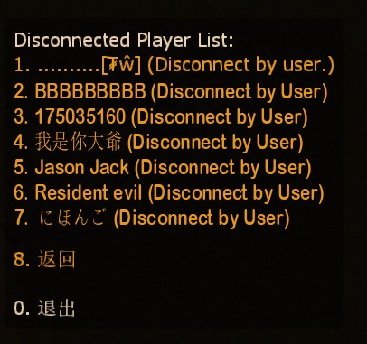
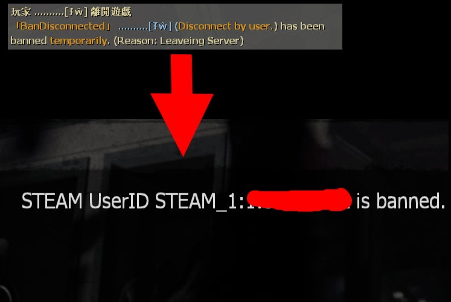

# Description | 內容
Auto ban players who have disconnected from the server instantly after joined the server
<br/>+
<br/>Tracks recently-disconnected players and lets you ban them

> __Note__ <br/>
This plugin is private, Please contact [me](https://github.com/fbef0102/Game-Private_Plugin#私人插件列表-private-plugins-list)<br/>
此為私人插件, 請聯繫[本人](https://github.com/fbef0102/Game-Private_Plugin#私人插件列表-private-plugins-list)

* Video | 影片展示
<br/>None

* Image
	* Say !admin->Player Commands->Ban Discnnect Player, Tracks all players who has left server. 
		> 管理員輸入!admin->玩家指令->Ban Discnnect Player 查看所有離開伺服器的玩家
		<br/>
	* Auto ban players who have disconnected from the server with 60 seconds after joined the server
		> 封鎖進來後秒退的玩家
		<br/>

* Apply to | 適用於
	```
	L4D1
	L4D2
	```

* <details><summary>Changelog | 版本日誌</summary>

	```php
	//mad_hamster @ 2011
	//HarryPotter @ 2022-2023
	```
	* v1.1 (2023-6-14)
		* Fix players got banned when map change

	* v1.0 (2023-5-31)
		* Remake code, convert code to latest syntax
		* Fix warnings when compiling on SourceMod 1.11.
		* Optimize code and improve performance
		* Add autoban if players disconnected from the server with 60 seconds after joined the server
		
	* 1.03
		* [Original Plugin by mad_hamster](https://forums.alliedmods.net/showthread.php?t=135533)
</details>

* Require | 必要安裝
	1. [[INC] Multi Colors](https://github.com/fbef0102/L4D1_2-Plugins/releases/tag/Multi-Colors)

* <details><summary>ConVar | 指令</summary>

	* cfg/sourcemod/bandisconnected.cfg
		```php
		// Ban player who disconnects within x seconds after player has joined server.
		bandisconnected_ban_within_join_seconds "60.0"

		// Ban How many mins for disconnected player. (0=Permanent Ban)
		bandisconnected_ban_mins "60"

		// If 1, disable Auto Ban when player crashed.
		bandisconnected_crash_ban_disable "1"

		// If 1, Enable Auto Ban when player disconnects.
		bandisconnected_enable_auto_ban "1"

		// Players with these flags have immune to not be banned automatically. (Empty = Everyone, -1: Nobody)
		bandisconnected_immue_flag "z"

		// List size of ban disconnected players menu
		bandisconnected_max "100"

		// If 1, notify someone disconnected and get banned.
		bandisconnected_notify_ban "1"
		```
</details>

* <details><summary>Command | 命令</summary>

	* **Ban a player after they have disconnected! (Access Required: ADMFLAG_BAN)**
		```php
		sm_bandisconnected <steamid> <minutes|0> [reason] <ip> <name>
		sm_bandc <steamid> <minutes|0> [reason] <ip> <name>
		```

	* **List all disconnected players! (Access Required: ADMFLAG_BAN)**
		```php
		sm_listdisconnected
		```
</details>

* The player will not get auto ban if disconnect reason is
	* Crash
	* Kick
	* Timed out
	* VAC Status Checker
	* This Steam accout does not own this game
	* Your client has failed to reply to a query in time
	* No Steam logon
	* No Response

- - - -
# 中文說明
自動封鎖近來伺服器後秒退的玩家 + 查看所有退出伺服器的玩家列表

* 原理
	* 玩家進來伺服器60內退出，將會被自動封鎖，不能再進來伺服器
		* 玩家崩潰、網路斷線，則不會被自動封鎖
	* 玩家離開伺服器之後，伺服器會記錄該位玩家的離開原因、steamid、名子
	* 管理員可輸入```sm_listdisconnected```查看列表
	* 正在連線Loading當中(還未完全進入伺服器)不會被自動封鎖
	* 正在換圖過程中離開伺服器不會被自動封鎖

* 用意在哪?
	* 有的玩家進來後不喜歡這個伺服器於是秒退，但是匹配房間又會不小心再進來
	* 有的低能玩家頻繁進來又退出又進來

* 功能
	* 可取消自動封鎖功能
	* 可取消自動封鎖的提示
	* 可設置自動封鎖的時間
	* 管理員輸入!admin->玩家指令->Ban Discnnect Player 也可查看所有離開伺服器的玩家列表

* 離線原因名詞解釋
	* Discennet by user => 玩家自主離開
	* Crash => 崩潰
	* Kick => 被踢
	* Timed out => 網路斷線
	* VAC Status Checker => 被VAC
	* This Steam accout does not own this game => 此帳號未擁有惡靈勢力遊戲
	* Your client has failed to reply to a query in time  => 沒有回應伺服器的網路數據 (可能是網路斷線)
	* No Steam logon => 沒有偵測到 Steam 正版帳號
	* No Response => 玩家無回應 (可能是網路斷線)