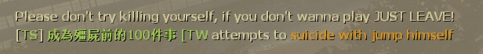
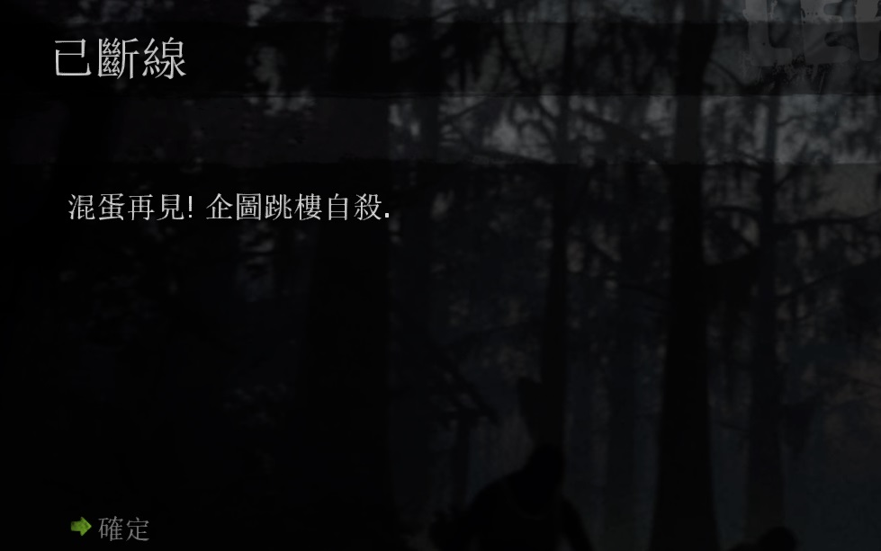

# Description | 內容
Prevents players griefing by suicide with jump

> __Note__ <br/>
This plugin is private, Please contact [me](https://github.com/fbef0102/Game-Private_Plugin#私人插件列表-private-plugins-list)<br/>
此為私人插件, 請聯繫[本人](https://github.com/fbef0102/Game-Private_Plugin#私人插件列表-private-plugins-list)

* [Video | 影片展示](https://youtu.be/tF9F1uvGxPY)

* Image
	<br/>
	<br/>
	<br/>
	<br/>

* <details><summary>How does it work?</summary>

	* Auto ban players who attemp to suicide
		* Jump off the building
		* Jump off the river
		* Fall off the ledge by holding space key intentionally
	* Record player in ```logs\l4d_block_suicide_jumps.log```
	* Ignore player
		* [Rock Jump by stepping on entity](https://www.youtube.com/watch?v=AEWIe3YRq7Y&t=369s)
		* Hanging from ledge
		* Incapacitated
		* Hit by tank
		* Capped by S.I. (Death Charge, Ride Jump, Death Smoke, Boomer Slap)
</details>

* Require | 必要安裝
	1. [left4dhooks](https://forums.alliedmods.net/showthread.php?t=321696)
    2. [[INC] Multi Colors](https://github.com/fbef0102/L4D1_2-Plugins/releases/tag/Multi-Colors)

* <details><summary>ConVar | 指令</summary>

	* cfg/sourcemod/l4d_block_suicide_jumps.cfg
		```php
		// 0=Plugin off, 1=Plugin on.
		l4d_block_suicide_jumps_enable "1"

		// Ban player who attempts to suicide with jump for X time.
		l4d_block_suicide_jumps_limit "3"

		// Ban How many mins. (0=Permanent Ban, -1=Kick)
		l4d_block_suicide_jumps_ban_duratuon "60"
		```
</details>

* <details><summary>Command | 命令</summary>

	None
</details>

* <details><summary>Data Config</summary>
  
	* [data/mapinfo.txt](data/mapinfo.txt)
		```php
		"MapInfo"
		{
			"c8m1_apartment"　//Map Name
			{
				"l4d_block_suicide_jumps_off" "1" // disabe plugin in this map
			}

			...
		}
		```
</details>

* Apply to | 適用於
	```
	L4D1
	L4D2
	```

* <details><summary>Translation Support | 支援翻譯</summary>

	```
	English
	繁體中文
	简体中文
	```
</details>

* <details><summary>Changelog | 版本日誌</summary>

	```php
	//rekcah @ 20211
	//HarryPotter @ 2023-2024
	```
	* v1.1h (2024-2-20)
		* Add data config to disable plugin in some maps

	* v1.0h (2023-9-21)
        * Require lef4dhooks v1.33 or above
		* Remake code, convert code to latest syntax
		* Fix warnings when compiling on SourceMod 1.11.
		* Optimize code and improve performance
		* Translation Support
		* Kick and ban the griefer
		* Ignore player if alerady hanging from ledge, incapacitated, hit by tank, capped by S.I.
		* Record to file
		
	* 1.0
		* [Original Plugin by rekcah](https://forums.alliedmods.net/showthread.php?t=331410)
</details>

- - - -
# 中文說明
企圖跳樓自殺的玩家將會傳送回樓頂，並封鎖踢出伺服器

* <details><summary>圖示</summary>

	<br/>
	<br/>
</details>

* 原理
	* 當玩家企圖多次自殺，將自動踢出伺服器並封鎖
		* 跳樓
		* 跳河
		* 按住空白鍵故意高空墬落摔傷
	* 紀錄玩家於 ```logs\l4d_block_suicide_jumps.log```
	* 有以下情況忽略
		* [踩頭高跳Bug](https://www.youtube.com/watch?v=AEWIe3YRq7Y&t=369s)
		* 掛邊
		* 倒地
		* 被Tank擊飛
		* 被特感抓住 (被Charger撞飛, 被Jockey騎下樓, 被Smoker拉下樓, 被Boomer炸飛)

* 用意在哪?
	* 防止玩家惡意搗亂跳樓

* <details><summary>指令中文介紹 (點我展開)</summary>

	* cfg/sourcemod/l4d_block_suicide_jumps.cfg
		```php
		// 0=關閉插件, 1=啟動插件
		l4d_block_suicide_jumps_enable "1"

		// 企圖自殺已達三次以上，立刻踢出並封鎖玩家
		l4d_block_suicide_jumps_limit "3"

		// 封鎖時間 (0=永遠, -1=只踢出伺服器)
		l4d_block_suicide_jumps_ban_duratuon "60"
		```
</details>

* <details><summary>文件設定範例</summary>
  
	* [data/mapinfo.txt](data/mapinfo.txt)
		```php
		"MapInfo"
		{
			"c8m1_apartment"　//地圖名
			{
				"l4d_block_suicide_jumps_off" "1" // 1=在這張地圖關閉此插件 (沒有寫則自動開啟)
			}

			...
		}
		```
</details>