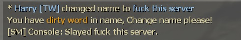
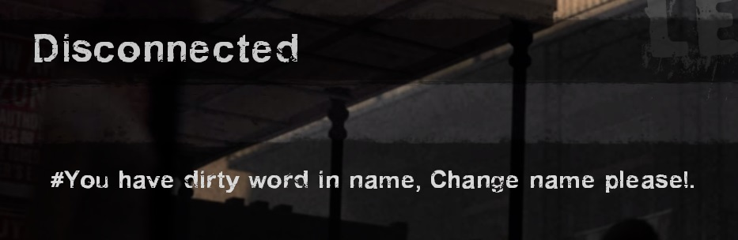

# Description | 內容
Kick player if has invalid name via Regular Expressions

> __Note__ <br/>
This plugin is private, Please contact [me](https://github.com/fbef0102/Game-Private_Plugin#私人插件列表-private-plugins-list)<br/>
此為私人插件, 請聯繫[本人](https://github.com/fbef0102/Game-Private_Plugin#私人插件列表-private-plugins-list)

* Video | 影片展示
<br/>None

* Image
    <br/>
    <br/>

* <details><summary>How does it work?</summary>

    * Punish player whose name has dirty word (Ban, Kick, Slay....)
    * Modify dirty word table in ```configs/l4d_invalid_name.cfg```
</details>

* Require | 必要安裝
    1. [[INC] Multi Colors](https://github.com/fbef0102/L4D1_2-Plugins/releases/tag/Multi-Colors)

* <details><summary>ConVar | 指令</summary>

    * cfg/sourcemod/l4d_invalid_name.cfg
        ```php
        // 0=Plugin off, 1=Plugin on.
        l4d_invalid_name_enable "1"

        // If 1, Remove all whitespace
        l4d_invalid_name_remove_white_space "1"
        ```
</details>

* <details><summary>Command | 命令</summary>

    None
</details>

* <details><summary>Data Config</summary>

    * configs/l4d_invalid_name.cfg
        ```php
        "l4d_invalid_name"
        {
            "Block2_English"  // Whatever name
            {
                "chatpattern"		"fuck" // dirty word you want to ban, comparison is case insensitive.
                "chatpattern"		"shit"
                "chatpattern"		"pussy"
                "chatpattern"		"idiot"
                "chatpattern"		"retarded"
                "chatpattern"		"moron"
                "chatpattern"		"bitch"
                
                "replace"			"**" // Replace the matches with a string
                "warn"				"You have {green}dirty word{default} in name, Change name please!" // Warn the client they are violating the matching rules
                "action"			"sm_slay #%u"  // server executes an RCON command, to see more cmds: https://wiki.alliedmods.net/Admin_commands_(sourcemod)#Basic_Commands
                "immunity"          "z" //Allow admins with specified levels to be immune
            }	
        }
        ```

    * Other keyValue
        ```php
        "replaceall" "****" // Replace the whole player name with a string
        ```

    * action
        ```php
        #%u = user id
        #%i = client id
        #%n = player name
        #%s = player steam id
        #%r = warn message
        ```
</details>

* Apply to | 適用於
    ```
    L4D1
    L4D2
    ```

* <details><summary>Related | 相關插件</summary>

    1. [sm_regexfilter](/Plugin_插件/Anti_Griefer_防惡意路人/sm_regexfilter): Filter dirty words via Regular Expressions
        * 禁詞表，任何人打字說出髒話或敏感詞彙，字詞會被屏蔽、禁言並處死玩家
</details>

* <details><summary>Changelog | 版本日誌</summary>

    * v1.0 (2024-1-31)
        * Initial Release
</details>

- - - -
# 中文說明
名字封鎖表，任何人的名字有髒話或敏感詞彙，會踢出玩家

* 圖示
    <br/>
    <br/>

* 原理
    * 只要名字有的字詞符合禁詞表內任何一個詞彙，屏蔽字詞並懲罰玩家
    * 禁詞表位於```configs/regexrestrict.cfg```，可自行增修
    * 英文字母與西里爾文字(俄文)也適用，自動偵測大小寫

* 用意在哪?
    * 懲罰惡意改名來亂的玩家

* <details><summary>指令中文介紹 (點我展開)</summary>

    * cfg/sourcemod/l4d_invalid_name.cfg
        ```php
        // 0=關閉插件, 1=啟動插件
        l4d_invalid_name_enable "1"

        // 為1時，忽略空白符號
        l4d_invalid_name_remove_white_space "0"
        ```
</details>

* <details><summary>文件設定範例</summary>

    * 禁詞表可自行增修
    * 可設置權限，管理員的名字不會受到插件的審查
    * 敏感字詞可以用其他文字和諧取代
    * configs/l4d_invalid_name.cfg
        ```php
        "l4d_invalid_name"
        {
            "Block3_China" //敏感字詞合集名稱，可自取
            {
                "chatpattern"       "nmsl" //敏感字詞為nmsl，即使字母大寫也會被檢測到
                "chatpattern"       "cao"
                "chatpattern"		"shabi"

                "replaceall"        "我是傻B！" // 幫玩家改名
               	"warn"				"名字带有{green}脏话{default}! 已改名!" // 顯示警告
		        "action"			"sm_slay #%u" //伺服器會採取的命令動作，此處命令為處死玩家，想看更多命令：https://wiki.alliedmods.net/Admin_commands_(sourcemod)
		        "immunity"          "z" //z權限的玩家不受影響
            }	
        }
        ```

    * 其他可用參數
        ```php
        "replace" "xxxx" // 名字內的敏感字詞用其他文字取代
        ```

    * action能寫的參數
        ```php
        #%u = 玩家的user id
        #%i = 玩家的client id
        #%n = 玩家名字
        #%s = 玩家的Steam ID (Steam_x:x:xxxx)
        #%r = 警告訊息
        ```
</details>

