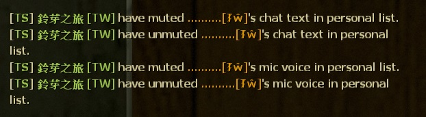
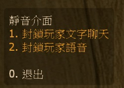

# Description | 內容
Player can personally mute someone chat text and mic voice.

> __Note__ <br/>
This plugin is private, Please contact [me](https://github.com/fbef0102/Game-Private_Plugin#私人插件列表-private-plugins-list)<br/>
此為私人插件, 請聯繫[本人](https://github.com/fbef0102/Game-Private_Plugin#私人插件列表-private-plugins-list)

* [Video | 影片展示](https://youtu.be/U-ncYt-JVWQ)

* Image
	* Display Menu
	<br/>
	* Mute chat text or mic voice
	<br/>

* Apply to | 適用於
	```
	L4D1
	L4D2
	```
	
* Translation Support | 支援翻譯
	```
	English
	繁體中文
	简体中文
	```

* <details><summary>Changelog | 版本日誌</summary>

	* v1.0
		* Initial Release
</details>

* Require | 必要安裝
	1. [SM-Custom-ChatColors-Menu](https://github.com/JoinedSenses/SM-Custom-ChatColors-Menu)
	2. [[INC] Multi Colors](https://github.com/fbef0102/L4D1_2-Plugins/releases/tag/Multi-Colors)

* <details><summary>ConVar | 指令</summary>

	* cfg/sourcemod/l4d_mute_player_list.cfg
		```php
		// Changes how message displays. (0: Disable, 1:In chat, 2: In Hint Box, 3: In center text)
		l4d_mute_player_list_announce_type "1"

		// 0=Plugin off, 1=Plugin on.
		l4d_mute_player_list_enable "1"
		```
</details>

* <details><summary>Command | 命令</summary>

	* **Open menu to mute other player's chat text and mic voice**
		```php
		sm_mutemenu
		```
</details>

- - - -
# 中文說明
玩家可以在個人列表上封鎖其他人的語音與聊天文字

* 圖示
	* 顯示介面
	<br/>
	* 提示訊息
	<br/>

* 原理
	* 每一位玩家可以輸入!mutemenu，選擇其他玩家採取動作，封鎖語音或聊天文字
	* 封鎖語音: 聽不見這位玩家發出的語音 (其他人依然能聽見)
	* 封鎖聊天文字: 看不見這位玩家輸入的聊天文字 (其他人依然能看見)

* 用意在哪?
	* 經常有惡意路人進來播放音樂或者輸入文字打廣告，這時候管理員不一定每次都在伺服器裡面
	* 提供玩家自行選擇封鎖對方的語音與文字，讓玩家開心玩遊戲

* 功能
	* 可設置提示顯示位置