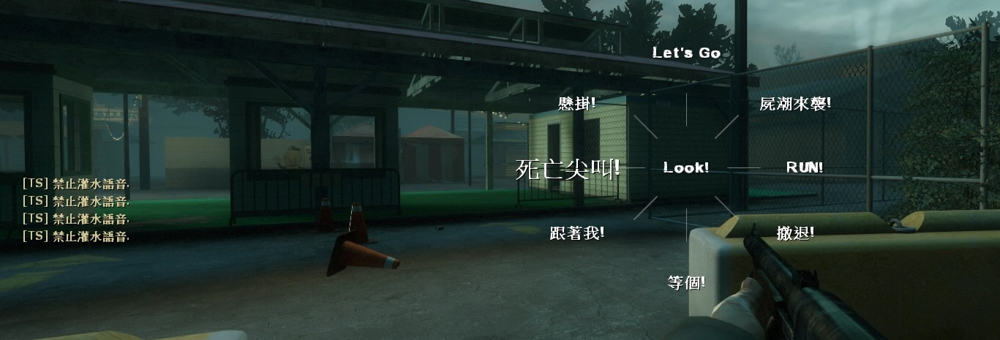

# Description | 內容
Stops vocalize flooding when reaching token limit

> __Note__ <br/>
This plugin is private, Please contact [me](https://github.com/fbef0102/Game-Private_Plugin#私人插件列表-private-plugins-list)<br/>
此為私人插件, 請聯繫[本人](https://github.com/fbef0102/Game-Private_Plugin#私人插件列表-private-plugins-list)

* [Video | 影片展示](https://youtu.be/coX2i0tun0k)

* Image | 圖示
	* vocalize limit reached
	<br/>

* Apply to | 適用於
```
L4D1 Dedicated Server
L4D2 Dedicated Server
```

> __Warning__ <br/>
This plugin doesn't work on listen server<br/>
此插件不適用於區域伺服器

* Translation Support | 支援翻譯
```
English
繁體中文
简体中文
```

* <details><summary>Changelog | 版本日誌</summary>

	```php
	//Mr. Zero @ 2014
	//HarryPotter @ 2022
	```
	* v1.3 (2022-11-18)
		* Request by 壹梦
        * Remake Code
        * Add Cvars
		* Split token into world and player
		* Delete commands

	* v1.0.2
        * [Original Plugin by Mr. Zero](https://forums.alliedmods.net/showthread.php?t=241588)
</details>

* Require | 必要安裝
    1. [sceneprocessor](https://forums.alliedmods.net/showpost.php?p=2766130&postcount=59)

* How does it work?
	* When player's character vocalizes, add a token, there are two types of token.
	* World token: Created by the map (such as landmarks, "Down this way", "Through here") and by the game (such as team mate actions, "Let me heal you up", "Help I'm falling")
	* Player token: Player uses vocalize command (such as "Death Scream", "Hurry up")
	* Stops vocalize when reaching token limit, token would be decreased after certain time

* <details><summary>ConVar | 指令</summary>

	* cfg\sourcemod\l4d_vocalize_antiflood.cfg
		```php
		// Players with these flags have immune to token limit. (Empty=Everyone, -1=Nobody)
		l4d_vocalize_antiflood_immue_flag "z"

		// If 1, notify antiflood message to player.
		l4d_vocalize_antiflood_notify "1"

		// Max Player Token limit. (-1 = No Limit)
		l4d_vocalize_antiflood_player_token_limit "3"

		// Time interval to decrease a player token. (second)
		l4d_vocalize_antiflood_player_token_time "10"

		// Time interval to decrease a word token. (second)
		l4d_vocalize_antiflood_word_token_time "5"

		// Max World Token limit. (-1 = No Limit)
		l4d_vocalize_antiflood_world_token_limit "-1"
		```
</details>

* <details><summary>Command | 命令</summary>

	None
</details>

- - - -
# 中文說明
限制玩家使用角色語音，當語音次數達到限制之後開始禁止，必須等待冷卻時間結束才能再使用角色語音

* 原理
	* 當角色發出語音，增加一個token，token分成兩種
	* 世界 token: 地圖上自動讓角色對話，或者遊戲插件使然
	* 玩家 token: 玩家自主使用角色對話
	* token達到限制之後會開始禁止角色發出語音，每過一段時間自動移除一個token

* 用意在哪?
	* 惡意玩家整場都在死亡尖叫，頻繁使用角色語音

* 功能
	1. 可設置管理員不會受到此插件的限制
	2. 可設置token次數
	3. 可設置一段時間降低token


