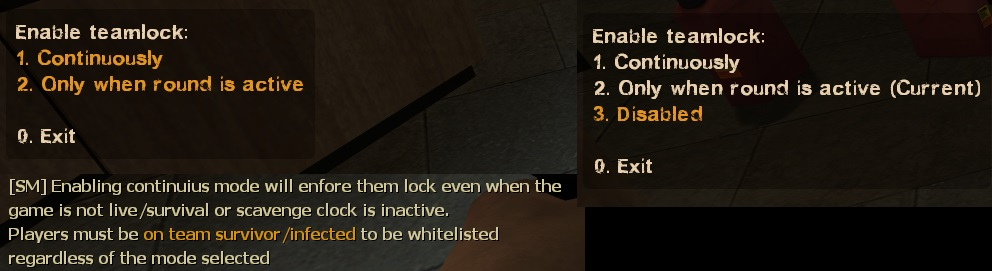
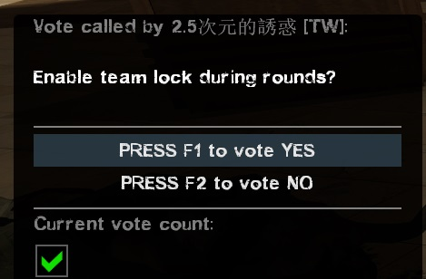

# Description | 內容
Calls a vote to enable / disable locking teams in place once game starts (so no spectators can join in mid-game)

> __Note__ <br/>
This plugin is private, Please contact [me](https://github.com/fbef0102/Game-Private_Plugin#私人插件列表-private-plugins-list)<br/>
此為私人插件, 請聯繫[本人](https://github.com/fbef0102/Game-Private_Plugin#私人插件列表-private-plugins-list)

* [Video | 影片展示](https://youtu.be/B1oghdYb_gE)

* Image | 圖示
	<br/>
	<br/>

* <details><summary>How does it work?</summary>

	* Before game starts, every can switch team
		* Before survivors leave the saferoom
		* Before survival starts
		* Before scavenge starts
	* After game starts, server will "lock the team"
		* Only the infected players or survivor players can switch team
		* All other spectators can not join the team and play
	* After map end or round end, every can switch team
	* Record Steam ID, the infected players or survivor players can switch team even if they leave and rejoin the server
</details>

* Require | 必要安裝
	1. [left4dhooks](https://forums.alliedmods.net/showthread.php?t=321696)
	2. [[INC] Multi Colors](https://github.com/fbef0102/L4D1_2-Plugins/releases/tag/Multi-Colors)
	3. [builtinvotes](https://github.com/fbef0102/Game-Private_Plugin/releases/tag/builtinvotes)

* <details><summary>ConVar | 指令</summary>

	* cfg/sourcemod/teamlock_vote.cfg
		```php
		// 0=Plugin off, 1=Plugin on.
		teamlock_vote_enable "1"

		// Delay to start another a teamlock vote after vote ends.
		teamlock_vote_delay "60"

		// Numbers of real survivor and infected player required to start a teamlock vote.
		teamlock_vote_required "2"

		// If 1, players can not start teamlock vote after game starts/survival begins.
		teamlock_vote_game_block "1"

		// Enable teamlock by default? [1-Enable/0-Disable]
		teamlock_vote_default_value "0"
		```
</details>

* <details><summary>Command | 命令</summary>
	
	* **Calls a vote to enable / disable locking teams (No one can switch team)**
		```php
		sm_teamlock
		```
</details>

* Apply to | 適用於
	```
	L4D1
	L4D2
	```

* <details><summary>Changelog | 版本日誌</summary>

	* v1.1 (2023-2-16)
		* Support L4D1

	* v1.0 (2022-11-27)
		* Initial Release
</details>

- - - -
# 中文說明
遊戲開始後旁觀者或路人不能跳隊到倖存者或感染者遊玩

* 原理
	* 遊戲開始之前任何人可以自由切換隊伍，這裡指的"遊戲開始"為
		* 倖存者離開安全區域
		* 生存模式計時開始
		* 清道夫開始時
	* 當遊戲開始時啟動"隊伍鎖住功能"
		* 只有人類玩家或特感玩家可以自由切換隊伍
		* 其他旁觀者人不能跳隊下去遊玩
	* 回合重新開始時名單會清除重置，任何人可以自由切換隊伍
	* 插件會紀錄玩家的Steam ID，意思是說即使人類玩家與特感玩家離開伺服器重進遊戲，依然可以自由切換隊伍
	* 當伺服器內沒有任何被插件記錄的玩家時，關閉"隊伍鎖住功能"，任何人可以自由切換隊伍
	* 閒置玩家不會被影響

* 用意在哪
	* 防止傻B路人在遊戲中途跳隊下去遊玩搗亂

* <details><summary>指令中文介紹 (點我展開)</summary>

	* cfg/sourcemod/teamlock_vote.cfg
		```php
		// 0=關閉插件, 1=啟動插件
		teamlock_vote_enable "1"

		// 60秒後才能再發起 "隊伍鎖住功能" 投票
		teamlock_vote_delay "60"

		// 發起 "隊伍鎖住功能" 投票需要的真人玩家數量，位於特感隊伍與人類隊伍
		teamlock_vote_required "2"

		// 為1時，遊戲開始後不能發起 "隊伍鎖住功能" 投票
		teamlock_vote_game_block "1"

		// 伺服器啟動時，預設打開 "隊伍鎖住功能"? [1-打開/0-關閉]
		teamlock_vote_default_value "0"
		```
</details>

* <details><summary>命令中文介紹 (點我展開)</summary>
	
	* **發起 "隊伍鎖住功能" 投票，開啟或關閉**
		```php
		sm_teamlock
		```
</details>
