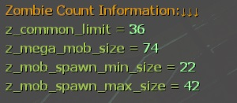

# Description | 內容
Adjust common infecteds/hordes/mobs depends on 5+ survivors in server

> __Note__ <br/>
This plugin is private, Please contact [me](https://github.com/fbef0102/Game-Private_Plugin#私人插件列表-private-plugins-list)<br/>
此為私人插件, 請聯繫[本人](https://github.com/fbef0102/Game-Private_Plugin#私人插件列表-private-plugins-list)

* [Video | 影片展示](https://youtu.be/isTpGqmf1qA)

* Image | 圖示
	<br/>

* Require | 必要安裝
	1. [[INC] Multi Colors](https://github.com/fbef0102/L4D1_2-Plugins/releases/tag/Multi-Colors)

* <details><summary>ConVar | 指令</summary>

	* cfg/sourcemod/l4d2_auto_add_zombie.cfg
		```php
		// 0=Plugin off, 1=Plugin on. (type !zminfo to see zombie count information)
		l4d2_auto_add_zombie_enable "1"

		// 1=Enable notify, 0=Disable notify
		l4d2_auto_add_zombie_hint "1"

		// Enable dynamic adjust if survivor count (real player + AI bot) is greater than this value.
		l4d2_auto_add_zombie_player_count "4"

		// How many common infecteds we can have at once on the map. (override official cvar '_common_limit')
		l4d2_auto_add_zombie_common_limit_default "30"

		// Numbers of Event horde/Alarm horde common infected. (override official cvar '_mega_mob_size')
		l4d2_auto_add_zombie_mega_mob_size_default "50"

		// Minimum numbers of Boomer vomit/Natural horde common infected. (override official cvar '_mob_spawn_min_size')
		l4d2_auto_add_zombie_mob_spawn_min_size_default "10"

		// Maximum numbers of Boomer vomit/Natural horde common infected. (override official cvar '_mob_spawn_max_size')
		l4d2_auto_add_zombie_mob_spawn_max_size_default "30"

		// (Dynamic Adjust) Add this value to '_common_limit_default' each player joins survivor team. (0=off)
		l4d2_auto_add_zombie_common_limit_add "2"

		// (Dynamic Adjust) Add this value to '_mega_mob_size_default' each player joins survivor team. (0=off)
		l4d2_auto_add_zombie_mega_mob_size_add "8"

		// (Dynamic Adjust) Add this value to '_mob_spawn_min_size_default' each player joins survivor team. (0=off)
		l4d2_auto_add_zombie_mob_spawn_min_size_add "4"

		// (Dynamic Adjust) Add this value to '_mob_spawn_max_size_default' each player joins survivor team. (0=off)
		l4d2_auto_add_zombie_mob_spawn_max_size_add "4"

		// If 1, When final rescue starts, disable Dynamic Adjust and restore all official cvars to default value.
		// Prevent too many common infected and horde keep coming, cause final stage stuck
		l4d2_auto_add_zombie_final_restore_default "1"
		```
</details>

* <details><summary>Command | 命令</summary>

	* **Check Zombie count information**
		```php
		sm_zminfo
		```
</details>

* <details><summary>Related Official ConVar</summary>

	* This plugin already modified the following cvars, you don't need to change.

	| ConVar/Command  					| Parameters or default value 	| Effect|
	| -------------|:-----------------:|:-------------:|
	| z_common_limit 					| 30   | How many common infecteds we can have at once.
	| z_mega_mob_size          			| 50   | Amount of zombies to spawn in Map Event horde & Alarm horde & Director Panic Event 
	| z_mob_spawn_min_size          	| 10   | Minimum amount of zombies to spawn in natural hordes & z_spawn mob & boomer hordes
	| z_mob_spawn_max_size          	| 30   | Maximum amount of zombies to spawn in natural hordes & z_spawn mob & boomer hordes
</details>

* Apply to | 適用於
	```
	L4D1
	L4D2
	```

* <details><summary>Translation Support | 支援翻譯</summary>

	```
	English
	繁體中文
	简体中文
	```
</details>

* <details><summary>Related Plugin | 相關插件</summary>

	1. [MultiSlots](https://github.com/fbef0102/L4D1_2-Plugins/tree/master/l4dmultislots): Allows additional survivor players in server when 5+ player joins the server
		> 創造5位以上倖存者遊玩伺服器
	2. [l4dinfectedbots](https://github.com/fbef0102/L4D1_2-Plugins/tree/master/l4dmultislots): Spawns multi infected bots in any mode + allows playable special infected in coop/survival + unlock infected slots (10 VS 10 available)
		> 多特感生成插件，倖存者人數越多，生成的特感越多，且不受遊戲特感數量限制 + 解除特感隊伍的人數限制 (可達成對抗 10 VS 10 玩法)
</details>

* <details><summary>Changelog | 版本日誌</summary>

	* v1.1 (2023-12-7)
		* When final rescue starts, disable Dynamic Adjust and restore all official cvars to default value.
		* Prevent too many common infected and horde keep coming, cause final stage stuck

	* v1.0 (2023-11-29)
	    * Initial Release
</details>

- - - -
# 中文說明
隨著玩家人數越多，殭屍/屍潮 數量越來越多

* 圖示
	<br/>

* 原理
	* 當倖存者超過四人以上時，增加更多的殭屍數量
	* 增加的有
		* 殭屍同時存在的總數量
		* 警報車/地圖機關 殭屍數量
		* Boomer噴到/自然屍潮 殭屍數量

* <details><summary>指令中文介紹 (點我展開)</summary>

	* cfg/sourcemod/l4d2_auto_add_zombie.cfg
		```php
		// 0=關閉插件, 1=啟動插件 (輸入 !zminfo 隨時查看當下的殭屍數量狀態)
		l4d2_auto_add_zombie_enable "1"

		// 1=啟用提示, 0=關閉提示
		l4d2_auto_add_zombie_hint "1"

		// 倖存者(真人+Bot)大於這個人數的時候才啟用動態調整模式 => 隨著玩家人數越多，殭屍/屍潮 數量越來越多.
		l4d2_auto_add_zombie_player_count "4"

		// 殭屍同時存在的總數量 (覆蓋官方指令 'z_common_limit')
		l4d2_auto_add_zombie_common_limit_default "30"

		// 警報車/地圖機關 殭屍數量. (覆蓋官方指令 'z_mega_mob_size')
		l4d2_auto_add_zombie_mega_mob_size_default "50"

		// Boomer噴到/自然屍潮 最少的殭屍數量. (覆蓋官方指令 'z_mob_spawn_min_size')
		l4d2_auto_add_zombie_mob_spawn_min_size_default "10"

		// Boomer噴到/自然屍潮 最多的殭屍數量. (覆蓋官方指令 'z_mob_spawn_max_size')
		l4d2_auto_add_zombie_mob_spawn_max_size_default "30"

		// (動態調整模式) 每新增一位倖存者，殭屍同時存在的總數量增加幾個. (0=關閉此功能)
		l4d2_auto_add_zombie_common_limit_add "2"

		// (動態調整模式) 每新增一位倖存者，警報車/地圖機關 殭屍數量增加幾個. (0=關閉此功能)
		l4d2_auto_add_zombie_mega_mob_size_add "8"

		// (動態調整模式) 每新增一位倖存者，Boomer噴到/自然屍潮 最少的殭屍數量增加幾個. (0=關閉此功能)
		l4d2_auto_add_zombie_mob_spawn_min_size_add "4"

		// (動態調整模式) 每新增一位倖存者，Boomer噴到/自然屍潮 最多的殭屍數量增加幾個. (0=關閉此功能)
		l4d2_auto_add_zombie_mob_spawn_max_size_add "4"

		// 為1時，當救援開始時，將所有的官方指令值改回預設值
		// 避免殭屍太多，導致救援卡關，無法生成Tank
		l4d2_auto_add_zombie_final_restore_default "1"
		```
</details>

* <details><summary>命令中文介紹 (點我展開)</summary>

	* **查看目前的殭屍數量狀態**
		```php
		sm_zminfo
		```
</details>

* <details><summary>相關的官方指令中文介紹 (點我展開)</summary>

	* 這個插件已經修改以下四個指令, 你無須更動

	| 指令  				| 預設值 	| 效果 |
	| -------------|:-----------------:|:-------------:|
	| z_common_limit 					| 30   | 地圖上殭屍同時存在的總數量
	| z_mega_mob_size          			| 50   | 警報車/地圖機關/導演屍潮 生成的殭屍數量.
	| z_mob_spawn_min_size          	| 10   | Boomer噴到/自然屍潮/z_spawn mob 最少生成的殭屍數量
	| z_mob_spawn_max_size          	| 30   | Boomer噴到/自然屍潮/z_spawn mob 最多生成的殭屍數量
</details>
