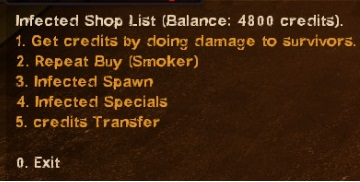
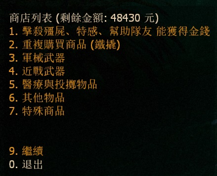
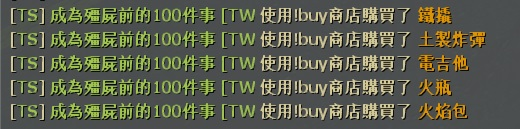
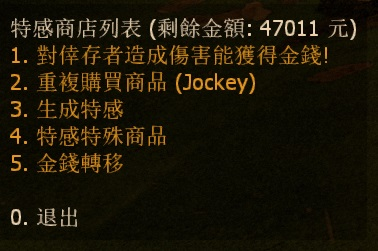
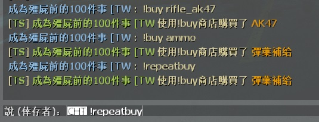

# Description | 內容
L4D2 Human and Zombie Shop by HarryPoter

> __Note__ <br/>
This plugin is private, Please contact [me](https://github.com/fbef0102/Game-Private_Plugin#私人插件列表-private-plugins-list)<br/>
此為私人插件, 請聯繫[本人](https://github.com/fbef0102/Game-Private_Plugin#私人插件列表-private-plugins-list)

* [Video | 影片展示](https://youtu.be/LP0ALxlbaZE)

* <details><summary>Image</summary>

	<br/>
	<br/>
	<br/>
	<br/>
	<br/>
</details>

* <details><summary>How does it work?</summary>

	* (Survivor) Killing zombies and infected to earn credits
	* (Infected) Doing Damage to survivors to earn credits
	* Type !buy in chatbox, buy anything you want
	* Save player's credits to server. (Database)
</details>

* Require | 必要安裝
	1. [left4dhooks](https://forums.alliedmods.net/showthread.php?t=321696)
	2. [[INC] Multi Colors](https://github.com/fbef0102/L4D1_2-Plugins/releases/tag/Multi-Colors)
	3. To unlock all melee weapons in all campaigns, you MUST use the [Mission and Weapons - Info Editor](https://forums.alliedmods.net/showthread.php?t=310586) plugin which supersedes the extension.

* <details><summary>ConVar | 指令</summary>

	* cfg/sourcemod/L4D2_Buy_Store.cfg
		```php
		// Numbers of real survivor and infected player require to active this plugin.
		sm_shop_player_require "4"

		// If 1, use CookiesCached to save player money. Otherwise, the moeny will not be saved if player leaves the server.
		sm_shop_CookiesCached_enable "1"

		// Giving money for killing a boomer
		sm_shop_boomkilled "10"

		// Giving money for killing a charger
		sm_shop_chargerkilled "30"

		// Giving money for killing a smoker
		sm_shop_smokerkilled "20"

		// Giving money for killing a hunter
		sm_shop_hunterkilled "20"

		// Giving money for killing a jockey
		sm_shop_jockeykilled "25"

		// Giving money for killing a spitter
		sm_shop_spitterkilled "10"

		// Giving one dollar money for hurting tank per X hp
		sm_shop_tank_hurt "40"

		// Giving money for killing a witch
		sm_shop_witchkilled "80"

		// Giving money for killing a zombie
		sm_shop_zombiekilled "1"

		// If 1, Giving money for healing people with kit (Money=Amount of health restored)
		sm_shop_heal_teammate "1"

		// Giving money for saving people with defibrillator
		sm_shop_defi_save "200"

		// Giving money for saving incapacitated people. (No Hanging from legde)
		sm_shop_help_teammate_save "30"

		// Giving money for incapacitating a survivor. (No Hanging from legde)
		sm_shop_infected_survivor_incap "30"

		// Giving money for killing a survivor.
		sm_shop_infected_survivor_killed "100"

		// If 1, decrease money if survivor friendly fire each other. (1 hp = 1 dollar)
		sm_shop_survivor_TK_enable "1"

		// Can not buy gas can in these maps, separate by commas (no spaces). (0=All maps, Empty = none).
		sm_shop_gascan_map_off "c1m4_atrium,c6m3_port,c14m2_lighthouse"

		// Can not buy cola in these maps, separate by commas (no spaces). (0=All maps, Empty = none).
		sm_shop_cola_map_off "c1m2_streets"

		// Max Air Jump Limit for survivor special item.
		sm_shop_special_max_jump_limit "3"

		// How long could "Infinite Ammo" state last for survivor special item.
		sm_shop_special_infinite_ammo_time "20"

		// Giving money to each alive survivor for mission accomplished award (non-final).
		sm_shop_stage_complete "400"

		// Giving money to each alive survivor for mission accomplished award (final).
		sm_shop_final_mission_complete "3000"

		// Giving money to each infected player for wiping out survivors.
		sm_shop_mission_lost "300"

		// If 1, Enable shop for infected.
		sm_shop_infected_enable "1"

		// Infected player must wait until survivors have left start safe area for at least X seconds to buy item. (0=Infected Shop available anytime)
		sm_shop_infected_wait_time "10"

		// Cold Down Time in seconds an infected player can not buy again after player buys item. (0=off).
		sm_shop_infected_cooltime_block "30.0"

		// Cold Down Time in seconds a survivor player can not buy again after player buys item. (0=off).
		sm_shop_survivor_cooltime_block "5.0"

		// How long could "Immune Everything" last for infected special item.
		sm_shop_special_immune_everything_time "10"

		// Tank limit on the field before infected can buy a tank. (0=Can't buy Tank)
		sm_shop_infected_tank_limit "1"

		// Witch limit on the field before infected can buy a witch. (0=Can't buy Witch)
		sm_shop_infected_witch_limit "4"

		// How far away from survivors an infected can buy and spawn witch.
		sm_shop_infected_witch_spawn_safety_range "1250"

		// Amount of seconds before a witch is kicked. (only remove witches bought by player in this plugin)
		sm_shop_infected_witch_lifespan "180"

		// How long could "Freeze-Infected" state last for survivor special item.
		sm_shop_special_freeze_time "20"

		// How long could "Gain Adrenaline Power" state last for survivor special item.
		sm_shop_special_adrenaline_time "20"

		// Maximum money limit. (Money saved when map change/leaving server)
		sm_shop_max_moeny_limit "32000"

		// How long could "Dead-Eyes" state last for survivor special item.
		sm_shop_special_dead_eyes_time "60"

		// Changes how 'You got credits by killing infected' Message displays. (0: Disable, 1:In chat, 2: In Hint Box, 3: In center text)
		sm_shop_kill_infected_announce_type "1"

		// "Changes how 'You got credits by helping teammate' Message displays. (0: Disable, 1:In chat, 2: In Hint Box, 3: In center text)
		sm_shop_help_teammate_announce_type "1"

		// Reduce money if tank players lose control and become AI tank. (0=off)
		sm_shop_tank_lost_control "1500"

		// Database to save money to.
		// empty = don't connect to database
		//  (MySQL & SQLite supported)
		sm_shop_database ""
		```
</details>

* <details><summary>Command | 命令</summary>

	* **Open shop menu**
		```php
		say "b"
		sm_shop
		sm_buy
		sm_b
		sm_money
		sm_purchase
		sm_market
		sm_item
		sm_items
		sm_credit
		sm_credits
		```
	* **Buy item short command list**
		```php
		Weapon
		{
			"!buy pistol" 				-> Pistol
			"!buy pistol_magnum"		-> Magnum
			"!buy pumpshotgun"			-> Pumpshotgun
			"!buy shotgun_chrome"		-> Chrome Shotgun
			"!buy smg"					-> Smg
			"!buy smg_silenced"			-> Silenced Smg
			"!buy smg_mp5"				-> MP5
			"!buy rifle"				-> Rifle
			"!buy rifle_ak47"			-> AK47
			"!buy rifle_desert"			-> Desert Rifle
			"!buy rifle_sg552"			-> SG552
			"!buy shotgun_spas"			-> Spas Shotgun
			"!buy autoshotgun"			-> Autoshotgun
			"!buy hunting_rifle"		-> Hunting Rifle
			"!buy sniper_military"		-> Military Sniper
			"!buy sniper_scout"			-> SCOUT
			"!buy sniper_awp"			-> AWP
			"!buy rifle_m60"			-> M60 Machine Gun
			"!buy grenade_launcher"		-> Grenade Launcher
		}

		Melee
		{
			"!buy chainsaw"				-> Chainsaw
			"!buy baseball_bat"			-> Baseball Bat
			"!buy cricket_bat"			-> Cricket Bat
			"!buy crowbar"				-> Crowbar
			"!buy electric_guitar"		-> Electric Guitar
			"!buy fireaxe"				-> Fire Axe
			"!buy frying_pan"			-> Frying Pan
			"!buy katana"				-> Katana
			"!buy machete"				-> Machete
			"!buy tonfa"				-> Tonfa
			"!buy golfclub"				-> Golf Club
			"!buy knife"				-> Knife
			"!buy pitchfork"			-> Pitchfork
			"!buy shovel"				-> Shovel
		}

		Medic and Throwable
		{
			"!buy health_100"			-> Health+100
			"!buy defibrillator"		-> Defibrillator
			"!buy first_aid_kit"		-> First Aid Kit
			"!buy pain_pills"			-> Pain Pill
			"!buy adrenaline"			-> Adrenaline
			"!buy pipe_bomb"			-> Pipe Bomb
			"!buy molotov"				-> Molotov
			"!buy vomitjar"				-> Vomitjar
		}

		Other
		{
			"!buy ammo"								-> Ammo
			"!buy laser_sight"						-> Laser Sight
			"!buy incendiary_ammo"					-> Incendiary Ammo
			"!buy explosive_ammo"					-> Explosive Ammo
			"!buy weapon_upgradepack_incendiary"	-> Incendiary Pack
			"!buy weapon_upgradepack_explosive"		-> Explosive Pack
			"!buy propanetank"						-> Propane Tank
			"!buy oxygentank"						-> Oxygen Tank
			"!buy fireworkcrate"					-> Firework Crate
			"!buy gascan"							-> Gascan
			"!buy cola_bottles"						-> Cola Bottles
			"!buy gnome"							-> Gnome
		}

		Survivor Special
		{
			"!buy Fire"						-> Fire Yourself
			"!buy Boom"						-> Drop Pipebomb
			"!buy Adrenaline_Power"			-> Gain Adrenaline Power
			"!buy Revive"					-> Save Yorself
			"!buy Fire_Infeceted"			-> All Infected Gets On Fire
			"!buy Teleport"					-> Teleport to teammate
			"!buy Infinite_Ammo"			-> Infinite Ammo
			"!buy No_FF"					-> No Friendly Fire
			"!buy Dead_Eyes"				-> Dead-Eyes
			"!buy Kill_Commons"				-> Kill Commons
			"!buy Kill_Witches"				-> Kill Witches
			"!buy Heal_Survivors"			-> Heal Survivors
			"!buy Jump+1"					-> Jump+1
			"!buy Slay_Infected"			-> Slay Infected Attacker
			"!buy Respawn"					-> Respawn Alive
			"!buy Freeze_Infected"			-> Freeze-Infected
		}

		Infected Spawn
		{
			"!buy Suicide" 	-> Suicide
			"!buy Smoker" 	-> Smoker
			"!buy Boomer" 	-> Boomer
			"!buy Hunter" 	-> Hunter
			"!buy Spitter" 	-> Spitter
			"!buy Jockey" 	-> Jockey
			"!buy Charger" 	-> Charger
			"!buy Tank" 	-> Tank
		}

		Infected Special
		{
			"!buy Health" 	-> Full Health
			"!buy Teleport" -> Teleport to survivor
			"!buy Immune" 	-> Immune Everything
			"!buy Horde" 	-> Zombie Horde
			"!buy Witch" 	-> Witch
		}
		```

	* **repeat purchase item you bought last time**
		```php
		sm_repeatbuy
		sm_lastbuy
		```

	* **donate money to another player (Or use "Credits Transfer" in shop menu)**
		```php
		sm_pay <name> <money>
		sm_donate <name> <money>
		```

	* **See all players' or specific player's deposit**
		```php
		sm_inspectbank [name]
		sm_checkbank [name]
		sm_lookbank [name]
		sm_allbank [name]
		```

	* **Adm gives/reduces money (ADMFLAG_BAN)**
		```php
		sm_givemoney <name> <+-money>
		sm_givecredit <name> <+-money>
		```

	* **Adm removes player's all money (ADMFLAG_BAN)**
		```php
		sm_clearmoney <name>
		sm_deductmoney <name>
		```
</details>

* <details><summary>Special Item</summary>

	* **Survivor Shop**
		* Fire
		<br/>Description: Do you feel annoying that you are surrounded by common infecteds?
		No need to throw molotov or use melee, create fire around you!!

		* Boom
		<br/>Description: Create the pipebomb from you and it is going to explode!!

		* Adrenaline_Power
		<br/>Description: Gain Adrenaline Power RIGHT NOW!! Move Faster and Save Faster

		* Revive
		<br/>Description: Save yourself when handing from ledge or incapacitated

		* Fire Infeceted
		<br/>Description: Tank throws a rock on the roof and smoker uses his tongue from nowhere, buy this item to burn them all!!

		* Teleport
		<br/>Description: Are you always alone and behind your team? Don't worry, buy this item to teleport back to your team.

		* Infinite Ammo
		<br/>Description: Just shoot the enemy and no need to reload your gun. Enjoy the fun

		* Dead Eyes
		<br/>Description: Special Infecteds always hide and seek, buy this item to see them all!!
		<br/>
		
		* No Friendly Fire
		<br/>Description: Are you tired of stupid friendly fire ? You are gonna love this item.

		* Kill Commons
		<br/>Description: Hate zombies, hate horde? Kill them all

		* Kill Witches
		<br/>Description: No longer you hear witch crying!

		* Heal Survivors
		<br/>Description: Your teammates are all down, buy this item to bring your team back to fight again.. No Surrender !!!

		* Jump+1
		<br/>Description: Now you are super mario, jump and skip the path quickly.

		* Slay Infected Attacker
		<br/>Description: Smoker drags you, Hunter pounces you, Jockey rides on you, charger charges you, and you can't do anything. Now buy this item to slay the infected and be free again.

		* Respawn Alive
		<br/>Description: Dead person isn't a good survivor, activate spell card: Dead Reborn

		* Ice World
		<br/>Description: Freeze All Infected, they can't move and attack. The most powerful item :D
		<br/>

	* **Infected Shop**
		* Full Health
		<br/>Description: You can have second chance.

		* Zombie Horde
		<br/>Description: Mob Incoming !!! Keep survivors busy.

		* Spawn Witch
		<br/>Description: Choose your location wisely and spawn a witch, survivors will feel very hard to complete the mission.
		<br/>

		* Teleport
		<br/>Description: Do you want to attack immediately? Give survivors a surprise !

		* God Mode
		<br/>Description: Being immune every damage from survivors, they can't stumble you, they can't shove you. No one can stop you, You are THE GOD!
		<br/>
</details>

* <details><summary>How to modify the item price</summary>

	* Modify [data/L4D2_Buy_Store.cfg](data/L4D2_Buy_Store.cfg)
</details>

* <details><summary>Database</summary>

	* Choose one of the following method to save money
		1. CookiesCached: Save player money locally via sourcemod data, set ```sm_shop_CookiesCached_enable "1"``` 
			```php
			//Cookies are saved to sourcemod\data\sqlite\clientprefs-sqlite.sq3
			```

		2. MySQL: Database across server, set ```sm_shop_database "shop"``` and set *sourcemod\configs\databases.cfg*
			```php
			// There would a data table named "Buy_Store_database" in database
			"shop"
			{
				"driver"			"default"
				"host"				"x.x.x.x"
				"database"			"yourdatabase"
				"user"				"youruser"
				"pass"				"yourpass"
				"port"				"yourport"
			}
			```
</details>

* Apply to | 適用於
	```
	L4D2
	```

* <details><summary>Translation Support | 支援翻譯</summary>

	```
	English
	繁體中文
	简体中文
	Spanish
	Russian
	Portuguese
	Dutch
	```
</details>

* <details><summary>Changelog | 版本日誌</summary>

	* v5.4 (2024-6-19)
		* Fix translation

	* v5.3 (2024-2-16)
		* Reduce money if tank players lose control
		* Update Cvars

	* v5.2 (2023-11-7)
		* Add repeat buy in survivor meanu and infected menu
		* Add data file, more convenient to edit item price

	* v5.1 (2023-4-28)
		* Optimize Code

	* v5.0 (2022-11-15)
		* Add short buy commands, directly buy item.
		* Repeat purchase item you bought last time.
		* Add Survivor/Infected Special items
		* Support Database
		* Points Transfer
</details>

- - - -
# 中文說明
人類與特感的購物商城 (附有特殊商品與資料庫)

* <details><summary>圖示</summary>

	<br/>
	<br/>
	<br/>
	<br/>
	<br/>
</details>

* 原理
	* (人類) 殺死特感與小殭屍獲取金額
	* (特感) 對倖存者造成傷害獲取金額
	* 輸入!buy購買商品，有特殊商品
	* 能購轉移金錢給其他玩家
	* 跨伺服器資料庫儲存設定

* <details><summary>指令中文介紹 (點我展開)</summary>

	* cfg/sourcemod/L4D2_Buy_Store.cfg
		```php
		// 倖存者與特感隊伍必須有至少4位以上的真人玩家才會啟動插件
		sm_shop_player_require "4"

		// 為1時，使用 CookiesCached 儲存玩家金錢. 意思是說，下次開服時，玩家依然保留上次遊玩的金額
		sm_shop_CookiesCached_enable "1"

		// 殺死 Boomer 獲得的金額
		sm_shop_boomkilled "10"

		// 殺死 Charger 獲得的金額
		sm_shop_chargerkilled "30"

		// 殺死 Smoker 獲得的金額
		sm_shop_smokerkilled "20"

		// 殺死 Hunter 獲得的金額
		sm_shop_hunterkilled "20"

		// 殺死 Jockey 獲得的金額
		sm_shop_jockeykilled "25"

		// 殺死 Spitter 獲得的金額
		sm_shop_spitterkilled "10"

		// 每對Tank造成40滴傷害，獲得一元
		sm_shop_tank_hurt "40"

		// 殺死 Witch 獲得的金額
		sm_shop_witchkilled "80"

		// 殺死 普通感染者 獲得的金額
		sm_shop_zombiekilled "1"

		// 使用治療包療隊友 可以獲得金額 (獲得金額=治療回復的血量)
		sm_shop_heal_teammate "1"

		// 電擊器復活隊友 獲得的金額
		sm_shop_defi_save "200"

		// 拯救倒地的隊友(掛邊不算) 獲得的金額
		sm_shop_help_teammate_save "30"

		// 使倖存者倒地的特感玩家(掛邊不算) 獲得的金額
		sm_shop_infected_survivor_incap "30"

		// 殺死倖存者的特感玩家(掛邊不算) 獲得的金額
		sm_shop_infected_survivor_killed "100"

		// 為1時，友傷會扣除金錢 (1hp = 1元)
		sm_shop_survivor_TK_enable "1"

		// 不能在這些地圖上購買汽油桶 (無空白). (0=全部地圖，留白=無)
		sm_shop_gascan_map_off "c1m4_atrium,c6m3_port,c14m2_lighthouse"

		// 不能在這些地圖上購買可樂瓶 (無空白). (0=全部地圖，留白=無)
		sm_shop_cola_map_off "c1m2_streets"

		// (倖存者特殊商品) "超級瑪利歐 跳躍+1" 最大跳躍數
		sm_shop_special_max_jump_limit "3"

		// (倖存者特殊商品) "無限子彈" 效果時間
		sm_shop_special_infinite_ammo_time "20"

		// 過關進入安全室時，活著的倖存者獲得的金額 (非救援關卡).
		sm_shop_stage_complete "400"

		// 破完地圖上救援載具時，活著的倖存者獲得的金額 (救援關卡).
		sm_shop_final_mission_complete "3000"

		// 滅團之後倖存者扣除的金額
		// 滅團之後特感玩家獲得的金額
		sm_shop_mission_lost "300"

		// 為1時，特感也能購買商品
		sm_shop_infected_enable "1"

		// 特感玩家必須等人類至少出門安全區域10秒後才能購買商品 (0=特感可以在任意時間點購買)
		sm_shop_infected_wait_time "10"

		// 特感玩家再次購買商品的冷卻時間 (0=無冷卻時間).
		sm_shop_infected_cooltime_block "30.0"

		// 倖存者再次購買商品的冷卻時間 (0=無冷卻時間).
		sm_shop_survivor_cooltime_block "5.0"

		// (特感特殊商品) "God 上帝模式" 效果時間
		sm_shop_special_immune_everything_time "10"

		// 場上的Tank數量達到此限制時，特感不能購買Tank生成 (0=無法購買Tank)
		sm_shop_infected_tank_limit "1"

		// (特感特殊商品) 場上的Witch數量達到此限制時，特感不能購買Witch生成 (0=無法購買Witch)
		sm_shop_infected_witch_limit "4"

		// (特感特殊商品) 特感玩家必須離倖存者多遠才能購買 Witch生成
		sm_shop_infected_witch_spawn_safety_range "1250"

		// 特感玩家購買的Witch在180秒後將被移除
		sm_shop_infected_witch_lifespan "180"

		// (倖存者特殊商品) "冰凍世界" 效果時間
		sm_shop_special_freeze_time "20"

		// (倖存者特殊商品) "注射興奮劑" 效果時間
		sm_shop_special_adrenaline_time "20"

		// 最大能儲存的金額
		sm_shop_max_moeny_limit "32000"

		// (倖存者特殊商品) "心靈透視" 效果時間
		sm_shop_special_dead_eyes_time "60"

		// "你殺死XXX獲得XX元" 提示該如何顯示. (0: 不提示, 1: 聊天框, 2: 黑底白字框, 3: 螢幕正中間)
		sm_shop_kill_infected_announce_type "1"

		// "你幫助隊友獲得XX元" 提示該如何顯示. (0: 不提示, 1: 聊天框, 2: 黑底白字框, 3: 螢幕正中間)
		sm_shop_help_teammate_announce_type "1"

		// Tank玩家失去控制權變成AI tank，將扣除金額. (0=關閉這項功能)
		sm_shop_tank_lost_control "1500"

		// 資料庫設定
		// 留白 = 不使用資料庫
		// (支援 MySQL & SQLite)
		sm_shop_database ""
		```
</details>

* <details><summary>命令中文介紹 (點我展開)</summary>

	* **開啟商城列表**
		```php
		say "b"
		sm_shop
		sm_buy
		sm_b
		sm_money
		sm_purchase
		sm_market
		sm_item
		sm_items
		sm_credit
		sm_credits
		```

	* **直接購買商品短名列表**
		```php
		快速購買武器
		{
			"!buy pistol" 				-> 手槍
			"!buy pistol_magnum"		-> 沙漠之鷹
			"!buy pumpshotgun"			-> 木製霰彈槍
			"!buy shotgun_chrome"		-> 鐵製霰彈槍
			"!buy smg"					-> 機槍
			"!buy smg_silenced"			-> 消音機槍
			"!buy smg_mp5"				-> MP5衝鋒槍
			"!buy rifle"				-> 步槍
			"!buy rifle_ak47"			-> AK47
			"!buy rifle_desert"			-> 三連發步槍
			"!buy rifle_sg552"			-> SG552步槍
			"!buy shotgun_spas"			-> 戰鬥霰彈槍
			"!buy autoshotgun"			-> 連發霰彈槍
			"!buy hunting_rifle"		-> 獵槍
			"!buy sniper_military"		-> 軍用狙擊槍
			"!buy sniper_scout"			-> SCOUT狙擊槍
			"!buy sniper_awp"			-> AWP
			"!buy rifle_m60"			-> 殲滅者 M60
			"!buy grenade_launcher"		-> 榴彈發射器
		}

		快速購買近戰武器
		{
			"!buy chainsaw"				-> 奪魂鋸
			"!buy baseball_bat"			-> 球棒
			"!buy cricket_bat"			-> 板球拍
			"!buy crowbar"				-> 鐵撬
			"!buy electric_guitar"		-> 電吉他
			"!buy fireaxe"				-> 斧頭
			"!buy frying_pan"			-> 平底鍋
			"!buy katana"				-> 武士刀
			"!buy machete"				-> 開山刀
			"!buy tonfa"				-> 警棍
			"!buy golfclub"				-> 高爾夫球棒
			"!buy knife"				-> 小刀
			"!buy pitchfork"			-> 草叉
			"!buy shovel"				-> 鐵鏟
		}

		快速購買醫療與投擲物品
		{
			"!buy health_100"			-> 生命值+100
			"!buy defibrillator"		-> 電擊器
			"!buy first_aid_kit"		-> 治療包
			"!buy pain_pills"			-> 止痛藥丸
			"!buy adrenaline"			-> 腎上腺素
			"!buy pipe_bomb"			-> 土製炸彈
			"!buy molotov"				-> 火瓶
			"!buy vomitjar"				-> 膽汁
		}

		快速購買其他物品
		{
			"!buy ammo"								-> 彈藥補給
			"!buy laser_sight"						-> 雷射裝置
			"!buy incendiary_ammo"					-> 火焰子彈
			"!buy explosive_ammo"					-> 高爆子彈
			"!buy weapon_upgradepack_incendiary"	-> 火焰包
			"!buy weapon_upgradepack_explosive"		-> 高爆彈
			"!buy propanetank"						-> 瓦斯桶
			"!buy oxygentank"						-> 氧氣罐
			"!buy fireworkcrate"					-> 煙火盒
			"!buy gascan"							-> 汽油
			"!buy cola_bottles"						-> 可樂瓶
			"!buy gnome"							-> 精靈小矮人
		}

		快速購買人類特殊物品
		{
			"!buy Fire"						-> 振火神通
			"!buy Boom"						-> 爆爆王
			"!buy Adrenaline_Power"			-> 注射興奮劑
			"!buy Revive"					-> 拯救自己
			"!buy Fire_Infeceted"			-> 炎之呼吸
			"!buy Teleport"					-> 飛雷神之術
			"!buy Infinite_Ammo"			-> 無限子彈
			"!buy No_FF"					-> 不會造成與受到友傷
			"!buy Dead_Eyes"				-> 心靈透視
			"!buy Kill_Commons"				-> 殺死所有普通殭屍
			"!buy Kill_Witches"				-> 殺死所有Witch
			"!buy Heal_Survivors"			-> 團隊治癒+100
			"!buy Jump+1"					-> 超級瑪利歐
			"!buy Slay_Infected"			-> 處死攻擊你的特感
			"!buy Respawn"					-> 魔法卡: 死者甦醒
			"!buy Freeze_Infected"			-> 冰凍世界
		}

		快速購買特感種類
		{
			"!buy Suicide" 	-> 自殺
			"!buy Smoker" 	-> Smoker
			"!buy Boomer" 	-> Boomer
			"!buy Hunter" 	-> Hunter
			"!buy Spitter" 	-> Spitter
			"!buy Jockey" 	-> Jockey
			"!buy Charger" 	-> Charger
			"!buy Tank" 	-> Tank
		}

		快速購買特感特殊物品
		{
			"!buy Health" 	-> 滿血恢復
			"!buy Teleport" -> 異時空傳送門
			"!buy Immune" 	-> God 上帝模式
			"!buy Horde" 	-> 屍潮降臨
			"!buy Witch" 	-> 召喚Witch
		}
		```

	* **重複購買上次的商品**
		```php
		sm_repeatbuy
		sm_lastbuy
		```

	* **捐贈金額給其他人 (或在商城列表使用"金錢轉移")**
		```php
		sm_pay <玩家名稱> <金錢>
		sm_donate <玩家名稱> <金錢>
		```

	* **查看所有玩家的銀行儲值**
		```php
		sm_inspectbank [name]
		sm_checkbank [name]
		sm_lookbank [name]
		sm_allbank [name]
		```

	* **管理員打錢 (權限：ADMFLAG_BAN)**
		```php
		sm_givemoney <玩家名稱> <+-金錢>
		sm_givecredit <玩家名稱> <+-金錢>
		```

	* **管理員沒收玩家的金錢 (權限：ADMFLAG_BAN)**
		```php
		sm_clearmoney <玩家名稱>
		sm_deductmoney <玩家名稱>
		```
</details>

* <details><summary>如何設定各商品金額</summary>

	* 修改文件 [data/L4D2_Buy_Store.cfg](data/L4D2_Buy_Store.cfg)
</details>

* <details><summary>資料庫設定</summary>

	* 以下方法二選一
		1. CookiesCached: 能幫玩家儲值金額到本地sourcemod庫上，開啟指令 ```sm_shop_CookiesCached_enable "1"```
			```php
			//儲存於sourcemod\data\sqlite\clientprefs-sqlite.sq3
			```

		2. MySQL: 跨伺服器儲值金額，設定指令 ```sm_shop_database "shop"```，然後設定文件 *sourcemod\configs\databases.cfg*
			```php
			// 資料庫中自動創建表格，名稱是 "Buy_Store_database"
			"shop"
			{
				"driver"			"default"
				"host"				"x.x.x.x"
				"database"			"yourdatabase"
				"user"				"youruser"
				"pass"				"yourpass"
				"port"				"yourport"
			}
			```
</details>

* <details><summary>特殊商品中文介紹 (點我展開)</summary>

	* **人類商品**
		* 振火神通
		<br/>說明: 原地著火

		* 爆爆王
		<br/>說明: 創造一顆即將要爆炸的土製炸彈

		* 注射興奮劑 (短暫時間)
		<br/>說明: 直接獲得腎上腺素效果

		* 拯救自己
		<br/>說明: 掛邊或倒地時自救

		* 炎之呼吸
		<br/>說明: 所有特感著火

		* 飛雷神之術
		<br/>說明: 傳送到附近的隊友身上

		* 無限子彈 (短暫時間)

		* 心靈透視
		<br/>說明: 直接看到特感與小殭屍位置
		<br/>
		
		* 不會造成與受到友傷 (當前回合)

		* 殺死所有普通殭屍

		* 殺死所有Witch

		* 團隊治癒+100

		* 超級瑪利歐 跳躍+1 (當前回合)
		<br/>說明: 空中二段跳

		* 處死攻擊你的特感

		* 魔法卡: 死者甦醒
		<br/>說明: 從死亡狀態直接復活

		* 冰凍世界 (短暫時間)
		<br/>說明: 凍結所有特感，所有特感均不能移動與攻擊
		<br/>

	* **特感商品**
		* 滿血恢復

		* 屍潮降臨

		* 召喚Witch (在你的位置上)
		<br/>

		* 異時空傳送門
		<br/>說明: 直接傳送到人類身上

		* God 上帝模式 (短暫時間)
		<br/>說明: 不會被震暈、不會被推開、不會受傷，無人能擋
		<br/>
</details>


