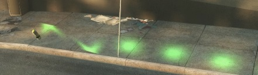
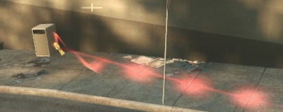
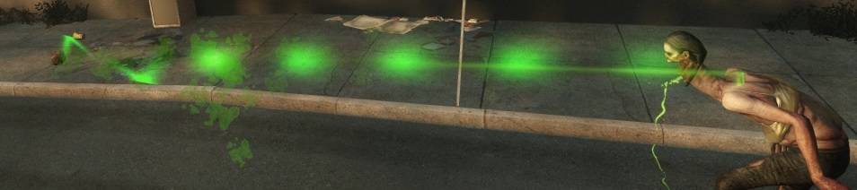
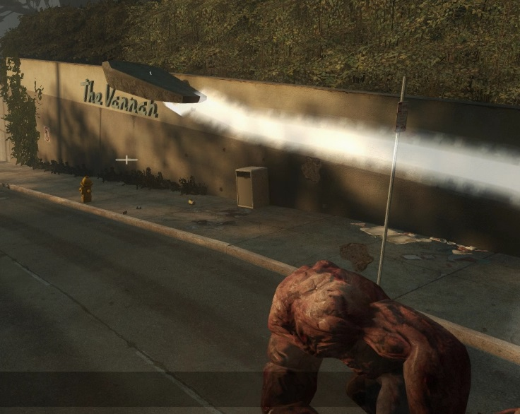

# Description | 內容
Trails Projectile (Pipe Bomb / Molotov / VomitJar / Grenade / Spitter Projectile / Tank Rock)

> __Note__ <br/>
This plugin is private, Please contact [me](https://github.com/fbef0102/Game-Private_Plugin#私人插件列表-private-plugins-list)<br/>
此為私人插件, 請聯繫[本人](https://github.com/fbef0102/Game-Private_Plugin#私人插件列表-private-plugins-list)

* [Video | 影片展示](https://youtu.be/c_0ACD0VLQA)

* Image | 圖示
	* Molotov projectile
        > 汽油彈
        <br/>
	* VomitJar projectile
        > 膽汁瓶
        <br/>
	* Pipe bomb projectile
        > 土製炸彈
        <br/>
	* Grenade launcher projectile
        > 榴彈
        <br/>
	* Spitter projectile
        > 唾液物
        <br/>
	* Tank Rock
        > 石頭
        <br/>

* Apply to | 適用於
    ```
    L4D1
    L4D2
    ```

* <details><summary>Changelog | 版本日誌</summary>

    * v1.2 (2022-10-26)
	    * More Cvars
        * Add spitter projectile
        * Auto generate cfg

    * v1.0
	    * [By Mister_Game_Over](https://forums.alliedmods.net/showthread.php?t=301388)
</details>

* Require | 必要安裝
<br>None

* <details><summary>ConVar | 指令</summary>

    * cfg/sourcemod/Trails_Projectile.cfg
        ```php
        // Enable/Disable plugin
        Trails_Projectile_enable "1"

        // (L4D2) Transparency of grenade trail. (10-255)
        Trails_Projectile_grenade_alpha "200"

        // (L4D2) Grenade trail color. Three values between 0-255 separated by spaces. RGB Color255 - Red Green Blue.
        // [default: 160 32 240]
        Trails_Projectile_grenade_color "160 32 240"

        // (L4D2) If 1, Enable grenade trail
        Trails_Projectile_grenade_enable "1"

        // (L4D2) Material of grenade trail. (1: liner, 2: dotted, 3: Random)
        Trails_Projectile_grenade_material "3"

        // Transparency of Molotov trail. (10-255)
        Trails_Projectile_molotov_alpha "200"

        // Molotov trail color. Three values between 0-255 separated by spaces. RGB Color255 - Red Green Blue.
        // [default: 255 255 0]
        Trails_Projectile_molotov_color "255 255 0"

        // If 1, Enable Molotov trail
        Trails_Projectile_molotov_enable "1"

        // Material of Molotov trail. (1: liner, 2: dotted, 3: Random)
        Trails_Projectile_molotov_material "3"

        // Transparency of pipe bomb trail. (10-255)
        Trails_Projectile_pipebomb_alpha "200"

        // pipe bomb trail color. Three values between 0-255 separated by spaces. RGB Color255 - Red Green Blue.
        // [default: 255 48 48]
        Trails_Projectile_pipebomb_color "255 48 48"

        // If 1, Enable pipe bomb trail
        Trails_Projectile_pipebomb_enable "1"

        // Material of pipe bomb trail. (1: liner, 2: dotted, 3: Random)
        Trails_Projectile_pipebomb_material "3"

        // Transparency of tank rock trail. (10-255)
        Trails_Projectile_rock_alpha "200"

        // Tank rock trail color. Three values between 0-255 separated by spaces. RGB Color255 - Red Green Blue.
        // [default: 200 200 200]
        Trails_Projectile_rock_color "200 200 200"

        // If 1, Enable tank rock trail
        Trails_Projectile_rock_enable "1"

        // Material of tank rock trail. (1: liner, 2: dotted, 3: Random)
        Trails_Projectile_rock_material "3"

        // (L4D2) Transparency of spitter projectile trail. (10-255)
        Trails_Projectile_spitter_alpha "200"

        // (L4D2) spitter projectile trail color. Three values between 0-255 separated by spaces. RGB Color255 - Red Green Blue.
        // [default: 0 255 0]
        Trails_Projectile_spitter_color "0 255 0"

        // (L4D2) If 1, Enable spitter projectile trail
        Trails_Projectile_spitter_enable "1"

        // (L4D2) Material of spitter projectile trail. (1: liner, 2: dotted, 3: Random)
        Trails_Projectile_spitter_material "3"

        // (L4D2) Transparency of vomitjar trail. (10-255)
        Trails_Projectile_vomitjar_alpha "200"

        // (L4D2) Vomitjar trail color. Three values between 0-255 separated by spaces. RGB Color255 - Red Green Blue.
        // [default: 50 205 50]
        Trails_Projectile_vomitjar_color "50 205 50"

        // (L4D2) If 1, Enable vomitjar trail
        Trails_Projectile_vomitjar_enable "1"

        // (L4D2) Material of vomitjar trail. (1: liner, 2: dotted, 3: Random)
        Trails_Projectile_vomitjar_material "3"
        ```
</details>

* <details><summary>Command | 命令</summary>
    
    None
</details>

- - - -
# 中文說明
投擲物品時有拖曳軌跡 (土製炸彈 / 汽油彈 / 膽汁瓶 / 榴彈 / Spitter唾液物 / Tank石頭)

* 原理
    * 丟出去投擲物的時候產生拖曳軌跡

* 功能
	* 可調整每種投擲物的開關、顏色、透明度、形狀


