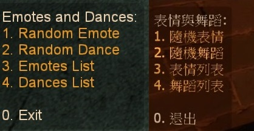

# Description | 內容
Emotes and Dance in L4D1/2

> __Note__ <br/>
This plugin is private, Please contact [me](https://github.com/fbef0102/Game-Private_Plugin#私人插件列表-private-plugins-list)<br/>
此為私人插件, 請聯繫[本人](https://github.com/fbef0102/Game-Private_Plugin#私人插件列表-private-plugins-list)

* [Video | 影片展示](https://youtu.be/iIDv53oFaJE)

* Image | 圖示
	<br/>
	* Special Infected can dance (特感也可以跳舞)
	<br/>
	* Support Lux's Model Changer (支援模組改變)
	<br/>

* <details><summary>How does it work?</summary>

	* Everyone types ```!dance``` -> Enjoy, everyone can see you dance
	* Admin types ```!admin``` -> Player commands -> "Emote player" -> make player dance
	* You must prepare fastdl, otherwise players can not dance (If you don't know what "FastDL" is, please google it)
</details>

* Require | 必要安裝
	1. [left4dhooks](https://forums.alliedmods.net/showthread.php?t=321696)
	2. [[INC] Multi Colors](https://github.com/fbef0102/L4D1_2-Plugins/releases/tag/Multi-Colors)

* <details><summary>ConVar | 指令</summary>

	* cfg/sourcemod/fortnite_dances_emotes_l4d.cfg
		```php
		// Enable/Disable sounds for emotes/dances. (Needs to restart map)
		fortnite_dances_emotes_l4d_sounds "0"

		// Cooldown for emotes/dances in seconds. -1 or 0 = no cooldown.
		fortnite_dances_emotes_l4d_cooldown "2.0"

		// Sound volume for the emotes/dances. [0.0-1.0]
		fortnite_dances_emotes_l4d_sound_volume "1.0"

		// Players with these flags have access to use emotes menu. (Empty = Everyone, -1: Nobody)
		fortnite_dances_emotes_l4d_flag_emote_menu ""

		// Players with these flags have access to use dances menu. (Empty = Everyone, -1: Nobody)
		fortnite_dances_emotes_l4d_flag_dance_menu ""

		// If 1, Hide weapons when dancing
		fortnite_dances_emotes_l4d_hide_weapons "1"

		// If 1, Hide enemy players when dancing
		fortnite_dances_emotes_l4d_hide_enemies "0"

		// If 1, Teleport back to the exact position when he started to dance. (Some maps need this for teleport triggers)
		fortnite_dances_emotes_l4d_teleportonend "1"

		// Sets the playback speed of the animation. [0.0-1.0]
		fortnite_dances_emotes_l4d_speed "0.80"

		// Player [1=Dance, 2=Emotes, 3=Random] when someone uses kit to heal him. (0=off)
		fortnite_dances_emotes_l4d_heal_dance "3"
		```
</details>

* <details><summary>Command | 命令</summary>
	
	* **Open Dance&Emote Menu**
		```php
		sm_dances
		sm_dance
		```

	* **Adm forces someone to dance, check source code to see Emote ID (Adm required: ADMFLAG_ROOT)**
		```php
		sm_setdances <#userid|name> [Emote ID]
		sm_setdance <#userid|name> [Emote ID]
		```
</details>

* <details><summary>How do I set up files</summary>

	1. Preparation
		* Download all files(addons, materials, models, and sound).
		* Put them in your game server
			* If L4D1, ```Left 4 Dead Dedicated Server\left4dead```
			* If L4D2, ```Left 4 Dead 2 Dedicated Server\left4dead2```
		* Prepare your content-server for FastDL, if you don't know what "FastDL" is, please google it

	2. Setup server to work with downloadable content
		* ConVars in your cfg/server.cfg should be:
			* If you are L4D1
			```php
			sm_cvar sv_allowdownload "1"
			sm_cvar sv_downloadurl "http://your-content-server.com/game/left4dead/"
			```
			* If you are L4D2
			```php
			sm_cvar sv_allowdownload "1"
			sm_cvar sv_downloadurl "http://your-content-server.com/game/left4dead2/"	
			```

	3. Uploading files to server.
		* Upload "models" and "sound" folder to content-server
			* If you are L4D1, ```your-content-server.com/game/left4dead/models/``` and ```your-content-server.com/game/left4dead/sound/```
			* If you are L4D2, ```your-content-server.com/game/left4dead2/models/``` and ```your-content-server.com/game/left4dead2/sound/```
		* Upload "models" and "sound" folder to game server.
			* If you are L4D1, ```Left 4 Dead Dedicated Server\left4dead```
			* If you are L4D2, ```Left 4 Dead 2 Dedicated Server\left4dead2```
		* Upload "models" and "sound" folder to your client's game folder (for test).
			* If you are L4D1, ```left 4 dead\left4dead\models\``` and ```left 4 dead\left4dead\sound\```
			* If you are L4D2, ```Left 4 Dead 2\left4dead2\models\``` and ```Left 4 Dead 2\left4dead2\sound\```

	4. Start the server and test
		* Join survivor and type !dance.
</details>

* Apply to | 適用於
	```
	L4D1
	L4D2
	```

* <details><summary>Translation Support | 支援翻譯</summary>

	```
	English
	繁體中文
	简体中文
	Spanish
	Turkish
	```
</details>

* <details><summary>Related Plugin | 相關插件</summary>

	1. [Lux's Model Changer](https://forums.alliedmods.net/showthread.php?t=286987): LMC Allows you to use most models with most characters
		* 可以自由變成其他角色或NPC的模組
	2. [l4d_MusicMapStart](https://github.com/fbef0102/L4D1_2-Plugins/tree/master/l4d_MusicMapStart): Download and play custom music in game
		* 回合開始播放音樂，使用!music點歌系統，可播放自製的音樂
	3. [map-decals](https://github.com/fbef0102/L4D1_2-Plugins/tree/master/map-decals): Allows admins to place any decals into the map that are defined in the the config and save them permanently for each map
		* 允許管理員將任何塗鴉放置在配置中定義的地圖中，並為每個地圖永久保存它們
</details>

* <details><summary>Changelog | 版本日誌</summary>

	* v1.5h (2024-9-23)
		* Compatible with with [Lux's Model Changer](https://forums.alliedmods.net/showthread.php?t=286987)

	* v1.4h (2024-5-8)
		* Update Translation
		* Update cvars
		* Add api
		* Change plugin name

	* v1.3h (2024-4-1)
		* Update Translation
		* Update cmds
		* Add "Emote player" in admin menu under 'Player commands' category

	* v1.2h (2024-3-25)
		* Fixed camera stuck when player dies

	* v1.1h (2024-3-13)
		* Fixed infected flashight off after dance end
		* Add Gamedata
		* Support readyup

	* v1.0h (2024-3-1)
		* Require left4dhooks
		* Survivor can't dance if is incap, hanging from ledge or get pinned by infected
		* Infected can't dance if is dead, or pinning survivor
		* Update translation

	* v1.5.3 (2023-12-24)
		* Fixed crash in some custom maps

	* v1.5.2 (2023-11-10)
		* Fixed crash when other plugins trying to call "CreateFakeClient"

	* v1.5.1 (2023-10-20)
		* Ghost infected can not dance

	* v1.5.0 (2022-11-14)
		* Player dances when someone uses kit to heal him
		* fix translation error
		* fix file error
		* Compatibility support for SourceMod 1.11. Fixed various warnings.
		* Combine L4D1 and L4D2 required files
		* Add convar to disable dance dounce and stop downloading sound files

	* v1.4.3
		* [Original plugin by Kodua, Franc1sco franug, TheBO$$, Foxhound](https://forums.alliedmods.net/showpost.php?p=2712458&postcount=163)
</details>

- - - -
# 中文說明
搞笑動作模組: 表情與舞蹈

* 原理
	* 任何人輸入```!dance```可以跳舞，所有玩家都會看到你在跳舞
	* 管理員輸入` ```!admin``` -> "玩家指令" -> "表情玩家" -> 指定玩家跳舞
	* 玩家的模組做特殊的動作，總共有80多種表情與舞蹈
	* 即使是使用自製的角色模組，依然能做表情與舞蹈

> __Note__ 需自備網空且支援FastDL，客戶端才會下載跳舞的檔案，否則此插件會無效 
> <br/>(不知道什麼是FastDL請自行Google)

* <details><summary>指令中文介紹 (點我展開)</summary>

	* cfg/sourcemod/fortnite_dances_emotes_l4d.cfg
		```php
		// 0=關閉跳舞音樂, 1=啟動跳舞音樂 (需要重啟地圖才會生效)
		fortnite_dances_emotes_l4d_sounds "1"

		// 再次跳舞的CD時間, -1或0 = 無CD.
		fortnite_dances_emotes_l4d_cooldown "3.0"

		// 跳舞音樂的音量 [數值介於 0.0~1.0] (1.0是最大了)
		fortnite_dances_emotes_l4d_sound_volume "1.0"

		// 擁有這些權限的玩家，才可以使用表情 (留白 = 任何人都能, -1: 無人)
		fortnite_dances_emotes_l4d_flag_emote_menu ""

		// 擁有這些權限的玩家，才可以使用跳舞 (留白 = 任何人都能, -1: 無人)
		fortnite_dances_emotes_l4d_flag_dance_menu ""

		// 為1時，跳舞時隱藏武器
		fortnite_dances_emotes_l4d_hide_weapons "1"

		//為1時，跳舞時隱藏敵人
		fortnite_dances_emotes_l4d_hide_enemies "0"

		// 為1時，跳舞完畢後回到原始的位置
		fortnite_dances_emotes_l4d_teleportonend "0"

		// 跳舞速度 [數值介於 0.0~1.0]
		fortnite_dances_emotes_l4d_speed "0.80"

		// 玩家被治療時，開始跳舞 [1=跳舞, 2=做表情, 3=隨機] (0=關閉這項功能)
		fortnite_dances_emotes_l4d_heal_dance "3"
		```
</details>

* <details><summary>命令中文介紹 (點我展開)</summary>
	
	* **打開跳舞選單**
		```php
		sm_dances
		sm_dance
		```

	* **管理員指定玩家強制跳舞 (權限: ADMFLAG_ROOT)**
		```php
		sm_setdances <#userid|name> [Emote ID]
		sm_setdance <#userid|name> [Emote ID]
		```
</details>

* <details><summary>如何安裝與設定檔案</summary>

	1. 準備清單
		* 下載所有文件（插件和模組檔案與音樂）。
		* 將它們放入遊戲伺服器資料夾中
			* 如果你是 L4D1，```Left 4 Dead Dedicated Server\left4dead```
			* 如果你是 L4D2，```Left 4 Dead 2 Dedicated Server\left4dead2```
		* 準備你的網空並可以支援FastDL, 不知道什麼是FastDL請自行Google
		
	2. 設置伺服器以處理可下載的內容
		* 寫入以下內容到cfg/server.cfg
			* 如果你是 L4D1
			```php
			sm_cvar sv_allowdownload "1"
			sm_cvar sv_downloadurl "http://your-content-server.com/game/left4dead/"
			```
			* 如果你是 L4D2
			```php
			sm_cvar sv_allowdownload "1"
			sm_cvar sv_downloadurl "http://your-content-server.com/game/left4dead2/"	
			```
		
	3. 上傳文件到伺服器。
		* 將"models" 和 "sound"資料夾上傳到網空伺服器
			* 如果你是 L4D1，```your-content-server.com/game/left4dead/models/``` 和 ```your-content-server.com/game/left4dead/sound/```
			* 如果你是 L4D2，```your-content-server.com/game/left4dead2/models/``` 和 ```your-content-server.com/game/left4dead2/sound/```
		* 將"models" 和 "sound"資料夾複製到您的伺服器資料夾上。
			* 如果你是 L4D1，```Left 4 Dead Dedicated Server\left4dead\models\``` 和 ```Left 4 Dead Dedicated Server\left4dead\sound\```
			* 如果你是 L4D2，```Left 4 Dead 2 Dedicated Server\left4dead2\models\``` 和 ```Left 4 Dead 2 Dedicated Server\left4dead\sound\```
		* 將"models" 和 "sound"資料夾上傳到您的遊戲本地資料夾（用於測試）。
			* 如果你是 L4D1，```left 4 dead\left4dead\models\``` 和 ```left 4 dead\left4dead\sound\```
			* 如果你是 L4D2，```Left 4 Dead 2\left4dead2\models\``` 和 ```Left 4 Dead 2\left4dead2\sound\```
		
	4. 啟動伺服器並測試
		* 加入倖存者並輸入```!dance```，測試跳舞是否有動作
</details>
