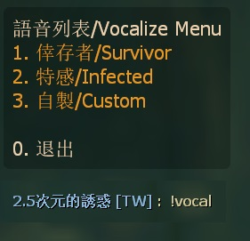
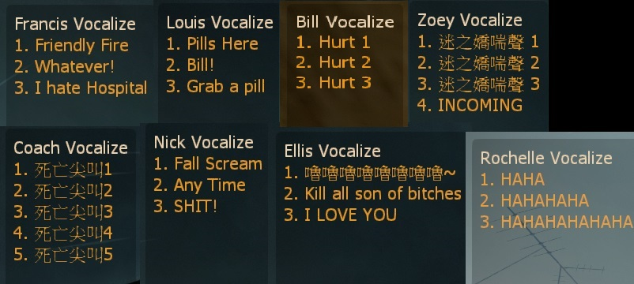

# Description | 內容
Player can select other character's voice and vocalize

> __Note__ <br/>
This plugin is private, Please contact [me](https://github.com/fbef0102/Game-Private_Plugin#私人插件列表-private-plugins-list)<br/>
此為私人插件, 請聯繫[本人](https://github.com/fbef0102/Game-Private_Plugin#私人插件列表-private-plugins-list)

* [Video | 影片展示](https://youtu.be/EVW_neSFDLg)

* <details><summary>Image | 圖示</summary>

	* Character Vocalize Menu
		> 選擇角色語音
		<br/>
	* All characters' vocalize menu (Custom)
		> 所有角色的語音 (可自定義)
		<br/>
</details>

* <details><summary>How does it work?</summary>

	* Type !vocal -> choose any sound to vocalize -> Have Fun!
</details>

* Require | 必要安裝
<br/>None

* <details><summary>ConVar | 指令</summary>

	* cfg/sourcemod/l4d_character_vocalize_select.cfg
		```php
		// Hold Reload button for at least X seconds to open menu. (-1=Disable button)
		l4d_character_vocalize_select_button_press "2.0"

		// Cold Down Time in seconds a player can use menu again. (0=No Cold Down)
		l4d_character_vocalize_select_cooldown_time "0.5"

		// 0=Plugin off, 1=Plugin on.
		l4d_character_vocalize_select_enable "1"

		// If 1, player can only select his own character
		l4d_character_vocalize_select_model_only "0"
		```
</details>

* <details><summary>Command | 命令</summary>

	* **Open menu for test mode**
		```php
		sm_vocal
		```
</details>

* <details><summary>Data Example</summary>

	* data/l4d_character_vocalize_select.cfg
		```php
		"l4d_character_vocalize_select"
		{
			"Ellis" // Please do not change
			{
				"num"		"3" // How many Ellis Vocal Commands
				"1"
				{
					"Name"		"嚕嚕嚕嚕嚕嚕嚕嚕~" // Name whatevert you want
					"Sound"		"player/survivor/voice/mechanic/adrenaline03.wav" // sound path, relative to “sound” folder
				}
				"2"
				{
					"Name"		"Kill all son of bitches"
					"Sound"		"player/survivor/voice/mechanic/worldsigns11.wav"
				}
				"3"
				{
					"Name"		"I LOVE YOU"
					"Sound"		"player/survivor/voice/mechanic/worldc2m1b09.wav"
				}
			}
		}
		```
</details>

* Apply to | 適用於
	```
	L4D1
	L4D2
	```

* <details><summary>Changelog | 版本日誌</summary>

	* v1.0 (2023-4-6)
	    * Initial Release
</details>

- - - -
# 中文說明
可以使用所有角色語音並發出對話，能自定義語音列表

* 原理
	* 輸入!vocal或者長按R兩秒鐘，會出現menu列表
	* 可以選擇其他角色並發出專屬於其他角色的語音
	* 語音列表可以自定義，見下方“Data設定範例”

* 用意在哪?
	* 娛樂，開黑好玩用
	* 瘋狂死亡尖叫

* 功能
	* 可設置語音冷卻時間
	* 可設置長按R的時間
	* 可設置只能選擇自己的角色語音

* <details><summary>Data設定範例</summary>

	* data/l4d_character_vocalize_select.cfg
		```php
		"l4d_character_vocalize_select"
		{
			"Ellis" // 請不要修改
			{
				"num"		"3" // Ellis的語音數量
				"1"
				{
					"Name"		"嚕嚕嚕嚕嚕嚕嚕嚕~" // 名稱隨便取，可以寫中文
					"Sound"		"player/survivor/voice/mechanic/adrenaline03.wav" // 對話音效檔路徑，相對於“sound”資料夾
				}
				"2"
				{
					"Name"		"Kill all son of bitches"
					"Sound"		"player/survivor/voice/mechanic/worldsigns11.wav"
				}
				"3"
				{
					"Name"		"I LOVE YOU"
					"Sound"		"player/survivor/voice/mechanic/worldc2m1b09.wav"
				}
			}
		}
		```
</details>
