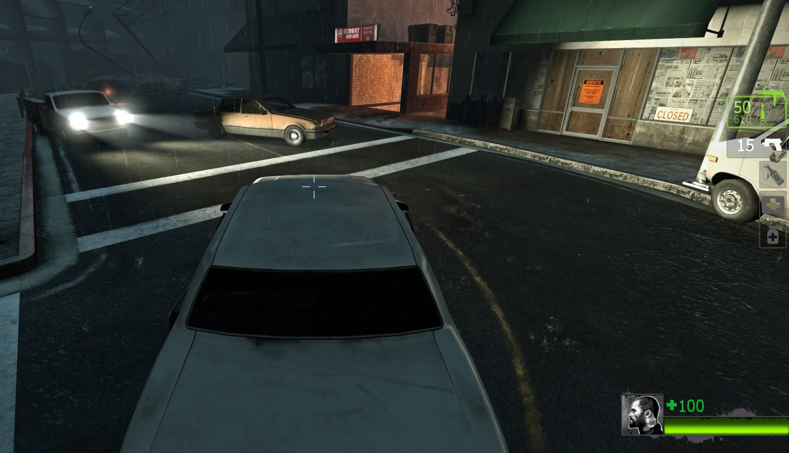
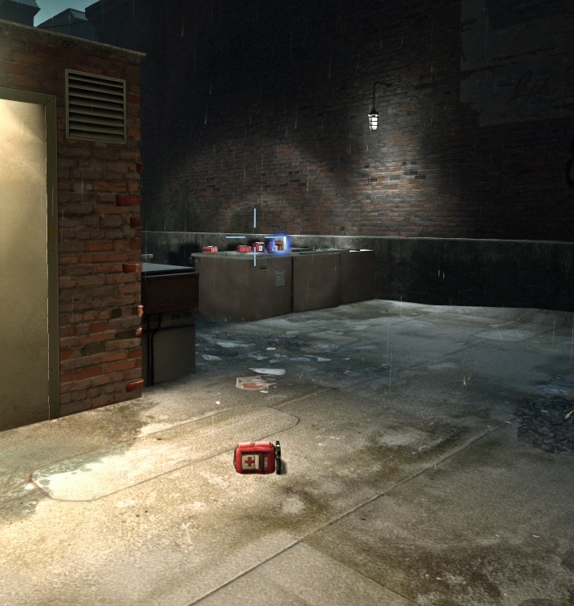
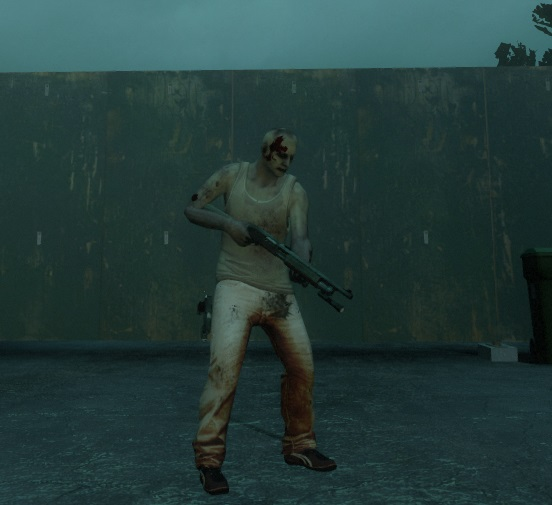
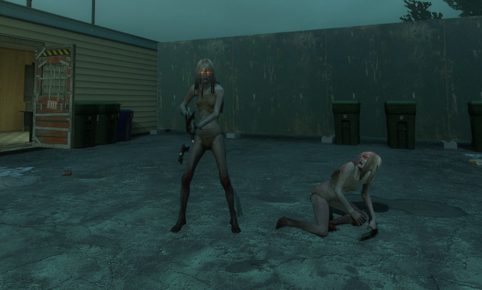

# Description | 內容
Player can become the model you point at.

> __Note__ <br/>
This plugin is private, Please contact [me](https://github.com/fbef0102/Game-Private_Plugin#私人插件列表-private-plugins-list)<br/>
此為私人插件, 請聯繫[本人](https://github.com/fbef0102/Game-Private_Plugin#私人插件列表-private-plugins-list)

* [Video | 影片展示](https://youtu.be/dKdnKxFNUXk)

* <details><summary>Image | 圖示</summary>

	<br/>
	<br/>
	<br/>
	<br/>
	<br/>
	<br/>
	<br/>
</details>

* <details><summary>How does it work?</summary>

	* Point an entity -> type ```!modcopy``` -> type ```!modmenu``` to change player model -> have fun!
	* Point an entity -> type ```!modme``` -> your model will be changed into the same as the entity -> have fun!
	* Can copy special infected, common infected, witch, tank model
	* 🟥 Can't keep the same model after next round, next map, next player spawn
</details>

* Require | 必要安裝
    1. [[INC] Multi Colors](https://github.com/fbef0102/L4D1_2-Plugins/releases/tag/Multi-Colors)
	2. [ThirdPersonShoulder_Detect](https://forums.alliedmods.net/showthread.php?t=298649)
	3. [Attachments API](https://forums.alliedmods.net/showthread.php?t=325651)

* <details><summary>ConVar | 指令</summary>

	* cfg/sourcemod/l4d_modme.cfg
		```php
		// 0=Plugin off, 1=Plugin on.
		l4d_modme_enable "1"

		// Players with these flags have access to use !modme command. (Empty = Everyone, -1: Nobody)
		l4d_modme_access_cmd_flag ""

		// Players with these flags have access to use !modplayer, !modmenu, !modset, !modcopy. (Empty = Everyone, -1: Nobody)
		l4d_modme_access_menu_flag "z"
		```
</details>

* <details><summary>Command | 命令</summary>

	* **Point an entity or infected and copy their model**
		```php
		sm_modcopy
		```

	* **Open Menu to replace player model with or reset model**
		```php
		sm_modmenu
		```

	* **Point an entity or infected and replace your model with their model**
		```php
		sm_modme
		```

	* **Set model manually, for example: sm_modset "models/infected/hulk.mdl"**
		```php
		sm_modset <model path>
		```

	* **Replace player with model manually, for example: sm_modplayer Nick "models/infected/hulk.mdl"**
		```php
		sm_modplayer <player name> <model path>
		```
</details>

* Apply to | 適用於
	```
	L4D1
	L4D2
	```

* <details><summary>Translation Support | 支援翻譯</summary>

	```
	English
	繁體中文
	简体中文
	```
</details>

* <details><summary>Related Plugin | 相關插件</summary>

	1. [l4d_h_csm](/Plugin_插件/Survivor_人類/l4d_h_csm): Allows players to change their L4D1/2 character or model in-game!
		* 允許玩家在遊戲中更換一二代角色
</details>

* <details><summary>Changelog | 版本日誌</summary>

	* v1.3 (2024-3-19)
		* Require Attachments API

	* v1.2 (2024-3-17)
		* Update cmds
		* Fixed Error

	* v1.1 (2024-3-17)
		* Update translation
		* Update cmds
		* Add menu to reset or place other players' model
		* Improve code
		* Compatible with l4d_h_csm v1.6h or above by harry

	* v1.0 (2023-4-8)
	    * Initial Release
</details>

- - - -
# 中文說明
玩家外觀可以變成地圖任何一個物件模型

* 原理
	* 對準一個物件然後輸入```!modcopy```儲存模型 => 輸入 ```!modmenu``` 選擇玩家取代模型
	* 對準一個物件然後輸入```!modme```，你的模型將變成物件的模型
	* 可以複製特感、Tank、Witch、普通感染者的模型
	* 🟥 變更的模型無法保留到下一關、下一次復活、下一回合

* <details><summary>指令中文介紹 (點我展開)</summary>

	* cfg/sourcemod/l4d_modme.cfg
		```php
		// 0=關閉插件, 1=啟動插件
		l4d_modme_enable "1"
		
		// 擁有這些權限的玩家，才可以輸入!modme (留白 = 任何人都能, -1: 無人)
		l4d_modme_access_cmd_flag ""

		// 擁有這些權限的玩家，才可以輸入!modplayer, !modmenu, !modset, !modcopy (留白 = 任何人都能, -1: 無人)
		l4d_modme_access_menu_flag "z"
		```
</details>

* <details><summary>命令中文介紹 (點我展開)</summary>

	* **複製準心指向的物件模組**
		```php
		sm_modcopy
		```

	* **打開介面重置或取代其他玩家的模型**
		```php
		sm_modmenu
		```

	* **自己的模組直接變成準心指向的物件**
		```php
		sm_modme
		```

	* **手動設置模型, 譬如: sm_modset "models/infected/hulk.mdl"**
		```php
		sm_modset <模型路徑>
		```

	* **手動幫玩家設置模型, 譬如: sm_modplayer Nick "models/infected/hulk.mdl"**
		```php
		sm_modplayer <玩家名稱> <模型路徑>
		```
</details>