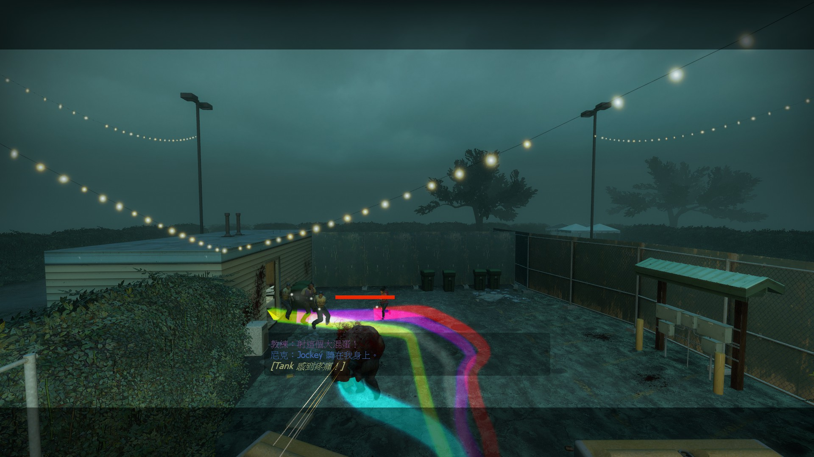

# Description | 內容
l4d player tail effect (env_spritetrail)

> __Note__ <br/>
This plugin is private, Please contact [me](https://github.com/fbef0102/Game-Private_Plugin#私人插件列表-private-plugins-list)<br/>
此為私人插件, 請聯繫[本人](https://github.com/fbef0102/Game-Private_Plugin#私人插件列表-private-plugins-list)

* [Video | 影片展示](https://youtu.be/SXZMB0t2mtc)

* <details><summary>Image | 圖示</summary>

	<br/>
	<br/>
	<br/>
</details>

* <details><summary>How does it work?</summary>

	* Attach trail effect while playing -> have fun
</details>

* Require | 必要安裝
	1. [SpriteTrail Fix](https://github.com/fbef0102/L4D1_2-Plugins/tree/master/l4d2_spritetrail_fix)
	2. [left4dhooks](https://forums.alliedmods.net/showthread.php?t=321696)
	3. [[INC] Multi Colors](https://github.com/fbef0102/L4D1_2-Plugins/releases/tag/Multi-Colors)

* <details><summary>Important Note</summary>

	* "l4d_player_spritetrail_lifetime" must greater than or equal to "l4d_player_spritetrail_changecolor_interval"
</details>

* <details><summary>ConVar | 指令</summary>

	* cfg/sourcemod/l4d_player_spritetrail.cfg
		```php
		// Players with these flags have access to have tail effect and use tail command. (Empty = Everyone, -1: Nobody)
		l4d_player_spritetrail_access_flag ""

		// If 1, Enable Tail effect for Bot Infected
		l4d_player_spritetrail_bot_infected_enable "1"

		// If 1, Enable Tail effect for Bot Survivor
		l4d_player_spritetrail_bot_survivor_enable "1"

		// Time interval to change tail color to random (0=Don't change color)
		l4d_player_spritetrail_changecolor_interval "5.0"

		// The default tail color. Three values between 0-255 separated by spaces. RGB Color255 - Red Green Blue. [-1 -1 -1: Random]
		l4d_player_spritetrail_color "-1 -1 -1"

		// Transparency of the tail (10-255).
		l4d_player_spritetrail_color_alpha "155"

		// 1=Enable Tail effect for everyone default? [1-Enable/0-Disable]
		l4d_player_spritetrail_default_value "1"

		// The width of the beam when it has full expanded.
		l4d_player_spritetrail_endwidth "3.0"

		// The default attached tail height
		l4d_player_spritetrail_height "10.0"

		// How long the beam is shown
		l4d_player_spritetrail_lifetime "4.0"

		// The width of the beam to the beginning.
		l4d_player_spritetrail_startwidth "15.0"
		```
</details>

* <details><summary>Command | 命令</summary>

	* **Toggle the attached tailed. Usage: sm_tail [R G B|off|random|red|green|blue|purple|cyan|orange|white|pink|lime|maroon|teal|yellow|grey]**
		```php
		sm_tail
		sm_tails
		sm_harrypotter
		sm_hy
		```
</details>

* Apply to | 適用於
	```
	L4D1
	L4D2
	```

* <details><summary>Similar Plugin | 相似插件</summary>

	1. [l4d_player_tail](/Plugin_插件/Fun_娛樂/l4d_player_tail)
		> 一樣是尾巴特效，看自己喜歡用哪一種
</details>

* <details><summary>Changelog | 版本日誌</summary>

	* v1.2
	    * Initial Release
</details>

- - - -
# 中文說明
玩家走路，會有尾巴特效 (使用物件: env_spritetrail)

* 原理
	* 色塊均勻，統一變色
	* 輸入```!tail```開關尾巴特效

* 功能
	1. 可自定義尾巴特效的寬度，消逝時間
	2. 玩家可打命令自行決定尾巴的顏色
	3. 尾巴過一段時間會隨機變色
	4. 無法改變尾巴的貼圖

* 注意事項
	* "l4d_player_spritetrail_lifetime" 指令數值必須大於或等於 "l4d_player_spritetrail_changecolor_interval" 指令數值

* <details><summary>命令中文介紹 (點我展開)</summary>

	* **!tail <顏色名稱或R G B>. 顏色: red, green, blue, purple, orange, yellow, white. 或是 3 個 0-255 RGB之值. 譬如: !tail red 或是 !tail 255 0 0**
		```php
		sm_tail
		sm_tails
		sm_harrypotter
		sm_hy
		```
</details>
