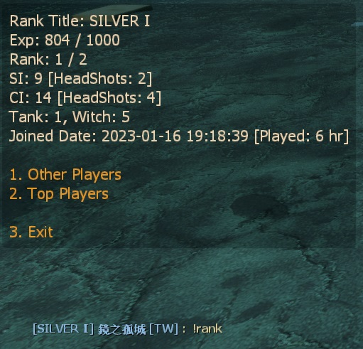
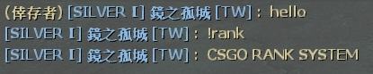

# Description | 內容
Kill infected to get Exp and rank, type !rank to show rank menu

> __Note__ <br/>
This plugin is private, Please contact [me](https://github.com/fbef0102/Game-Private_Plugin#私人插件列表-private-plugins-list)<br/>
此為私人插件, 請聯繫[本人](https://github.com/fbef0102/Game-Private_Plugin#私人插件列表-private-plugins-list)

* Video | 影片展示
	<br/>None

* <details><summary>Image | 圖示</summary>

	* Your Rank statistics (你的Rank統計表)
	<br/>
	* Add Rank tag to Name (玩家名字給予Rank稱號)
	<br/>
	* CSGO Rank (仿CSGO Rank)
	<br/>
</details>

* Require | 必要安裝
	1. [[INC] Multi Colors](https://github.com/fbef0102/L4D1_2-Plugins/releases/tag/Multi-Colors)
	2. [simple-chatprocessor](https://github.com/fbef0102/L4D1_2-Plugins/tree/master/simple-chatprocessor)
	3. [smlib](https://github.com/fbef0102/L4D1_2-Plugins/releases/tag/smlib-Colors)
	4. Optional - [[INC] readyup](/left4dead2/scripting/include/readyup.inc)

* <details><summary>ConVar | 指令</summary>

	* cfg/sourcemod/l4d_ranking_system.cfg
		```php
		// Giving exp for killing a boomer
		l4d_ranking_system_boomk_illed "10"

		// Giving exp for killing a charger
		l4d_ranking_system_charger_killed "30"

		// Database to save ranking system. (MySQL & SQLite supported)
		l4d_ranking_system_database "rank"

		// 0=Plugin off, 1=Plugin on.
		l4d_ranking_system_allow "1"

		// Giving exp for killing a hunter
		l4d_ranking_system_hunter_killed "20"

		// Giving exp for killing a jockey
		l4d_ranking_system_jockey_killed "25"

		// Numbers of real survivor player require to active this plugin.
		l4d_ranking_system_player_require "2"

		// If 1, add rank title to player name in chatbox
		l4d_ranking_system_rank_display "1"

		// Giving exp for killing a smoker
		l4d_ranking_system_smoker_killed "20"

		// Giving exp for killing a spitter
		l4d_ranking_system_spitter_killed "10"

		// Giving exp for killing a tank
		l4d_ranking_system_tank_killed "200"

		// How many top rank players to display in 'Top Players' menu
		l4d_ranking_system_top_rank_numbers "10"

		// Giving exp for killing a witch
		l4d_ranking_system_witch_killed "80"

		// Giving exp for killing a zombie
		l4d_ranking_system_zombie_killed "1"
		```
</details>

* <details><summary>Command | 命令</summary>

	* **Open Rank System Menu**
		```php
		sm_rank
		sm_rankmenu
		```
</details>

* <details><summary>Data Config</summary>

	* ```configs\l4d_ranking_system.cfg``` 
		```php
		"l4d_ranking_system"
		{
			"Rank"
			{
				"num"		"18" // There are 18 Rank titles
				"1" // If player has point between 0~999, he got rank title "SILVER Ⅰ"
				{
					"Name"		"SILVER Ⅰ" 
					"Point_Min"	"0"
					"Point_Max"	"1000"
				}
				"2" // If player has point between 1000~1999, he got rank title "SILVER Ⅱ"
				{
					"Name"		"SILVER Ⅱ"
					"Point_Min"	"1000"
					"Point_Max"	"2000"
				}
				...
			}
		}
		```
</details>

* <details><summary>Database</summary>

	* Choose one of the following method
		1. Database across server, set ```l4d_ranking_system_database "rank"``` and set *sourcemod\configs\databases.cfg*
			```php
			"rank"
			{
				"driver"			"default"
				"host"				"x.x.x.x"
				"database"			"yourdatabase"
				"user"				"youruser"
				"pass"				"yourpass"
				"port"				"yourport"
			}
			```

		2. Local database, set *sourcemod\configs\databases.cfg*
			```php
			"rank"
			{
				"driver"			"sqlite"
				"database"			"rank_system"
			}
			```
</details>

* Apply to | 適用於
	```
	L4D1
	L4D2
	```

* <details><summary>Optional | 輔助插件</summary>

	1. [readyup](/Plugin_插件/Server_伺服器/readyup): Ready Plugin
		> 準備插件，新的回合開始時顯示Rank Hud
</details>

* <details><summary>Changelog | 版本日誌</summary>

	* v1.6 (2023-11-5)
		* Require simple-chatprocessor & smlib

	* v1.5 (2023-5-9)
		* Add rank title to player name

	* v1.4 (2023-4-28)
		* Optimize Code

	* v1.3 (2023-1-16)
		* Add 
			1. number of SI kills
			2. number of Witch kills
			3. number of CI Kills
			4. number of Tank Kills
			5. number of SI headshots
			6. number of CI headshots
			7. and how long player playing on this server start from joined date


	* v1.2 (2022-12-23)
		* Show rank hud when new player joins and new round starts

	* v1.1
		* Supporty MySQL and Local-SQLite

	* v1.0
		* Initial Release
</details>

- - - -
# 中文說明
殺死殭屍與特感獲得經驗值與頭銜名稱，輸入!rank顯示排行榜菜單

> __Note__ 此插件已停止中文更新，如要更多功能，[新版插件請點擊這裡](/Plugin_插件/只有中文的插件列表/l4d_ranking_system_V3)