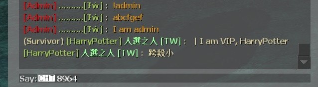

# Description | 內容
Changes the colors of players chat based on config file.

> __Note__ <br/>
This plugin is private, Please contact [me](https://github.com/fbef0102/Game-Private_Plugin#私人插件列表-private-plugins-list)<br/>
此為私人插件, 請聯繫[本人](https://github.com/fbef0102/Game-Private_Plugin#私人插件列表-private-plugins-list)

* Video | 影片展示
<br/>None

* Image | 圖示
	* Admin & VIP colors (管理員 & VIP 顏色)
	<br/>

* Require | 必要安裝
	1. [simple-chatprocessor](https://github.com/fbef0102/L4D1_2-Plugins/tree/master/simple-chatprocessor)
	2. [smlib](https://github.com/fbef0102/L4D1_2-Plugins/releases/tag/smlib-Colors)
	3. Optional - [l4d_ranking_system](/Plugin_插件/Fun_娛樂/l4d_ranking_system)

* <details><summary>ConVar | 指令</summary>

	None
</details>

* <details><summary>Command | 命令</summary>

	* **Reloads settings from the config file (Adm Required: ADMFLAG_CONFIG)**
		```php
		sm_reloadscc
		```
		
	* **Prints out the color names in their color (Adm Required: ADMFLAG_CONFIG)**
		```php
		sm_printcolors
		```
</details>

* <details><summary>Data Config</summary>

	* configs/simple-chatcolors.cfg
		```php
		"Settings"
		{
			"admins_z" //Groups, name whatever
			{
				"flag"			"z"			//Admin flag (NOTE: only one flag per group! "a" is okay, "ab" is NOT)
				"tag"			"[Admin] " //custom tag before name
				"tagcolor"		"{R}" 	//tag color
				"namecolor"		"{G}" 	//name color
				"textcolor"		"{O}" 	//text color
			}
			"76561198026784913" // specific steam account (Steam64 ID format)
			{
				"tag"			"[HarryPotter] "
				"tagcolor"		"{G}"
				"namecolor"		"{L}"
				"textcolor"		"{N}"
			}
			"Everyone"
			{
				"flag"			"" //everyone
				"tag"			"Newbie"
				"tagcolor"		""
				"namecolor"		""
				"textcolor"		"{N}"
			}
		}
		```

	* Following named colors are supported
		* {N}-Default White
		* {G}-Green
		* {L}-Lightgreen
		* {R}-Red 		- There must be at least one player or bot in infected team，or red will turn into {G} color
		* {B}-Blue   		- There must be at least one player or bot in survivor team，or blue will turn into {G} color
		* {T}-Teamcolor   - Depends on the team where you at, Survivor-Blue, Infected-Red, Spectator-Special White
		* {O}-Olive
		* Warning:  2 of (Blue, Red, Lightgreen, Teamcolor) colors can not be used together

	* [Find your SteamID 64](https://steamid.xyz/)
</details>

* Apply to | 適用於
	```
	L4D1
	L4D2
	```

* <details><summary>Changelog | 版本日誌</summary>

	```php
	//Antithasys @ 2011
	//HarryPotter @ 2023-2024
	```
	* v1.2h (2024-1-20)
		* Compatible with [l4d_ranking_system](/Plugin_插件/Fun_娛樂/l4d_ranking_system) by harry

	* v1.1h (2023-12-29)
		* Optimize code and improve performance

	* v1.0h (2023-6-15)
		* Remake code, convert code to latest syntax
		* Fix warnings when compiling on SourceMod 1.11.
		* Optimize code and improve performance
		* Use Steam64 ID instead of STEAM_X:X:XXXXXX

	* v2.2.0
	    * [Original Plugin By Antithasys](https://forums.alliedmods.net/showthread.php?t=167814)
</details>

- - - -
# 中文說明
根據管理員或玩家身分修改聊天窗口的對話顏色

* 原理
	* 管理員在聊天窗口輸入文字並送出之後，依照其身分顯示對應的稱號並修改顏色
	* 普通玩家也可以有稱號與顏色

* <details><summary>文件設定範例</summary>

	* 可自訂顏色與稱號
	* configs/simple-chatcolors.cfg
		```php
		"Settings"
		{
			"admins_z" //群組名，可隨便取
			{
				"flag"			"z"			//管理員權限 (注意: 一次只能寫一個權限，譬如寫 "flag" "a" 可以，寫 "flag" "ab" 不行)
				"tag"			"[Admin] " //自訂稱號 (在名字之前)
				"tagcolor"		"{R}" 	//稱號顏色
				"namecolor"		"{G}" 	//名字顏色
				"textcolor"		"{O}" 	//文字顏色
			}
			"76561198026784913" // 特定的Steam帳戶，可視為VIP (Steam64 ID 格式)
			{
				"tag"			"[HarryPotter] "
				"tagcolor"		"{G}"
				"namecolor"		"{L}"
				"textcolor"		"{N}"
			}
			"Everyone"
			{
				"flag"			"" // 每個人 (普通玩家)
				"tag"			"Newbie"
				"tagcolor"		""
				"namecolor"		""
				"textcolor"		"{N}"
			}
		}
		```

	* 支援以下顏色
		* {N}-預設白色
		* {G}-綠色
		* {L}-淺綠色
		* {R}-紅色 		- 特感隊伍要有人或bot在才會顯示紅色，否則顯示橘色
		* {B}-藍色 		- 人類隊伍要有人或bot在才會顯示藍色，否則顯示橘色
		* {T}-依照你所在的隊伍給予顏色，在人類隊伍顯示藍色；在特感隊伍顯示紅色；在旁觀隊伍顯示特殊白色
		* {O}-橘色
		* 警告:  藍色, 紅色, 淺綠色, 隊伍顏色，這四種顏色的其中兩種不能出現在同一句話

	* [查找你的 SteamID 64](https://steamid.xyz/)
</details>