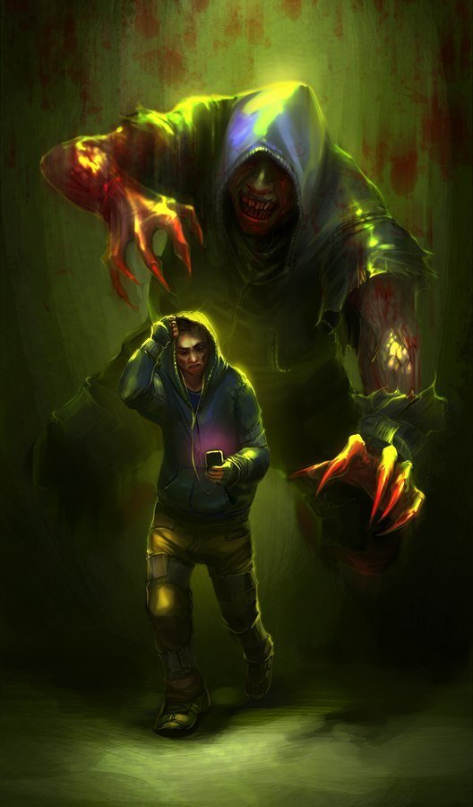

# Description | 內容
Allows for unique Hunter abilities to the destructive beast.

> __Note__ <br/>
This plugin is private, Please contact [me](https://github.com/fbef0102/Game-Private_Plugin#私人插件列表-private-plugins-list)<br/>
此為私人插件, 請聯繫[本人](https://github.com/fbef0102/Game-Private_Plugin#私人插件列表-private-plugins-list)

* [Video | 影片展示](https://youtu.be/Sh11NlYvd0k)

* Image | 圖示
	* The destructive Hunter
		> 毀滅性特感
		<br/>
	* Sledgehammer ability
		> Sledgehammer: Hunter高撲造成額外傷害，距離越遠，傷害越大
		<br/>
	* Meteor strike ability
		> Meteor Strike: Hunter高撲造成核彈衝擊，震飛周圍的倖存者
		<br/>
	* Death Fire ability
		> Death Fire: Hunter死亡時，其屍體產生火焰
		<br/>

* Apply to | 適用於
	```
	L4D1
	L4D2
	```

* <details><summary>Changelog | 版本日誌</summary>

	```php
	//Mortiegama @ 2014-2014
	//HarryPotter @ 2023
	```
	* v1.1h (2023-4-30)
		* New abilitity "Auto Fire": Hunter would get fire automatically when spawn

	* v1.0h (2023-3-24)
		* Remake code, convert code to latest syntax
		* Fix warnings when compiling on SourceMod 1.11.
		* Optimize code and improve performance
		* Delete ability "Bile Feet", "Bile Pimple", "Bile Throw", "Explosive Diarrhea".
		* Add two abilitites
			* Meteor Strike ability: the high pounces create meteor strike, inflict extra damage and send nearby survivors flying.
			* Death Fire ability: create fire where the hunter dies.
		* Rename some cvars
		* Correct melee damage when enable Shunpo ability
		* Replace Gamedata with left4dhooks
	* v1.1
		* [Original Plugin by Mortiegama](https://forums.alliedmods.net/showthread.php?t=239492)
</details>

* Require | 必要安裝
	1. [left4dhooks](https://forums.alliedmods.net/showthread.php?t=321696)
	2. [[INC] Multi Colors](https://github.com/fbef0102/L4D1_2-Plugins/releases/tag/Multi-Colors)

* Related Plugin | 相關插件
	1. [pounceannounce](https://github.com/fbef0102/L4D1_2-Plugins/tree/master/pounceannounce): Announces hunter pounces to the entire server
		> 顯示Hunter造成的高撲傷害與高撲距離
	2. [l4d2_pounce_damage by Silvers](https://forums.alliedmods.net/showthread.php?t=320024): Patches the Hunter to enable bonus damage in all gamemodes.
		> 任何模式的AI Hunter都可以造成高撲傷害
	3. [l4d_infected_speed_boost](/Plugin_插件/Special_Infected_特感/l4d_infected_speed_boost): L4D1/2 infected get speed boost while duck or climbing the ladder
		> 特感在爬梯或蹲下期間自動加速移動

* <details><summary>ConVar | 指令</summary>

	* cfg/sourcemod/l4d_hunter_destructive.cfg
		```php
		// Chance that the fire will be created when the hunter dies. (100 = 100%).
		l4d_hunter_destructive_autofire_chance "60"

		// If 1, Hunter would get fire automatically if .
		l4d_hunter_destructive_autofire_enable "1"

		// Chance that the fire will be created when the hunter dies. (100 = 100%).
		l4d_hunter_destructive_deathfire_chance "60"

		// If 1, Enables Death Fire ability, create fire where the hunter dies.
		l4d_hunter_destructive_deathfire_enable "1"

		// If 1, Enables the Evil Demon ability, after hunter pounce a survivor to incapacitated, he will release and search next target.
		l4d_hunter_destructive_evil_enable "1"

		// Chance that the Flame Claw will ignite a Survivor. (100 = 100%).
		l4d_hunter_destructive_flameclaw_chance "100"

		// How much damage is by the flames each second.
		l4d_hunter_destructive_flameclaw_damage "2"

		// For how many seconds will the Survivor remain ignited.
		l4d_hunter_destructive_flameclaw_duration "4"

		// If 1, Enables Flame Claw Ignite ability, allows the Hunter to ignite Survivors with claw while on fire.
		l4d_hunter_destructive_flameclaw_enable "1"

		// Amount of extra damage caused by Inferno Rage.
		l4d_hunter_destructive_infernorage_damage "2.0"

		// If 1, Enables Inferno Rage ability, adds extra damage to survivors when Hunter is on fire.
		l4d_hunter_destructive_infernorage_enable "1"

		// If 1, Enables Kevlar Skin ability, allows the Hunter to be immune to fire damage. (Still get fire)
		l4d_hunter_destructive_kevlar_skin_enable "1"

		// Damage caused by meteor strike.
		l4d_hunter_destructive_meteor_damage "8.0"

		// Hunter Pounce Distance needed to trigger meteor strike.
		l4d_hunter_destructive_meteor_distance "750.0"

		// If 1, Enables meteor strike ability, the high pounces create meteor strike, inflict extra damage and send nearby survivors flying.
		l4d_hunter_destructive_meteor_enable "1"

		// (L4D2) How much force is applied to the survivor due to meteor strike.
		l4d_hunter_destructive_meteor_power "300.0"

		// Hunter meteor strike range.
		l4d_hunter_destructive_meteor_range "200.0"

		// (L4D2) Vertical force multiplier due to meteor strike.
		l4d_hunter_destructive_meteor_vertical_mult "1.5"

		// Percent of damage the Hunter avoids while using Shunpo.
		l4d_hunter_destructive_shunpo_amount "0.8"

		// Amount of time until the next Shunpo can be activated.
		l4d_hunter_destructive_shunpo_cooldown "3.0"

		// How long the Hunter is able to keep the Shunpo ability active. (0=Always active Shunpo)
		l4d_hunter_destructive_shunpo_duration "4.0"

		// If 1, Enables Shunpo ability, a Hunter takes damage he will increase his evasiveness and reduce damage taken.
		l4d_hunter_destructive_shunpo_enable "1"

		// If 1, active the ability Shunpo only when hunter is on fire
		l4d_hunter_destructive_shunpo_when_onfire "1"

		// If 1, Enables Sledgehammer ability, the Hunter can inflict extra damage to survivors based on the distance of the pounce.
		l4d_hunter_destructive_sledgehammer_enable "1"

		// Maximum amount of damage the Sledgehammer will cause. (Should be Survivor health max).
		l4d_hunter_destructive_sledgehammer_max_damage "100.0"

		// Amount to multiply the damage dealt from Sledgehammer.
		l4d_hunter_destructive_sledgehammer_multiplier "1.0"
		```
</details>

* <details><summary>Command | 命令</summary>

	None
</details>

* Details
	* <b>Inferno Rage ability</b> - Adds extra damage to survivors when Hunter is on fire
	* <b>Kevlar Skin ability</b> - Allows the Hunter to be immune to fire damage. (Still get fire)
	* <b>Sledgehammer ability</b> - Hunter can inflict extra damage to survivors based on the distance of the pounce
	* <b>Meteor Strike ability</b> - High pounces create meteor strike, inflict extra damage and send nearby survivors flying.
	* <b>Shunpo ability</b> - Hunter takes damage he will increase his evasiveness and reduce damage taken.
	* <b>Flame Claw Ignite ability</b> - Allows the Hunter to ignite Survivors with claw while on fire.
	* <b>Evil Demon ability</b> - after hunter pounce a survivor to incapacitated, he will release and search next target.
	* <b>Death Fire ability</b> - create fire where the hunter dies.
	* <b>Get Fire ability</b> - Hunter would get fire automatically when spawn

- - - -
# 中文說明
增強Hunter，賦予多種超能力成為毀滅性的野獸

* 原理
	* 能力1: <b>Kevlar Skin</b> - 免疫火焰傷害 (依然會著火)
	* 能力2: <b>Inferno Rage</b> - 著火時攻擊倖存者會有額外傷害加成
	* 能力3: <b>Sledgehammer</b> - 高撲造成額外傷害，距離越遠，傷害越大 (非高撲傷害加成)
	* 能力4: <b>Flame Claw Ignite</b> - 著火時用手抓人產生的傷害會持續一段時間
	* 能力5: <b>Meteor Strike</b> - 高撲造成核彈衝擊，震飛周圍的倖存者
	* 能力6: <b>Shunpo</b> - 著火時減少受到的傷害比
	* 能力7: <b>Evil Demon</b> - 抓倒倖存者之後會自動釋放，並尋找下一個攻擊目標
	* 能力8: <b>Death Fire</b> - 死亡時，其屍體產生火焰
	* 能力9: <b>Get Fire</b> - Hunter生成時自動著火

* 功能
	* 可設定各能力的開關
	* 可設定Inferno Rage的傷害加成
	* 可設定Sledgehammer的傷害倍數
	* 可設定Flame Claw Ignite的右手的傷害值、機率、持續時間
	* 可設定Meteor Strike的衝擊範圍、額外傷害、衝擊力道、高撲距離門檻
	* 可設定Shunpo的減傷比
	* 可設定Death Fire的機率
	* 可設定Get Fire的自動著火機率