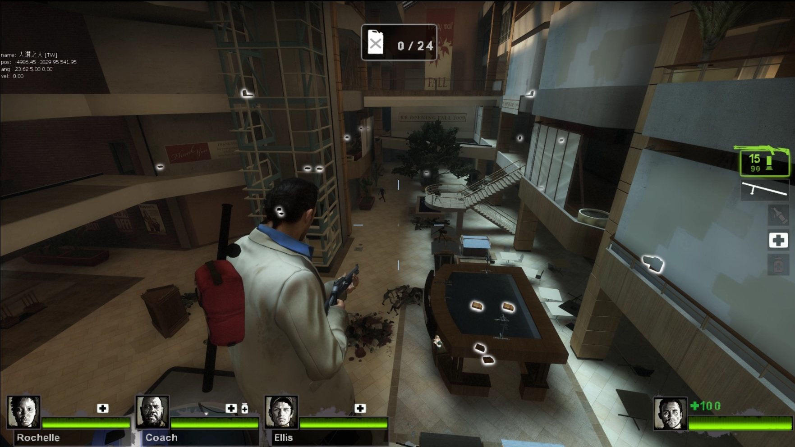
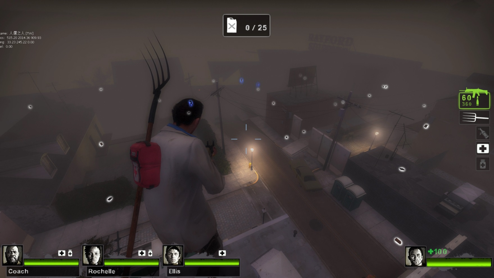

# Description | 內容
Increase gas cans in scavenge events, and to be randomly placed by custom list of gas can locations.

> __Note__ <br/>
This plugin is private, Please contact [me](https://github.com/fbef0102/Game-Private_Plugin#私人插件列表-private-plugins-list)<br/>
此為私人插件, 請聯繫[本人](https://github.com/fbef0102/Game-Private_Plugin#私人插件列表-private-plugins-list)

* [Video | 影片展示](https://youtu.be/7qUJMo9vUL4)

* Image | 圖示
	* C1m4
	<br/>
	<br/>
	<br/>

	* C6m3
	<br/>

	* C12m2
	<br/>

* Apply to | 適用於
	```
	L4D2 Coop/Versus/Realism/Scavenge
	```

* <details><summary>Changelog | 版本日誌</summary>
	
	```php
	//pvtschlag @ 2010
	//HarryPotter @ 2022-2023
	```
	* v1.0h (2023-5-31)
		* Data Support
		* Remake code, convert code to latest syntax
		* Fix warnings when compiling on SourceMod 1.11.
		* Optimize code and improve performance
		* "coop", "scavenge" files respectively
		* Fixed Edit mode Error

	* v0.0
	    * [Original Plugin By pvtschlag](https://forums.alliedmods.net/showthread.php?t=112096)
</details>

* Require | 必要安裝
	1. [left4dhooks](https://forums.alliedmods.net/showthread.php?t=321696)

* <details><summary>ConVar | 指令</summary>

	* cfg/sourcemod/l4d2_remix_gascan.cfg
		```php
		// Value = How many Gas Cans to spawn from the pool in Scavenge mode.
		l4d2_remix_gascan_can_count_scavenge "16"

		// Value = How many Gas Cans to spawn from the pool in coop/versus/realism mode by default.
		l4d2_remix_gascan_count_coop "30"

		// Determines if a message should be sent when the gas cans are scrambled in coop/versus/realism mode.
		l4d2_remix_gascan_notify_coop "0"

		// Determines if a message should be sent when the gas cans are scrambled in Scavenge mode.
		l4d2_remix_gascan_notify_scavenge "0"

		// Determines if gas cans should be scrambled when scavenge events in coop/versus/realism mode.
		l4d2_remix_gascan_scramble_coop "1"

		// Determines if gas cans should be scrambled at the start of a round in Scavenge mode.
		l4d2_remix_gascan_scramble_scavenge "1"
		```
</details>

* <details><summary>Command | 命令</summary>

	* **Enters edit mode to allow changing can locations. (Adm required: ADMFLAG_ROOT)**
		```php
		sm_editcans
		```

	* **Stores the current scavenger can locations into a file. (Adm required: ADMFLAG_ROOT)**
		```php
		sm_savecans
		```

	* **Removes all gas cans. (Adm required: ADMFLAG_ROOT)**
		```php
		sm_removecans
		```

	* **Reloads all gas cans from file. (Adm required: ADMFLAG_ROOT)**
		```php
		sm_reloadcans
		```

	* **Adds a gascan in your current position. (Adm required: ADMFLAG_ROOT)**
		```php
		sm_addcan
		```

	* **Deletes a gascan you are looking at. (Adm required: ADMFLAG_ROOT)**
		```php
		sm_delcan
		```

	* **Enters edit mode to allow changing can locations in scavenge mode. (Adm required: ADMFLAG_ROOT)**
		```php
		sm_editscavengecans
		```

	* **Stores the current scavenger can locations into a file in scavenge mode. (Adm required: ADMFLAG_ROOT)**
		```php
		sm_savescavengecans
		```

	* **Removes all gas cans in scavenge mode. (Adm required: ADMFLAG_ROOT)**
		```php
		sm_removescavengecans
		```

	* **Reloads all gas cans from file in scavenge mode. (Adm required: ADMFLAG_ROOT)**
		```php
		sm_reloadscavengecans
		```

	* **Adds a gascan in your current position in scavenge mode. (Adm required: ADMFLAG_ROOT)**
		```php
		sm_addscavengecan
		```

	* **Deletes a gascan you are looking at in scavenge mode. (Adm required: ADMFLAG_ROOT)**
		```php
		sm_delscavengecan
		```
</details>

* Data Example
	* data/l4d2_remix_gascan.txt
		```php
		"l4d2_remix_gascan"
		{
			"c1m4_atrium" //Map Name
			{
				"coop" 		"30" // Value = How many Gas Cans to spawn from the pool in coop/versus/realism mode. (-1=Do Nothing in this map, Use cvar "l4d2_remix_gascan_count_coop" if no keyvalue)
				"scavenge" 	"20" // Value = How many Gas Cans to spawn from the pool in Scavenge mode. (-1=Do Nothing in this map, Use cvar "l4d2_remix_gascan_can_count_scavenge" if no keyvalue)
			}
		}
		```

* Q&A
	* <details><summary><b>How to spawn gascan</b></summary>

		* Coop/Versus/Realism
			* Change mode to coop, go to map 
			* Admin types ```!editcans``` to enters edit mode
			* Type ```!addcan``` to add a gascan in your current position or ```!delcan``` to remove a gascan you are looking at.
			* Type ```!savecans``` to stores all gas can locations into a file.
				* The file would be ```cfg\remix_gascan\coop\xxxxx.txt```
				* xxxxx is map name
			* Edit ```data/l4d2_remix_gascan.txt``` and ```"coop" "XX"``` to dedcide how many Gas Cans to spawn from the file.
			* Restart Map

		* Scavenge
			* Change mode to scavenge, go to map 
			* Admin types ```!editscavengecans``` to enters edit mode
			* Type ```!addscavengecan``` to add a gascan in your current position or ```!sm_delscavengecan``` to remove a gascan you are looking at.
			* Type ```!savescavengecans``` to stores all gas can locations into a file.
				* The file would be ```cfg\remix_gascan\scavenge\xxxxx.txt```
				* xxxxx is map name
			* Edit ```data/l4d2_remix_gascan.txt``` and ```"scavenge" "XX"``` to dedcide how many Gas Cans to spawn from the file.
			* Restart Map
	</details>

	* <details><summary><b>How to increase number of gas can needed</b></summary>

		* Coop/Versus/Realism
			* [C1M4 line 183](scripts/vscripts/c1m4_atrium_finale.nut#L183)
			* [C6M3 line 250](scripts/vscripts/c6m3_port_finale.nut#L250)
			* [C14M2 line 165, 177, 183, 189](scripts/vscripts/c14m2_lighthouse_finale.nut#L165-L189)

		* Scavenge
			* No Clue
	</details>

- - - -
# 中文說明
汽油桶關卡或清道夫模式可以隨機放置自己想要的汽油桶位置與數量

* 原理
	* 在戰役/對抗/寫實模式中，C1M4、C6M3、C14M2的汽油桶關卡，可以自由新增汽油桶位置與數量
	* 在清道夫模式中，可以自由新增汽油桶位置與數量
	* 從文件裡挑選的汽油桶位置是隨機的，所以每次生成汽油桶的位置會不一樣 (但數量還是一樣)

* 功能
	1. 可設置開關
	2. 可設置提示

* Data設定範例
	* data/l4d2_remix_gascan.txt
		```php
		"l4d2_remix_gascan"
		{
			"c1m4_atrium" //地圖名
			{
				"coop" 		"30" // 在戰役/對抗/寫實模式中，從文件挑選汽油桶生成的數量. (-1=在這張地圖關閉插件，如果沒有寫此行，預設使用指令l4d2_remix_gascan_count_coop)
				"scavenge" 	"20" // 在清道夫模式中，從文件挑選汽油桶生成的數量. (-1=在這張地圖關閉插件，如果沒有寫此行，預設使用指令l4d2_remix_gascan_can_count_scavenge)
			}
		}
		```

* Q&A問題
	* <details><summary><b>如何自己決定汽油桶位置</b></summary>

		* 戰役/對抗/寫實
			* 遊戲模式換成戰役，然後切換地圖
			* 管理員輸入 ```!editcans```進入編輯模式
			* 輸入 ```!addcan``` 在準星上新增汽油桶 或 輸入```!delcan``` 刪除準星指向的汽油桶
			* 輸入 ```!savecans``` 儲存所有的汽油桶至文件檔案
				* 文件檔案位於 ```cfg\remix_gascan\coop\xxxxx.txt```
				* xxxxx 是地圖名
			* 編輯文件 ```data/l4d2_remix_gascan.txt``` 寫下 ```"coop" "XX"``` 自行決定要生成的數量
			* 重啟地圖

		* 清道夫
			* 遊戲模式換成清道夫，然後切換地圖
			* 管理員輸入 ```!editscavengecans```進入編輯模式
			* 輸入 ```!addscavengecan``` 在準星上新增汽油桶 或 輸入```!delscavengecan``` 刪除準星指向的汽油桶
			* 輸入 ```!savescavengecans``` 儲存所有的汽油桶至文件檔案
				* 文件檔案位於 ```cfg\remix_gascan\scavenge\xxxxx.txt```
				* xxxxx 是地圖名
			* 編輯文件 ```data/l4d2_remix_gascan.txt``` 寫下 ```"scavenge" "XX"``` 自行決定要生成的數量
			* 重啟地圖
	</details>

	* <details><summary><b>如何修改通關需要的汽油桶數量</b></summary>

		* 戰役/對抗/寫實
			* [C1M4 行 183](scripts/vscripts/c1m4_atrium_finale.nut#L183)
			* [C6M3 行 250](scripts/vscripts/c6m3_port_finale.nut#L250)
			* [C14M2 行 165, 177, 183, 189](scripts/vscripts/c14m2_lighthouse_finale.nut#L165-L189)

		* 清道夫
			* 不知道
	</details>