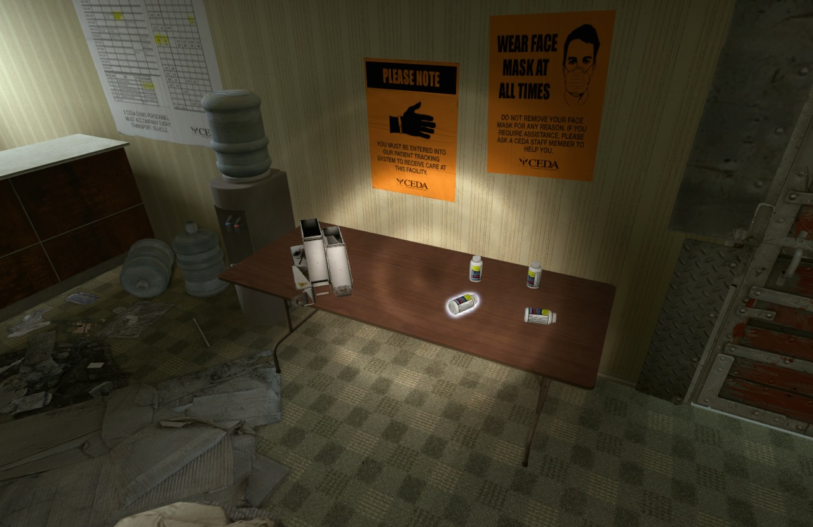
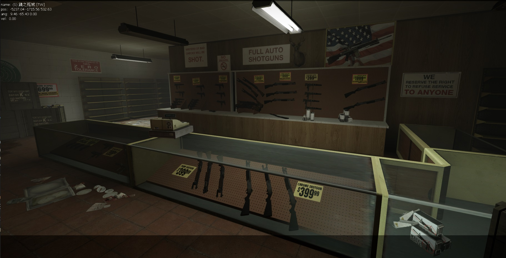

# Description | 內容
Replace big guns with other guns + Replace items with other items

> __Note__ <br/>
This plugin is private, Please contact [me](https://github.com/fbef0102/Game-Private_Plugin#私人插件列表-private-plugins-list)<br/>
此為私人插件, 請聯繫[本人](https://github.com/fbef0102/Game-Private_Plugin#私人插件列表-private-plugins-list)

* Video | 影片展示
<br/>None

* Image | 圖示
	* Replace kits with pills and ammo with laser sight 
		> 治療包替換成藥丸，子彈堆替換成雷射裝置
		<br/>

	* Replace All big guns with T1 weapons (Smg、Shotgun)
		> 將所有大槍刪除並替換成T1武器 (機槍、單發散彈槍)
		<br/>

* Apply to | 適用於
	```
	L4D2 Any Mode
	```

* <details><summary>Changelog | 版本日誌</summary>
	
	* v1.1 (2023-7-1)
	    * Fixed scavenge gascan removed

	* v1.0 (2023-5-3)
	    * Initial Release
</details>

* Require | 必要安裝
	1. [[INC] l4d2_weapons](/left4dead2/scripting/include/l4d2_weapons.inc)

* <details><summary>ConVar | 指令</summary>

	* cfg/sourcemod/l4d2_replace_gun_item.cfg
		```php
		// 0=Plugin off, 1=Plugin on.
		l4d2_replace_gun_item_enable "1"

		// Replace the weapon if the weapon is late spawn during the game.
		l4d2_replace_gun_item_late_spawn "0"

		// Replace the primary weapon
		l4d2_replace_gun_item_primary "1"

		// Replace the secondary weapon.
		l4d2_replace_gun_item_secondary "1"

		// Replace the throwable weapon.
		l4d2_replace_gun_item_throwable "1"

		// Replace the heavy health item (slot 4 weapon).
		l4d2_replace_gun_item_heavy_health "1"

		// Replace the light health item (slot 5 weapon).
		l4d2_replace_gun_item_light_health "1"

		// Replace the Special Items.
		l4d2_replace_gun_item_special "1"
		```
</details>

* <details><summary>Command | 命令</summary>

	None
</details>

* <details><summary>API | 串接</summary>

	```c++
	/**
	* Call this function to replace all weapons and all items with other weapons and items now
	* 
	* @param Slot_Primary			Shoud Replace Primary Weapons ?
	* @param Slot_Secondary			Shoud Replace Secondary Weapons ?
	* @param Slot_Throwable			Shoud Replace Throwable ?
	* @param Slot_HeavyHealthItem	Shoud Replace Slot 4 Items ?
	* @param Slot_LightHealthItem	Shoud Replace Slot 5 Items ?
	* @param Special				Shoud Replace Special Items ?
	*
	* @return						None
	*/
	native void l4d2_RGI_ReplaceAllWeapons(bool Slot_Primary, bool Slot_Secondary, bool Slot_Throwable, bool Slot_HeavyHealthItem, bool Slot_LightHealthItem, bool Special)
	```
</details>

* <details><summary>Data Example</summary>

	* data/l4d2_replace_gun_item.cfg
		```php
		"l4d2_replace_gun_item"
		{
			"Weapons" // Do not modify this line
			{
				"weapon_pumpshotgun"
				{
					// -1=Don't remove or replace
					"replace" "-1"
				}
				"weapon_autoshotgun"
				{
					// replace autoshotgun with pumpshotgun
					"replace" "weapon_pumpshotgun"
				}
			}

			"Special"
			{
				"weapon_oxygentank"
				{
					// Empty = Remove Weapon
					"replace" ""
				}
				"weapon_gascan"
				{
					// Will NOT replace scavenge gascan
					"replace" "weapon_adrenaline"
				}
			}
		}
		```
</details>

- - - -
# 中文說明
刪除大槍、刪除治療包、刪除其他投擲物與物品，並替換成其他武器或物品

* 原理
	* 地圖載入後，將所有大槍武器刪除並替換成小槍
	* 地圖載入後，將所有治療包與電擊器刪除並替換成藥丸
	* 可以偵測所有武器與物品，然後刪除並替換成其他武器或物品
		* 近戰武器不適用
	* 遊戲中途生成或掉落的物資也能被替換，譬如
		* 墮落生還者掉落的物資
		* CEDA掉落的膽汁瓶
		* 綠色箱的無限物資
* 功能
	* 可以手動更改配置，替換成自己想要的武器或物品
	* 可設置不要替換遊戲中途生成或掉落的物資

* <details><summary>Data 設定範例</summary>

	* data/l4d2_replace_gun_item.cfg
		```php
		"l4d2_replace_gun_item"  // 別改這行
		{
			"Weapons" // 武器列表，別改這行
			{
				"weapon_pumpshotgun"
				{
					// -1 = 單發散彈槍不刪除也不取代
					"replace" "-1"
				}
				"weapon_autoshotgun"
				{
					// 連發散彈槍刪除並替換成單發散彈槍
					"replace" "weapon_pumpshotgun"
				}
			}

			"Special"  // 特殊物品列表，別改這行
			{
				"weapon_oxygentank"
				{
					// 留白 = 移除所有瓦斯桶
					"replace" ""
				}
				"weapon_gascan"
				{
					// 不會影響黃色與綠色的汽油桶
					// 所有汽油桶替換成腎上腺素
					"replace" "weapon_adrenaline"
				}
			}
		}
		```

    * 所有武器名稱
        ```c++
		// * Primary Weapons */
        木製單發散彈槍 => weapon_pumpshotgun
        鐵製單發散彈槍 => weapon_shotgun_chrome
        Uzi烏茲衝鋒槍 => weapon_smg
        消音衝鋒槍 => weapon_smg_silenced
        自動連發散彈槍 => weapon_autoshotgun
        自動連發戰鬥散彈槍=> weapon_shotgun_spas
        獵槍 => weapon_hunting_rifle
        軍用狙擊槍 => weapon_sniper_military
        Uzi烏茲衝鋒槍 => weapon_smg
        M16步槍 => weapon_rifle
        三連發步槍 => weapon_rifle_desert
        AK47 => weapon_rifle_ak47
        榴彈發射器 => weapon_grenade_launcher
        M60機關槍 => weapon_rifle_m60
        近戰武器 => weapon_melee
        電鋸 => weapon_chainsaw
        CSS-MP5衝鋒槍 => weapon_smg_mp5
        CSS-SG552步槍 => weapon_rifle_sg552
        CSS-Scout狙擊槍 => weapon_sniper_scout
        CSS-AWP狙擊槍 => weapon_sniper_awp

		// * Secondary Weapons */
        手槍 => weapon_pistol
        麥格農手槍 => weapon_pistol_magnum

		// * Throwable */
		燃燒瓶 => weapon_molotov
		膽汁瓶 => weapon_vomitjar
		土製炸彈 => weapon_pipe_bomb

		// * Slot 4 Items */
		治療包 => weapon_first_aid_kit
		電擊器 => weapon_defibrillator
		高爆彈包 => weapon_upgradepack_explosive
		火焰彈包 => weapon_upgradepack_incendiary

		// * Slot 5 Items */
		藥丸 => weapon_pain_pills
		腎上腺素 => eapon_adrenaline

		// * Special Items */
		雷射裝置 => upgrade_laser_sight
		子彈堆 => weapon_ammo_spawn
		瓦斯桶 => weapon_propanetank
		氧氣罐 => weapon_oxygentank
		汽油桶 => weapon_gascan
		煙火盒 => weapon_fireworkcrate
		精靈小矮人 => weapon_gnome
		可樂瓶 => weapon_cola_bottles
        ```
</details>