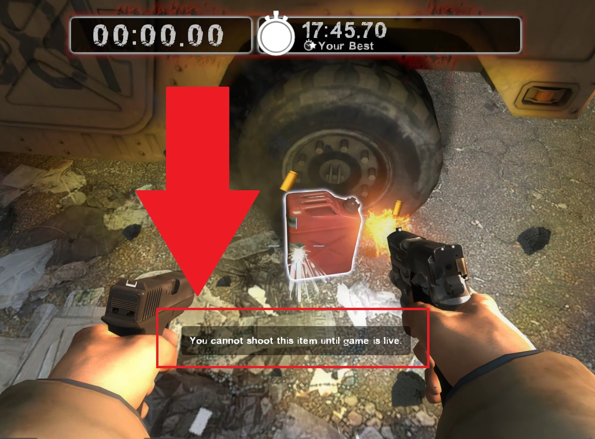
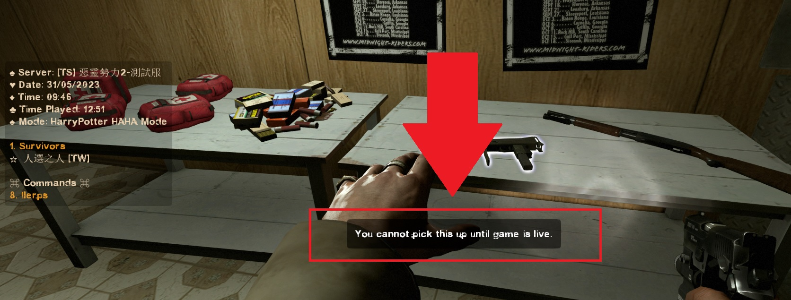

# Description | 內容
Survivors can't pick up weapons and items before the start of each round 
<br/>+ 
<br/>Gives health items and throwables to survivors at the start of each round

> __Note__ <br/>
This plugin is private, Please contact [me](https://github.com/fbef0102/Game-Private_Plugin#私人插件列表-private-plugins-list)<br/>
此為私人插件, 請聯繫[本人](https://github.com/fbef0102/Game-Private_Plugin#私人插件列表-private-plugins-list)

* [Video | 影片展示](https://youtu.be/1G6euowfyFI)

* Image | 圖示
	* Survivors can't pick up weapons and items before the start of each round 
		> 遊戲開始之前不能撿起任何武器或物品
		<br/>

	* Can't shoot any gascan before the start of each round 
		> 遊戲開始之前不能點燃任何汽油桶
		<br/>

	* Support ReadyUp plugin
		> 支援準備插件
		<br/>

* Apply to | 適用於
	```
	L4D2 Any Mode
	```

* Translation Support | 支援翻譯
	```
	English
	繁體中文
	简体中文
	```

* <details><summary>Changelog | 版本日誌</summary>
	
	* v1.1h (2023-7-12)
		* Fixed plugin is not working in coop/realism mode
	
	* v1.0h (2023-5-31)
		* Remake code, convert code to latest syntax
		* Fix warnings when compiling on SourceMod 1.11.
		* Optimize code and improve performance
		* Survivors can't pick up weapons and items before the start of each round 
		* Can't ignite gascan, firebox, prop tanks before the start of each round 
		* Translation Support

	* v2.2
		* [From SirPlease/L4D2-Competitive-Rework](https://github.com/SirPlease/L4D2-Competitive-Rework/blob/master/addons/sourcemod/scripting/starting_items.sp)
</details>

* Require | 必要安裝
	1. [left4dhooks](https://forums.alliedmods.net/showthread.php?t=321696)
	2. [[INC] Multi Colors](https://github.com/fbef0102/L4D1_2-Plugins/releases/tag/Multi-Colors)
    3. [[INC] l4d2_weapons](/left4dead2/scripting/include/l4d2_weapons.inc)
	4. [[INC] readyup](/left4dead2/scripting/include/readyup.inc)

* Optional | 輔助插件
	1. [readyup](/Plugin_插件/Server_伺服器/readyup): Ready Plugin
		> 所有玩家準備才能開始遊戲的插件

* <details><summary>ConVar</summary>

	* cfg/sourcemod/starting_items.cfg
		```php
		// Changes how message displays. (0: Disable, 1:In chat, 2: In Hint Box, 3: In center text)
		starting_items_announce_type "2"

		// 0=Plugin off, 1=Plugin on.
		starting_items_enable "1"

		// Weapon flags that survivors can't pick up before leaving the saferoom or before round live
		// 0: Disable, 1: slot 1 weapon, 2: slot 2 weapon, 4: slot 3 weapon, 8: slot 4 weapon, 16: slot 5 weapon, 32: Gascan、FireWorks、Prop Tanks、Oxy Tanks
		starting_items_ready_disable_weapon_slot "63"

		// Item flags to give on leaving the saferoom or round live
		// 0: Disable, 1: Kit, 2: Defib, 4: Pills, 8: Adren, 16: Pipebomb, 32: Molotov, 64: Bile
		starting_items_round_live_give_flags "41"
		```
</details>

* <details><summary>Command | 命令</summary>

	None
</details>

- - - -
# 中文說明
回合開始之前不得拿武器與物品 + 回合開始之後自動給予一些物資

* 原理
	* 遊戲開始之前，不准撿起地圖上的武器與物品
	* 遊戲開始之前，不准點燃汽油桶、瓦斯桶、煙火盒
	* 遊戲開始之後，插件會給予火瓶、腎上腺素、治療包
	* 這裡指的"遊戲開始"是
		1. 戰役/對抗/寫實中離開安全室
		2. 生存模式計時開始
		3. 清道夫模式計時開始
	* 支援準備插件，所有人準備之前與之後
	* 不影響過關攜帶的武器

* <details><summary>指令中文介紹(點我展開)</summary>

	* cfg/sourcemod/starting_items.cfg
		```php
		// 訊息顯示位置. (0: 關閉, 1: 聊天窗, 2: 螢幕下方黑底白字窗, 3: 螢幕正中間)
		starting_items_announce_type "2"

		// 0=插件關閉, 1=插件開啟.
		starting_items_enable "1"

		// 遊戲開始之前不能撿起的武器或物品
		// 0: 關閉此功能, 1: 主武器, 2: 副武器, 4: 投擲物品, 8: 醫療包, 電擊器, 燃燒彈包與高爆彈包, 16: 藥丸與腎上腺素, 32: 汽油桶、煙火盒、瓦斯桶、氧氣灌 (請將數字相加起來)
		starting_items_ready_disable_weapon_slot "63"

		// 遊戲開始之後，插件會給予的物資
		// 0: 關閉此功能, 1: 醫療包, 2: 電擊器, 4: 藥丸, 8: 腎上腺素, 16: 土製炸彈, 32: 火瓶, 64: 膽汁瓶 (請將數字相加起來)
		starting_items_round_live_give_flags "41"
		```
</details>