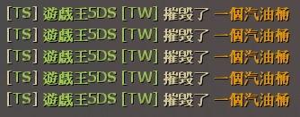
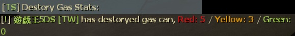

# Description | 內容
Type !gas to disaply who shot the last gas can. + Announce when gas can being shot.

> __Note__ <br/>
This plugin is private, Please contact [me](https://github.com/fbef0102/Game-Private_Plugin#私人插件列表-private-plugins-list)<br/>
此為私人插件, 請聯繫[本人](https://github.com/fbef0102/Game-Private_Plugin#私人插件列表-private-plugins-list)

* Video | 影片展示
<br/>None

* Image | 圖示
	* who is the culprit
		> 打爆汽油桶的兇手
		<br/>
	* display the last players who shot the gas (Survival Only)
		> 顯示最後幾位引爆汽油桶的玩家 (僅限生存模式)
		<br/>
	* announce message when player destroyed the gas
		> 即時顯示
		<br/>
	* display all players' gascan destroyed stats. (L4D2 Scavenge Only)
		> 顯示玩家摧毀汽油桶的數量 (僅限清道夫模式)
		<br/>

* Apply to | 適用於
	```
	L4D1
	L4D2
	```

* Translation Support | 支援翻譯
	```
	English
	繁體中文
	简体中文
	```

* <details><summary>Changelog | 版本日誌</summary>

	* v1.3 (2023-3-1)
		* Request by JACK
		* Add cvars
			```php
			// If 1, Ignore gas can if ignited by fire
			who_shot_gas_ignore_fire "0"

			// If 1, Ignore gas can if ignited by special infected (Ex. Spitter)
			who_shot_gas_ignore_infected "1"
			```

	* v1.2 (2023-2-28)
		* Request by JACK
		* Add Commands, 
			```php
			sm_surgas, "Output to the chat the last player to explodes (last hit) a gascan. (Survival Only)"

			sm_scavgas, "Output to the chat all players' gascan destroyed stats. (L4D2 Scavenge Only)"
			```

	* v1.1 (2023-2-28)
		* Request by JACK
		* Translation Support
		* Add cvars
			```php
			// If 1, Announce when gas can being shot.
			who_shot_gas_announce_when_destroy "1"

			// If 1, Ignore gas can being shot before game starts (Survival/Scavenge)
			who_shot_gas_ignore "1"
			```

	* v1.0
		* Original Request by Dam Dam
</details>

* Require | 必要安裝
<br/>None

* <details><summary>ConVar | 指令</summary>

	* cfg/sourcemod/who_shot_gas.cfg
		```php
		// If 1, Announce when gas can being shot.
		who_shot_gas_announce_when_destroy "1"

		// If 1, Ignore gas can being shot before game starts (Survival/Scavenge)
		who_shot_gas_ignore "1"

		// If 1, Ignore gas can if ignited by fire
		who_shot_gas_ignore_fire "0"

		// If 1, Ignore gas can if ignited by special infected (Ex. Spitter)
		who_shot_gas_ignore_infected "1"

		// Output to the chat last X players to explodes (last hit) a gascan. (0=OFF)
		who_shot_gas_number "5"
		```
</details>

* <details><summary>Command | 命令</summary>
	
	* **Output to the chat the last player to explodes (last hit) a gascan. (Survival Only)**
		```php
		sm_surgas
		```

	* **Output to the chat all players' gascan destroyed stats. (L4D2 Scavenge Only)**
		```php
		sm_scavgas
		```
</details>

- - - -
# 中文說明
誰他馬打爆最後一個汽油桶

* 原理
	* 哪位傻B點燃汽油桶，適合生存/清道夫模式之下找出兇手
	* 生存/清道夫模式下計時開始之前，忽略被摧毀的汽油桶

* 功能
	* 可輸入指令!gas查看誰摧毀最後幾個汽油桶
	* 可開關即時顯示
