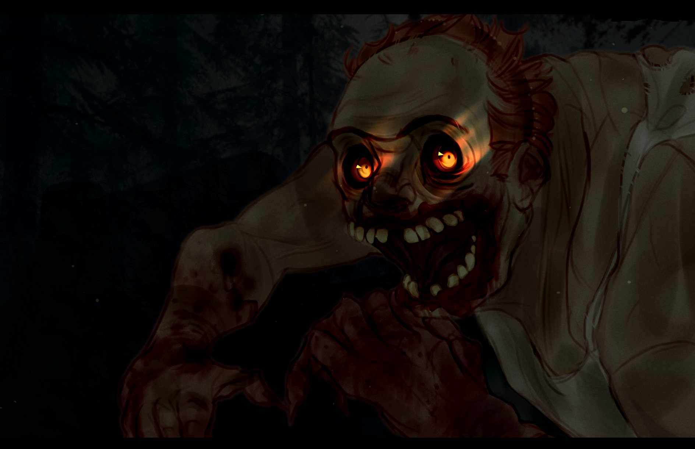
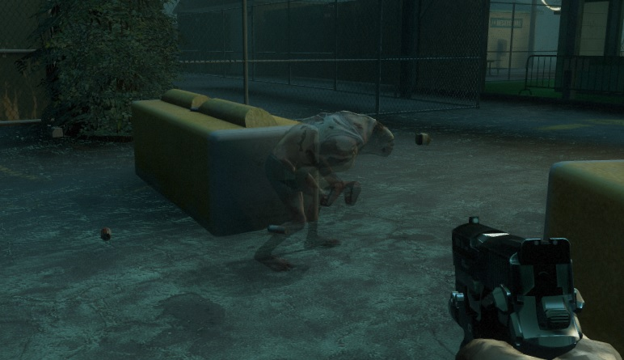
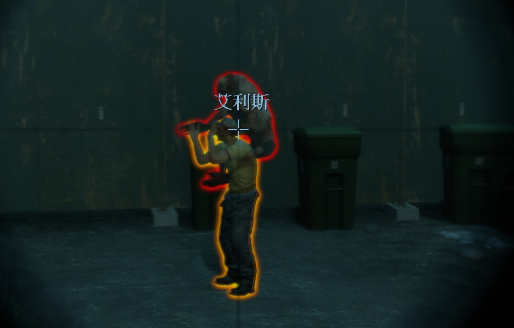
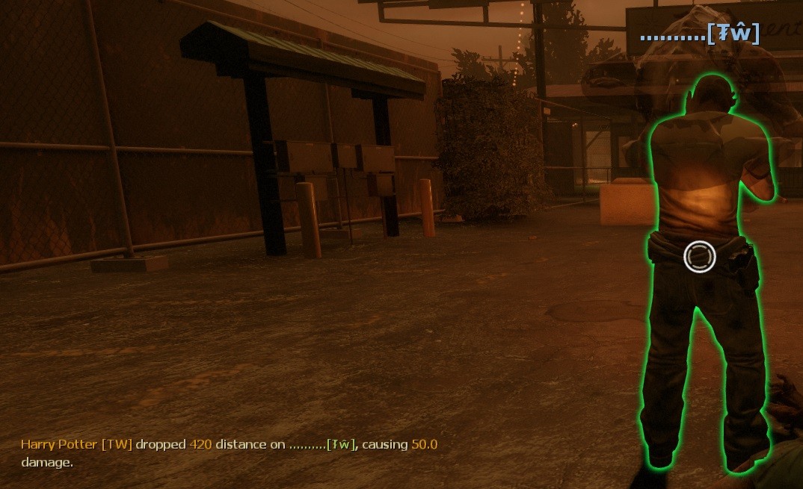

# Description | 內容
Allows for unique Jockey abilities to empower the small tyrant.

> __Note__ <br/>
This plugin is private, Please contact [me](https://github.com/fbef0102/Game-Private_Plugin#私人插件列表-private-plugins-list)<br/>
此為私人插件, 請聯繫[本人](https://github.com/fbef0102/Game-Private_Plugin#私人插件列表-private-plugins-list)

* [Video | 影片展示](https://youtu.be/2lkefzNmEsk)

* Image | 圖示
	* The Small Tyrant
		> 小暴君
		<br/>
	* Ghost Stalker ability
		> Ghost Stalker能力
		<br/>
	* Human Shield ability
		> Human Shield能力
		<br/>
	* Gravity Pounce ability
		> Gravity Pounce能力
		<br/>

* Apply to | 適用於
	```
	L4D2
	```

* <details><summary>Changelog | 版本日誌</summary>

	```php
	//Mortiegama @ 2014
	//HarryPotter @ 2022-2023
	```
	* v1.1h (2023-2-14)
		* Rename all cvars
		* Remake Human Shield ability and make new damage calculation formula

	* v1.0h (2023-1-31)
		* Request by Shadow
		* Remake code, convert code to latest syntax
		* Fix warnings when compiling on SourceMod 1.11.
		* Optimize code and improve performance
		* Delete "Bacterial Feet ability", "Marionette ability", "Rodeo Jump ability", they cause too many bugs.
		* Replace Gamedata with left4dhooks

	* v1.3
		* [Original Plugin by Mortiegama](https://forums.alliedmods.net/showthread.php?t=234267)
</details>

* Require | 必要安裝
	1. [left4dhooks](https://forums.alliedmods.net/showthread.php?t=321696)
	2. [[INC] Multi Colors](https://github.com/fbef0102/L4D1_2-Plugins/releases/tag/Multi-Colors)

* Related Plugin | 相關插件
	1. [Jockey Auto Jump by Silvers](https://forums.alliedmods.net/showthread.php?t=316613): Makes the Jockey automatically jump when riding a survivor.
		> AI jockey 騎人的時候，自動跳高
	2. [Jockey jump by DieTeetasse](https://forums.alliedmods.net/showthread.php?t=122213): Adding the ability that the jockey can jump with a survivor
		> Jockey 真人玩家騎人的時候，可以按空白鍵跳高
	3. [Jockey Ride Screen Fade by Marttt](https://forums.alliedmods.net/showthread.php?t=334143): Adds a blind fade effect while on Jockey ride
		> 被Jockey騎的時候致盲
	4. [l4d2_jockey_continue_incap_ride](/Plugin_插件/Jockey_Jockey/l4d2_jockey_continue_incap_ride): Allows jockeys to continue riding survivors after they would be incapacitated
		> Jockey可以繼續騎即將要倒地的倖存者

* <details><summary>ConVar | 指令</summary>

	* cfg/sourcemod/l4d2_Sinister_Jockey.cfg
		```php
		// If 1, Enables the Ghost Stalker ability, allowing the Jockey to become nearly invisible.
		l4d2_Sinister_Jockey_ghoststalker_enable "1"

		// Modifies the opacity of the Jockey to become closer to invisible (0-255)
		l4d2_Sinister_Jockey_ghoststalker_visibility "100"

		// Maximum amount of damage the Jockey can inflict while dropping (Should be Survivor health max).
		l4d2_Sinister_Jockey_gravitypounce_cap "100"

		// If 1, Enables the Gravity Pounce ability, the Jockey can inflict damage based on how far he drops on a Survivor.
		l4d2_Sinister_Jockey_gravitypounce_enable "1"

		// Amount to multiply the damage dealt by the Jockey when dropping.
		l4d2_Sinister_Jockey_gravitypounce_multiplier "1.0"

		// Damage that inflicted to the Survivor while Human Shield ability enabled.
		// Damge = the damage jockey received / this cvar valve (0=No damage)
		l4d2_Sinister_Jockey_humanshield_divisor "30.0"

		// If 1, Enables the Human Shield ability, the Jockey can use the Survivor as a human shield while riding.
		l4d2_Sinister_Jockey_humanshield_enable "1"

		// Percent of damage the Jockey avoids using a Survivor as a shield.
		l4d2_Sinister_Jockey_humanshield_percent "0.7"
		```
</details>

* <details><summary>Command | 命令</summary>

	None
</details>

* Details
	* <b>Ghost Stalker ability</b> - Allowing the Jockey to become nearly invisible.
	* <b>Gravity Pounce ability</b> - The Jockey can inflict damage based on how far he drops on a Survivor.
	* <b>Human Shield ability</b> - The Jockey can use the Survivor as a human shield while riding.

* <details><summary>Human Shield Calculation Formula</summary>
	
	> Example: Jockey gets AWP shot while riding a survivor<br/>
	AWP 1 shot damage = 90<br/>
	Jockey receive damage = 90 * 0.7 = 63<br/>
	Survivor receive damage = 63 / 30.0 = 2.1<br/>
	```php
	l4d2_Sinister_Jockey_humanshield_divisor "30.0"
	l4d2_Sinister_Jockey_humanshield_enable "1"
	l4d2_Sinister_Jockey_humanshield_percent "0.7"
	```
</details>

* <details><summary>Related Official ConVar</summary>

	* write down the following cvars in cfg/server.cfg
		```php
		// Jockey Movement Speed (default: 250, maximum: 450)
		sm_cvar z_jockey_speed 		"250"

		// Jockey Riding Speed, speed = survivor speed * 0.8
		// default: 0.8, maximum: 1.0
		sm_cvar z_jockey_control_max "0.8"
		sm_cvar z_jockey_control_min "0.8"

		// Survivor can resist the ridding speed (0=Survivor can't control ridding speed)
		// default: 0.7, maximum: 1.0
		sm_cvar z_jockey_control_variance"0.7"
		```
</details>

- - - -
# 中文說明
增強Jockey，賦予多種超能力成為小小的暴君

* 原理
	* 能力1: <b>Ghost Stalker</b> - 身體接近透明
	* 能力2: <b>Human Shield</b> - 抓住倖存者的時候使用倖存者的身體當盾牌，轉移自己受到的傷害
	* 能力3: <b>Gravity Pounce</b> - 跟Hunter一樣有高撲傷害

* 功能
	* 可設定各能力的開關
	* 可設定Ghost Stalker的透明程度
	* 可設定Human Shield的轉移傷害程度
	* 可設定Gravity Pounce的最大傷害

* <details><summary>Human Shield的傷害計算 (點我展開)</summary>
	
	> 舉例: Jockey 騎倖存者的時被AWP射中一槍<br/>
	AWP 一槍傷害 = 90<br/>
	Jockey 受到的傷害 = 90 * 0.7 = 63<br/>
	倖存者 受到的傷害 = 63 / 30.0 = 2.1<br/>
	```php
	l4d2_Sinister_Jockey_humanshield_divisor "30.0"
	l4d2_Sinister_Jockey_humanshield_percent "0.7"
	```
</details>

* <details><summary>相關的官方指令中文介紹 (點我展開)</summary>

	* 以下指令寫入文件 cfg/server.cfg，可自行調整
		```php
		// Jockey 移動速度 (預設: 250, 最大: 450)
		sm_cvar z_jockey_speed "250"

		// Jockey 騎人的速度調整, 速度為人類速度210 * 0.8, 因此數值1.0的時候, 騎人速度等同於人類速度210 
		// 預設: 0.8, 最大: 1.0
		sm_cvar z_jockey_control_max "0.8"
		sm_cvar z_jockey_control_min "0.8"

		// 人類可以抵抗Jockey騎走的速度調整 (0=無法使用上下左右抵抗騎走速度)
		// 預設: 0.7, 最大: 1.0
		sm_cvar z_jockey_control_variance"0.7"
		```
</details>