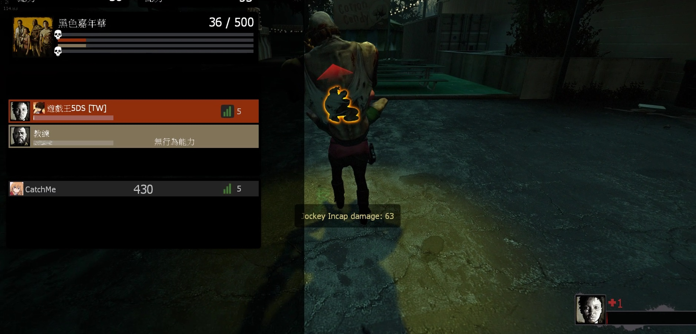

# Description | 內容
Allows jockeys to continue riding survivors after they would be incapacitated

> __Note__ <br/>
This plugin is private, Please contact [me](https://github.com/fbef0102/Game-Private_Plugin#私人插件列表-private-plugins-list)<br/>
此為私人插件, 請聯繫[本人](https://github.com/fbef0102/Game-Private_Plugin#私人插件列表-private-plugins-list)

* [Video | 影片展示](https://youtu.be/7J76Zh4Yfxk)

* Image | 圖示
	* Message
		> 提示
		<br/>
	* Incap Ride Damage
		> 倒地繼續騎
		<br/>

* Apply to | 適用於
	```
	L4D2
	```

* <details><summary>Changelog | 版本日誌</summary>

	```php
	//dcx2 @ 2013
	//HarryPotter @ 2023
	```
	* v1.0h (2023-2-28)
		* Rename all cvars
		* Request by 小颯
		* Remake code, convert code to latest syntax
		* Fix warnings when compiling on SourceMod 1.11.
		* Optimize code and improve performance
		* Replace Gamedata, l4d2_direct.txt with left4dhooks

	* v1.5
		* [Original Plugin by dcx2](https://forums.alliedmods.net/showthread.php?t=216739)
</details>

* Require | 必要安裝
	1. [left4dhooks](https://forums.alliedmods.net/showthread.php?t=321696)
	2. [[INC] Multi Colors](https://github.com/fbef0102/L4D1_2-Plugins/releases/tag/Multi-Colors)

* Related Plugin | 相關插件
	1. [l4d2_Sinister_Jockey](/Plugin_插件/Jockey_Jockey/l4d2_Sinister_Jockey): Allows for unique Jockey abilities to empower the small tyrant.
		> 增強Jockey，賦予多種超能力成為小小的暴君

* <details><summary>ConVar | 指令</summary>

	* cfg/sourcemod/l4d2_jockey_continue_incap_ride.cfg
		```php
		// Enable bit flag (add together):
		// 1=humans can ride, 2=AI can ride, 4=Enabled in competitive modes, 8=Enabled in cooperative modes, 16=Announce incap rides
		// 31=all, 0=off.
		l4d2_jockey_continue_incap_ride_enable "31"

		// Damage done by the jockey during an incap ride will be multiplied by this.
		l4d2_jockey_continue_incap_ride_multiplier "3.0"
		```
</details>

* <details><summary>Command | 命令</summary>

	None
</details>

* <details><summary>Related Official ConVar</summary>

	* write down the following cvars in cfg/server.cfg
		```php
		// Jockey Recharge after dismounting (Default: 6)
		sm_cvar z_leap_interval_post_ride "6"

		// Jockey Recharge after incapping (Default: 30)
		sm_cvar z_leap_interval_post_incap "30"
		```
</details>

- - - -
# 中文說明
Jockey可以繼續騎即將要倒地的倖存者

* 原理
	* Jockey騎尚未失去行動能力的倖存者時，如果倖存者即將倒地，則Jockey可以續騎
	* 如果傷害超過倒地的狀態300血量，則倖存者直接處死
	* 此插件不會讓Jockey去騎已經倒在地上的倖存者

* 功能
	* 可設置個模式開關
	* 可設置只有人類或AI操控的Jockey可以使用這能力
	* 可設定倒地狀態繼續騎的倍率傷害

* <details><summary>相關的官方指令中文介紹 (點我展開)</summary>

	* 以下指令寫入文件 cfg/server.cfg，可自行調整
		```php
		// Jockey 騎未倒地的倖存者，被解除控制時的能力CD (預設: 6)
		sm_cvar z_leap_interval_post_ride "6"

		// Jockey 騎倒地的倖存者，被解除控制時的能力CD (預設: 30)
		sm_cvar z_leap_interval_post_incap "30"
		```
</details>