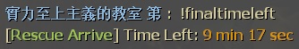
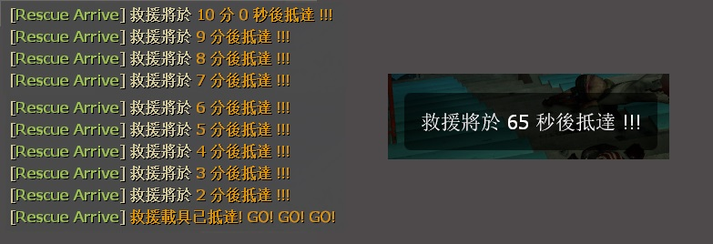

# Description | 內容
Increase the finale rescue time, survivors must hold up until time passed

> __Note__ <br/>
This plugin is private, Please contact [me](https://github.com/fbef0102/Game-Private_Plugin#私人插件列表-private-plugins-list)<br/>
此為私人插件, 請聯繫[本人](https://github.com/fbef0102/Game-Private_Plugin#私人插件列表-private-plugins-list)<br/>

* [Video | 影片展示](https://youtube.com/shorts/dEV8-GZUpT4)

* Image
	<br/>
	<br/>
	<br/>

* <details><summary>How does it work?</summary>

	* Increase the finale rescue time, survivors must hold up until time passed
	* Rescue vehicle will not arrive until time passed
	* Endless hordes after 2 final tank waves
	* Apply to all official/custom maps
	* 🟥 Auto disable plugin in the following final type.
		1. Gauntlet final, ex: c5m5, c13m4
		2. Scavenge final, ex: c1m4, c6m3
	* You can customize time for each map in file ```data/l4d2_final_rescue_arrive_time.cfg```
</details>

* Require | 必要安裝
	1. [left4dhooks](https://forums.alliedmods.net/showthread.php?t=321696)
	2. [[INC] Multi Colors](https://github.com/fbef0102/L4D1_2-Plugins/releases/tag/Multi-Colors)

* <details><summary>ConVar</summary>

	* cfg\sourcemod\l4d2_final_rescue_arrive_time.cfg
		```php
		// 0=Plugin off, 1=Plugin on.
		l4d2_final_rescue_arrive_time_enable "1"

		// Default time before rescue vehicle arrived.
		l4d2_final_rescue_arrive_time_default "360"

		// By default, when to start countdown timer, 0=Once Final Starts, 1=First Tank Stage, 2=Second Tank Stage, 3=Third Tank Stage (c7m3_port)
		l4d2_final_rescue_arrive_time_start "0"

		// Display count down hint text when remaining time is below this value
		l4d2_final_rescue_arrive_time_announce_left "90.0"

		// If 1, time pause when tank is on the field
		l4d2_final_rescue_arrive_time_tank_pause "0"
		```
</details>

* <details><summary>Command</summary>
    
   * **Display rescue vehicle arrive time left**
		```php
		sm_finaltimeleft
		sm_finaltime
		```
</details>

* <details><summary>Example Config</summary>

	* data/l4d2_final_rescue_arrive_time.cfg
		```php
		"l4d2_final_rescue_arrive_time"
		{
			"c1m4_atrium" // Map name
			{
				"time"		"0" // Scavenge Final, 0=Turn off the plugin in this map
			}
			"c2m5_concert" // Map name
			{
				"time"      "600" // set rescue arrive time (seconds)
				"start"		"0"	// When to countdown timer, 0=Once Final Starts, 1=First Tank Stage, 2=Second Tank Stage
			}
			"c7m3_port"
			{
				"time"		"200"
				"start"		"3"	// When to countdown timer, 0=Once Final Starts, 1=First Tank Stage, 2=Second Tank Stage, 3=Third Tank Stage
			} 
		}
		```
</details>

* Apply to | 適用於
    ```
    L4D2 coop/versus/realism
    ```

* <details><summary>Translation Support | 支援翻譯</summary>

	```
	English
	繁體中文
	简体中文
	```
</details>

* <details><summary>Related Plugin | 相關插件</summary>

	1. [l4d_rescue_vehicle_leave_timer](https://github.com/fbef0102/L4D2-Plugins/tree/master/l4d_rescue_vehicle_leave_timer): When rescue vehicle arrived and a timer will display how many time left for vehicle leaving. If a player is not on rescue vehicle or zone, slay him
    	> 救援來臨之後，未在時間內上救援載具逃亡的玩家將處死
</details>

* <details><summary>Changelog | 版本日誌</summary>

    * v1.2 (2024-3-11)
		* Fixed standard final custom map not working

    * v1.1 (2024-2-12)
		* Fixed sometimes not working

    * v1.0 (2024-1-21)
        * Initial Release
</details>

- - - -
# 中文說明
增加最後救援的防守時間，倖存者必須等待時間結束，救援載具才會來臨

* 圖示
	<br/>
	<br/>
	<br/>

* 原理
	* 增加救援抵達的時間，救援載具不會來臨直到時間結束
	* 2波Tank階段後，生成無限屍潮，時間結束之後，強制刷出救援載具
	* 適用於所有官方地圖與三方地圖
	* 🟥 遇到以下救援類型則自動關閉功能
		1. 衝刺跑圖, 譬如: c5m5, c13m4
		2. 灌汽油載具, 譬如: c1m4, c6m3
	* 可以設置文件```data/l4d2_final_rescue_arrive_time.cfg```，決定每一關的救援抵達時間

* 用意在哪?
	* 適合屍潮太多或Tank過多的伺服器，導致救援階段卡關
	* 強制刷出救援載具

* <details><summary>指令中文介紹 (點我展開)</summary>

	* cfg\sourcemod\l4d2_final_rescue_arrive_time.cfg
		```php
		// 0=關閉插件, 1=啟動插件
		l4d2_final_rescue_arrive_time_enable "1"

		// 救援載具抵達時間 (預設)
		l4d2_final_rescue_arrive_time_default "360"

		// 救援載具抵達時間何時開始倒數計時, 0=救援開始時, 1=第一波Tank階段, 2=第二波Tank階段, 3=第三波Tank階段, 譬如c7m3_port
		l4d2_final_rescue_arrive_time_start "0"

		// 剩餘90秒時，開始顯示倒數
		l4d2_final_rescue_arrive_time_announce_left "90.0"

		// 為1時，Tank在場上時，倒數時間暫停
		l4d2_final_rescue_arrive_time_tank_pause "0"
		```
</details>

* <details><summary>命令中文介紹 (點我展開)</summary>
    
   * **查看救援抵達剩餘時間**
		```php
		sm_finaltimeleft
		sm_finaltime
		```
</details>

* <details><summary>文件設定</summary>

	* 設定文件```data\l4d2_final_rescue_arrive_time.cfg```，決定每一關的救援抵達時間
		```php
		"l4d2_final_rescue_arrive_time"
		{
			"c1m4_atrium" // 地圖名
			{
				"time"		"0" // 灌汽油載具, 0=關閉此插件
			}
			"c2m5_concert" // 地圖名
			{
				"time"      "600" // 設置救援抵達的時間 (秒數)
				"start"		"0"	// 何時開始倒數計時, 0=救援開始時, 1=第一波Tank階段, 2=第二波Tank階段, 3=第三波Tank階段
			}
			"c7m3_port"
			{
				"time"		"200"
				"start"		"3"	// 何時開始倒數計時, 0=救援開始時, 1=第一波Tank階段, 2=第二波Tank階段, 3=第三波Tank階段
			} 
		}
		```
</details>